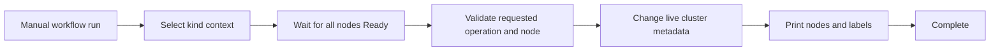

# Repository Extra Guide

This document is a companion to [diagrams.md](diagrams.md). It explains the repository structure, the systems represented in the diagrams, the current Kubernetes design, alternative Kubernetes choices, and the cluster-only patching workflow.

## What This Repository Does

This repository contains a small Flask application packaged as a Docker image and run in a local, multi-node Kubernetes cluster created with kind.

The current path is:

```text
Source code -> Docker image -> GHCR -> self-hosted runner -> kind cluster -> Kubernetes Service -> Flask pods
```

There are two separate GitHub Actions responsibilities:

- **CI** builds the application image and pushes it to GitHub Container Registry.
- **CD** deploys the application image and Kubernetes manifests to the local cluster.
- **Cluster patching** performs live cluster administration only. It does not deploy the application.

## Repository Structure

```text
docker-k8s-cicd/
|-- app/
|   |-- app.py
|   |   Flask application exposing / and /healthz on port 5000.
|   `-- requirements.txt
|       Python dependencies for the Flask application.
|
|-- k8s/
|   |-- deployment.yaml
|   |   Four-replica stateless Deployment scheduled on worker nodes.
|   `-- service.yaml
|       NodePort Service exposing the application on port 30080.
|
|-- scripts/
|   |-- setup-kind-cluster.sh
|   |   Creates the kind cluster, labels workers, builds and loads the image,
|   |   and applies the initial application manifests.
|   |-- start-cluster.sh
|   |   Starts the stopped kind node containers and waits for Ready nodes.
|   `-- stop-cluster.sh
|       Stops kind node containers without deleting the cluster.
|
|-- .github/workflows/
|   |-- ci.yml
|   |   Builds and pushes the Docker image after changes to the application,
|   |   Dockerfile, or CI workflow.
|   |-- cd.yml
|   |   Pulls the image and deploys it to the local kind cluster after CI.
|   `-- patch.yml
|       Manually performs cluster-only operations on the self-hosted runner.
|
|-- Dockerfile
|   Builds the Python 3.12 image and runs the application as appuser.
|-- kind-config.yaml
|   Defines one control-plane node and two worker nodes for a new kind cluster.
|-- docs/
|   |-- diagrams.md
|   |   Mermaid diagrams and detailed architecture notes.
|   |-- README_Extra.md
|   |   This companion guide.
|   |-- interview.html
|   |   Standalone interactive interview quiz.
|   |-- interview.css
|   |   Quiz visual styling.
|   |-- interview.js
|   |   Quiz state, scoring, rotation, and history logic.
|   `-- interview-questions.json
|       Curated 100-question Kubernetes and CI/CD bank.
|-- .dockerignore
|   Files excluded from the Docker build context.
|-- LICENSE
|   Repository license.
|-- README.md
|   Main setup, lifecycle, and CI/CD guide.
`-- requirements and workflow metadata
```

## Current Cluster Design

The current cluster is named `docker-k8s-cicd` and contains:

- One control-plane node
- Two worker nodes
- Four `python-app` replicas
- Two application pods per worker through `topologySpreadConstraints`
- A `NodePort` Service on port `30080`, targeting application port `5000`
- A worker node label: `node-role.kubernetes.io/worker=true`
- Readiness and liveness checks using `/healthz`

The Deployment selects only nodes with the worker label. If that label is missing, new application pods cannot be scheduled. The cluster patching workflow can restore the label without changing the application Deployment.

## Diagram Guide

The diagrams in [diagrams.md](diagrams.md) cover these views:

| Diagram | What it explains |
| --- | --- |
| Current repository structure | Where source, manifests, scripts, workflows, and documentation live |
| Current deployment path | How source code reaches the kind cluster |
| High-level architecture | GitHub, GHCR, the self-hosted runner, Docker, and kind |
| CI/CD pipeline | Image build, registry push, image pull, and application rollout |
| Kubernetes topology | Control plane, workers, Service, and four pods |
| Cluster options | kind compared with Minikube, Docker Desktop, kubeadm, and managed Kubernetes |
| Deployment options | Deployment compared with StatefulSet, DaemonSet, Job, and CronJob |
| Cluster patching workflow | Manual cluster operation selection and verification |
| Runtime request flow | NodePort and Service routing to the Flask application |
| Container image build | Base image, dependencies, application code, and non-root runtime |
| Deployment rollout | Image loading and application rollout sequence |
| Cluster lifecycle | Create, start, stop, and delete states for kind |

## Kubernetes Alternatives

The repository currently uses kind because it is lightweight and can create a repeatable multi-node cluster from Docker containers.

| Cluster type | Suitable use | Important difference |
| --- | --- | --- |
| kind | Local development and CI testing | Images may need `kind load docker-image`. |
| Minikube | Local single-node development | Use `minikube image load` or the Minikube Docker environment. |
| Docker Desktop Kubernetes | Local Windows or macOS development | Use the Docker Desktop Kubernetes context. |
| kubeadm | Self-managed virtual machines or servers | Networking, storage, registry, and node setup are your responsibility. |
| Managed Kubernetes | Cloud or production-like environments | Use registry pulls, ingress, TLS, secrets, and cloud integrations. |

`kind-config.yaml` only describes cluster creation. It is not a live Kubernetes patch manifest. Changing node roles, node count, or port mappings normally requires deleting and recreating the kind cluster. Live node labels and scheduling state can be changed with `kubectl`.

## Kubernetes Workload Alternatives

The application currently uses a `Deployment` because it is a stateless HTTP service.

- **Deployment:** Long-running stateless services with rolling updates.
- **StatefulSet:** Workloads requiring stable identities, ordering, or persistent storage.
- **DaemonSet:** One pod on every matching node, such as a node agent.
- **Job:** A task that runs to completion, such as a migration.
- **CronJob:** A task that runs on a schedule.
- **ReplicaSet:** Maintains replicas but is normally managed by a Deployment.

Changing workload type is an application architecture change, not a cluster patch. It should be reviewed separately from node administration.

## Cluster-Only Patching Workflow

The cluster patching workflow is [`.github/workflows/patch.yml`](../.github/workflows/patch.yml). It runs on the existing self-hosted runner because that runner can access the local kind cluster.

Run it from GitHub:

1. Open **Actions**.
2. Select **Patch Local Kubernetes Cluster**.
3. Select **Run workflow**.
4. Choose an operation.
5. Provide a worker node name only for `cordon-worker` or `uncordon-worker`.

Supported operations:

| Operation | Effect | Application deployment changed? |
| --- | --- | --- |
| `reconcile-worker-labels` | Adds or restores `node-role.kubernetes.io/worker=true` on non-control-plane nodes. | No |
| `cordon-worker` | Prevents new pods from being scheduled on the selected worker. Existing pods are not automatically removed. | No |
| `uncordon-worker` | Allows new pods to be scheduled on the selected worker again. | No |
| `verify` | Waits for Ready nodes and prints node state and labels. | No |

The workflow performs these common safety steps:



The workflow intentionally does **not** run any of these application deployment actions:

- `docker pull`
- `kind load docker-image`
- `kubectl apply -f k8s/`
- `kubectl set image`
- `kubectl rollout status deployment/python-app`
- Application health checks

Those actions belong to [cd.yml](../.github/workflows/cd.yml), not the cluster patch workflow.

## Equivalent Manual Commands

Use the kind context before running live cluster commands:

```bash
kubectl config use-context kind-docker-k8s-cicd
kubectl wait --for=condition=Ready nodes --all --timeout=120s
kubectl get nodes -o wide
kubectl get events --sort-by=.lastTimestamp
```

Restore worker labels:

```bash
for node in $(kubectl get nodes -l '!node-role.kubernetes.io/control-plane' -o name); do
    kubectl label "${node}" node-role.kubernetes.io/worker=true --overwrite
done
```

Temporarily stop scheduling on a worker and restore scheduling later:

```bash
kubectl cordon docker-k8s-cicd-worker
kubectl uncordon docker-k8s-cicd-worker
```

Verify labels and scheduling state:

```bash
kubectl get nodes --show-labels
kubectl describe node docker-k8s-cicd-worker
```

## Operational Boundaries

- The patch workflow changes live cluster metadata only.
- It does not recreate the cluster.
- It does not modify `kind-config.yaml`.
- It does not change the `python-app` Deployment or Service.
- Cordoning a node does not evict existing pods. Draining is a separate, more disruptive operation and should be added only with explicit maintenance safeguards.
- The self-hosted runner must have Docker, kind, kubectl, and access to the `kind-docker-k8s-cicd` kubeconfig context.
- The runner must be trusted because patch operations can change cluster scheduling behavior.

## Related Files

- [Main README](../README.md)
- [Architecture and diagrams](diagrams.md)
- [Cluster creation configuration](../kind-config.yaml)
- [Application Deployment](../k8s/deployment.yaml)
- [Application Service](../k8s/service.yaml)
- [Cluster patch workflow](../.github/workflows/patch.yml)
- [Application deployment workflow](../.github/workflows/cd.yml)
- [Interactive interview lab](interview.html)
