# Repository Diagrams

These diagrams describe the build, delivery, runtime, and local cluster lifecycle of `docker-k8s-cicd`. The sections below also document the current repository layout, alternative Kubernetes choices, and a repeatable patching workflow. See the [extra repository and operations guide](README_Extra.md) for the consolidated reference.

## Current Repository Structure

```text
docker-k8s-cicd/
|-- app/
|   |-- app.py                 Flask application with / and /healthz
|   `-- requirements.txt       Python dependencies
|-- k8s/
|   |-- deployment.yaml        Four-replica Kubernetes Deployment
|   `-- service.yaml           NodePort service on port 30080
|-- scripts/
|   |-- setup-kind-cluster.sh  Create, label, and deploy the kind cluster
|   |-- start-cluster.sh       Resume stopped kind node containers
|   `-- stop-cluster.sh        Stop kind node containers without deleting data
|-- .github/workflows/
|   |-- ci.yml                 Build and push the Docker image to GHCR
|   `-- cd.yml                 Load the image and roll out to local Kubernetes
|-- Dockerfile                 Build the non-root Python application image
|-- kind-config.yaml           One control plane and two worker nodes
|-- docs/diagrams.md           Architecture and operational diagrams
`-- README.md                  Setup, lifecycle, and CI/CD instructions
```

The current deployment path is:

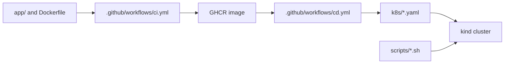

## High-Level Architecture

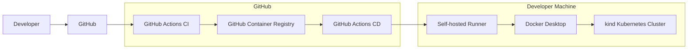

## CI/CD Pipeline

A push to `main` starts CI. After CI succeeds, CD runs on the self-hosted runner that can reach the local kind cluster.

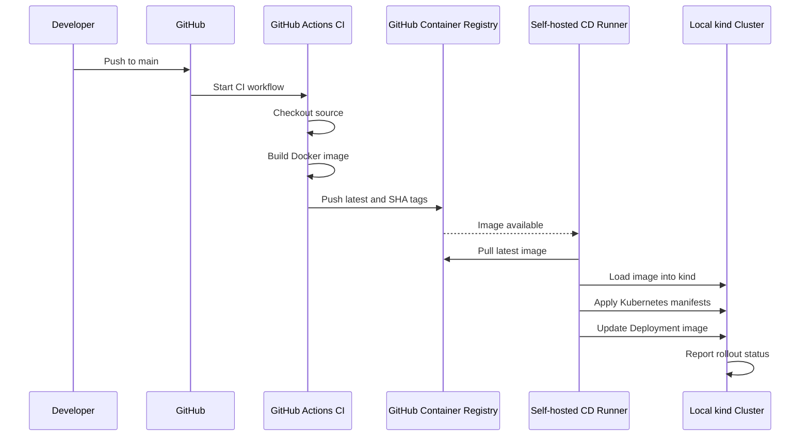

## Kubernetes Cluster Topology

The Deployment creates four replicas and restricts them to the two labeled worker nodes. The topology spread constraint keeps two pods on each worker.

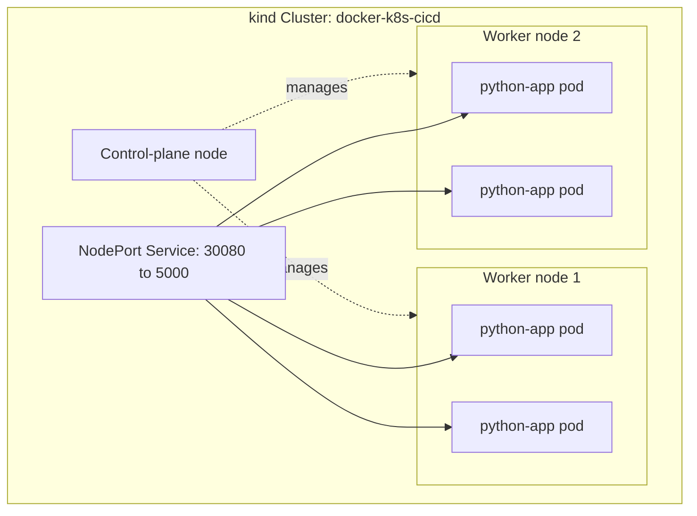

## Kubernetes Cluster Options

The repository currently uses **kind** because it provides a repeatable local multi-node cluster using Docker containers. The manifests can also be used with other Kubernetes distributions, subject to networking, storage, registry access, and context changes.

| Cluster type | Best use | Changes or considerations |
| --- | --- | --- |
| kind | Local development and CI testing | Current configuration; image must be loaded with `kind load docker-image` unless nodes can pull from GHCR. |
| Minikube | Local development with a simple single-node workflow | Use the Minikube Docker environment or `minikube image load`; NodePort access is usually through `minikube service`. |
| Docker Desktop Kubernetes | Local development on Windows or macOS | Use the Docker Desktop context; image loading is usually unnecessary because Docker shares its image store. |
| kubeadm cluster | Self-managed servers or virtual machines | Configure networking, storage, ingress, registry credentials, and node labels separately. |
| Managed Kubernetes | Production-like deployment in a cloud provider | Replace local image loading with registry pulls and add cloud-specific ingress, TLS, secrets, and observability. |

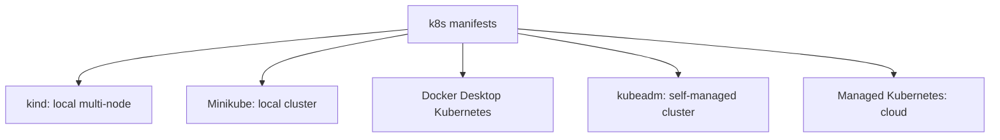

The `nodeSelector` in `k8s/deployment.yaml` expects the worker label `node-role.kubernetes.io/worker=true`. That label is added by the kind setup script and must also exist on worker nodes in another cluster, or the selector must be changed.

## Kubernetes Deployment Options

The current application uses a **Deployment**, which is the correct default for a stateless Flask service. Other Kubernetes workload types solve different problems:

| Workload type | Use it for | Fit for this app |
| --- | --- | --- |
| Deployment | Long-running, stateless services with rolling updates | Current and recommended choice |
| StatefulSet | Stable pod identities, ordered rollout, and persistent storage | Only if the app gains stateful storage or clustered identity |
| DaemonSet | One pod on every matching node | Not appropriate; the app needs four replicas, not one per node |
| Job | A task that runs to completion | Appropriate for migrations or one-time maintenance, not the HTTP server |
| CronJob | Scheduled Jobs | Appropriate for periodic cleanup or reporting tasks |
| ReplicaSet | Replica maintenance without Deployment rollout behavior | Usually managed indirectly by a Deployment |

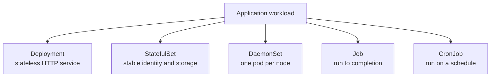

## Cluster Patching Workflow

The GitHub Actions workflow at [.github/workflows/patch.yml](../.github/workflows/patch.yml) performs live cluster operations only. It does not deploy the application, load images, apply files from `k8s/`, or change the `python-app` Deployment.

Run it manually from **Actions > Patch Local Kubernetes Cluster > Run workflow** on the self-hosted runner. It supports:

- `reconcile-worker-labels` - restores the worker label required by the current Deployment's `nodeSelector`.
- `cordon-worker` - prevents new pods from being scheduled on a selected worker.
- `uncordon-worker` - allows scheduling on a selected worker again.
- `verify` - checks cluster readiness and prints node state without changing anything.

The workflow uses the `kind-docker-k8s-cicd` context and verifies that a cordon or uncordon target is not the control-plane node.

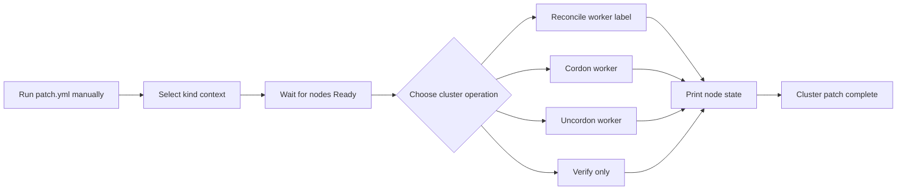

Equivalent manual verification commands:

```bash
# Select the local cluster before patching.
kubectl config use-context kind-docker-k8s-cicd

# Confirm cluster readiness and inspect nodes.
kubectl wait --for=condition=Ready nodes --all --timeout=120s
kubectl get nodes -o wide
kubectl get events --sort-by=.lastTimestamp
```

To restore the worker labels required by this repository:

```bash
for node in $(kubectl get nodes -l '!node-role.kubernetes.io/control-plane' -o name); do
    kubectl label "${node}" node-role.kubernetes.io/worker=true --overwrite
done
```

To temporarily remove a worker from scheduling and restore it later:

```bash
kubectl cordon docker-k8s-cicd-worker
kubectl uncordon docker-k8s-cicd-worker
```

`kind-config.yaml` is a cluster creation definition, not a live patch manifest. Changes to its node count, node roles, or port mappings require recreating the kind cluster, while labels, scheduling state, and other live Kubernetes metadata can be changed through the patch workflow.

## Runtime Request Flow

The Service selects pods using the `app: python-app` label. The current kind configuration does not define a host port mapping, so local access may use the NodePort or the documented `kubectl port-forward` command.

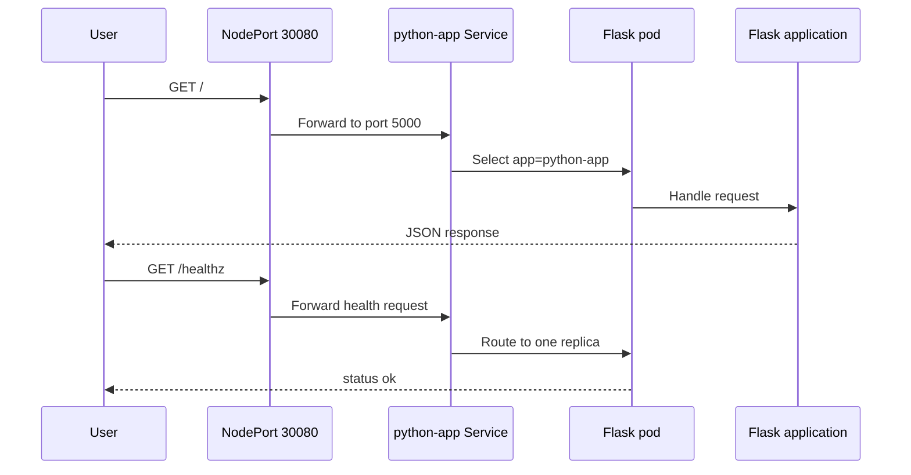

## Container Image Build

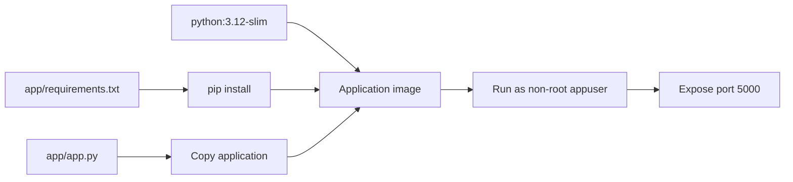

## Deployment Rollout

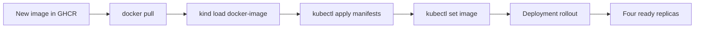

## Cluster Lifecycle

The stop script stops the three kind node containers without deleting the cluster state. The start script resumes them and waits for all nodes to become ready.

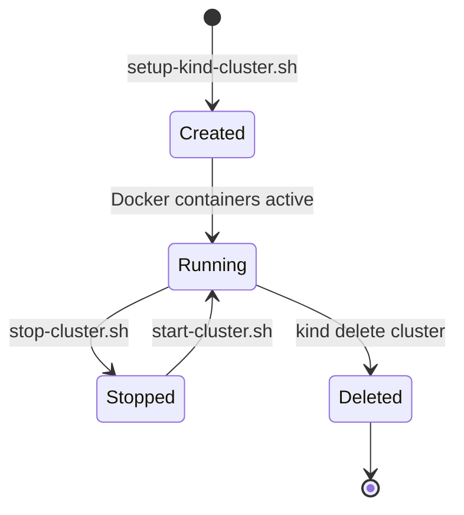
