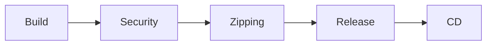

# CI (Continuous Integration)

CI validates and packages a change before it goes anywhere. This repo breaks
CI into four steps, each documented separately:

| Step | What it does | Doc |
| ---- | ------------- | --- |
| 1. Build | Compile/package the source, per repo type (C#, Python, Java, VCS-only, monorepo) | [build.md](build.md) |
| 2. Security | Scan dependencies, code, and container/IaC for known issues | [security.md](security.md) |
| 3. Zipping | Package the build output into a versioned, deployable artifact | [zipping.md](zipping.md) |
| 4. Release | Publish the artifact (registry, package feed, or release page) | [release.md](release.md) |

## Flow

Once a build is released, it's picked up by one of the [CD](../cd/README.md)
destinations.
