# Kubernetes Networking Study and Reference Guide

Last verified: 2026-09-01  
Audience: IT professionals, platform engineers, DevOps engineers, SREs, and Kubernetes administrators

> This guide focuses on modern Kubernetes networking concepts and operational practice. Some behavior depends on the cluster distribution, cloud provider, operating system, CNI plugin, kube-proxy mode, and ingress or gateway controller.

---

## Table of Contents

1. [Kubernetes Networking at a Glance](#kubernetes-networking-at-a-glance)
2. [The Kubernetes Network Model](#the-kubernetes-network-model)
3. [Pod Networking](#pod-networking)
4. [Container Network Interface](#container-network-interface)
5. [Common CNI Plugins](#common-cni-plugins)
6. [Services and Service Discovery](#services-and-service-discovery)
7. [EndpointSlices](#endpointslices)
8. [kube-proxy and Service Routing](#kube-proxy-and-service-routing)
9. [DNS and CoreDNS](#dns-and-coredns)
10. [Ingress](#ingress)
11. [Gateway API](#gateway-api)
12. [NetworkPolicy](#networkpolicy)
13. [Traffic Flow Walkthroughs](#traffic-flow-walkthroughs)
14. [Namespaces and Networking](#namespaces-and-networking)
15. [Dual-Stack IPv4 and IPv6](#dual-stack-ipv4-and-ipv6)
16. [Egress and External Connectivity](#egress-and-external-connectivity)
17. [Observability](#observability)
18. [Security](#security)
19. [Troubleshooting Workflows](#troubleshooting-workflows)
20. [Common Failure Scenarios](#common-failure-scenarios)
21. [Production Best Practices](#production-best-practices)
22. [Command Reference](#command-reference)
23. [Interview Questions](#interview-questions)
24. [Reference Manifests](#reference-manifests)
25. [Official References](#official-references)

---

## Kubernetes Networking at a Glance

Kubernetes networking is the system that allows workloads, nodes, and external clients to communicate reliably while Pods are created, destroyed, rescheduled, and scaled. It is built from several layers:

| Layer | Main Objects or Components | Purpose |
|---|---|---|
| Pod network | Pods, container runtime, CNI plugin | Gives Pods IP addresses and enables Pod-to-Pod communication |
| Service abstraction | Service, EndpointSlice, kube-proxy or replacement | Provides stable virtual IPs, names, and load balancing to changing backend Pods |
| DNS | CoreDNS, Service DNS records, Pod DNS config | Provides name-based service discovery |
| North-south traffic | LoadBalancer Service, NodePort, Ingress, Gateway API | Exposes workloads to clients outside the cluster |
| Policy | NetworkPolicy, CNI policy engine, admission/policy tools | Restricts traffic between Pods and external destinations |
| Observability | Metrics, logs, flow logs, packet capture, CNI telemetry | Helps prove where traffic fails and why |

High-level architecture:

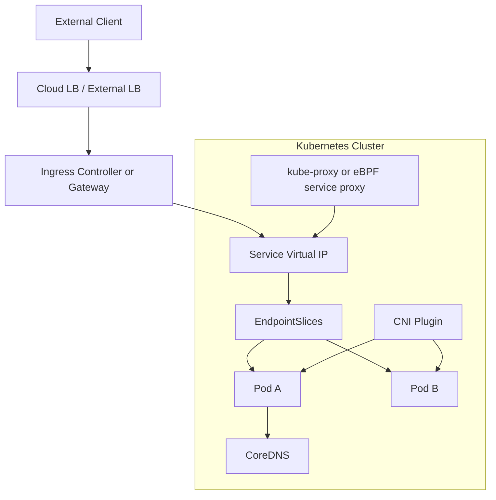

---

## The Kubernetes Network Model

Kubernetes assumes a flat, routable Pod network.

Core rules:

- Every Pod gets its own cluster-wide IP address.
- Containers inside the same Pod share one network namespace and communicate over `localhost`.
- Pods can communicate directly with other Pods without NAT, unless policy or infrastructure intentionally blocks traffic.
- Node agents, such as kubelet, can communicate with Pods on the same node.
- Services provide stable access to dynamic Pods.
- DNS provides stable names for Services and, in some cases, Pods.
- NetworkPolicy can restrict traffic, but only if the CNI plugin enforces it.

Important implications:

- Applications should usually listen on `0.0.0.0` inside the container, not only `127.0.0.1`, when other Pods or Services must reach them.
- Pod IPs are ephemeral. Do not hard-code them.
- Service names and labels are the usual discovery mechanism.
- Kubernetes itself defines APIs and desired behavior, but the concrete implementation is mostly delegated to CNI plugins, kube-proxy or replacements, DNS, cloud controllers, and load balancer controllers.

---

## Pod Networking

### Pod Network Namespace

Each Pod has a network namespace containing:

- One or more network interfaces, commonly `eth0`.
- A loopback interface, `lo`.
- IP address or addresses assigned by the CNI plugin.
- Routes.
- DNS resolver configuration, usually mounted into `/etc/resolv.conf`.
- iptables, nftables, or policy rules depending on the runtime and CNI.

All containers in a Pod share this namespace:

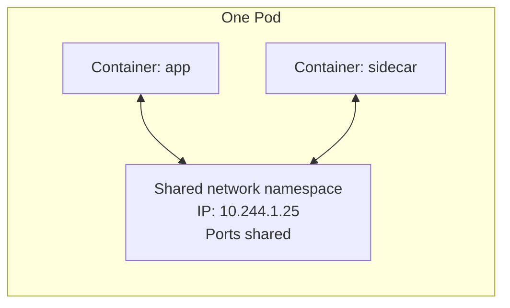

Consequences:

- Two containers in the same Pod cannot both bind the same port on the same IP.
- Sidecars can proxy traffic over `localhost`.
- Pod-level firewalling generally applies to the whole Pod, not an individual container.

### Pod IP Lifecycle

Typical flow when a Pod is scheduled:

1. Scheduler assigns the Pod to a node.
2. Kubelet asks the container runtime to create a Pod sandbox.
3. The runtime invokes CNI plugins.
4. CNI IPAM allocates an IP address.
5. CNI configures interfaces, routes, and any overlay or policy state.
6. Kubelet reports Pod status, including `podIP` and `podIPs`.
7. EndpointSlice controller adds the Pod as an endpoint if it matches a Service selector and is ready.

### Same-Node Pod-to-Pod Traffic

Common Linux bridge or veth flow:

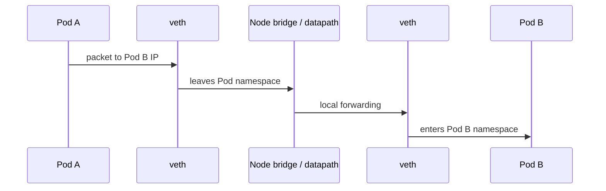

Depending on the CNI, the datapath could be a Linux bridge, Open vSwitch, eBPF, host routing, or another mechanism.

### Cross-Node Pod-to-Pod Traffic

Common patterns:

| Pattern | How it works | Tradeoffs |
|---|---|---|
| Overlay | Encapsulates Pod packets in VXLAN, Geneve, IP-in-IP, etc. | Easier across networks; adds encapsulation overhead and MTU concerns |
| Native routing | Underlay routes Pod CIDRs between nodes | Efficient; requires network route control |
| Cloud-native VPC networking | Pods get IPs from cloud VPC/subnets | Integrates with cloud routing/security; may face IP exhaustion |
| eBPF datapath | Uses eBPF programs for routing, service load balancing, and policy | High performance and visibility; plugin-specific behavior |

Cross-node overlay example:

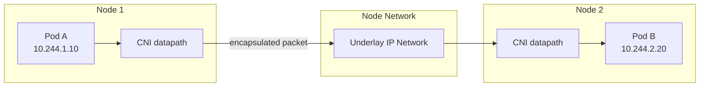

### hostNetwork Pods

A Pod with `hostNetwork: true` uses the node network namespace.

Use cases:

- Node-level agents.
- High-performance networking agents.
- DNS agents in some designs.
- Monitoring or security daemons.

Risks:

- Port conflicts with node services.
- Reduced network isolation.
- NetworkPolicy support may be limited or different.
- The Pod sees the node IP stack directly.

---

## Container Network Interface

The Container Network Interface, or CNI, is the standard plugin interface used by container runtimes to configure Pod networking on Linux. Kubernetes requires a network implementation that satisfies the Kubernetes network model.

### CNI Responsibilities

A Kubernetes CNI plugin or plugin chain commonly handles:

- Pod interface creation.
- IP address allocation through IPAM.
- Route configuration.
- Encapsulation or routing across nodes.
- NetworkPolicy enforcement.
- Service acceleration or kube-proxy replacement, depending on plugin.
- Egress masquerading or NAT behavior.
- Optional bandwidth shaping.
- Optional encryption.

### CNI Configuration

CNI config is usually found on each node under:

```text
/etc/cni/net.d/
/opt/cni/bin/
```

The exact paths depend on the OS, distribution, and runtime.

Modern Kubernetes delegates CNI management to the container runtime and node setup. Older kubelet flags such as `--network-plugin` and `--cni-bin-dir` were removed from kubelet in Kubernetes 1.24.

### CNI Plugin Chain

Many deployments use a chain of plugins:

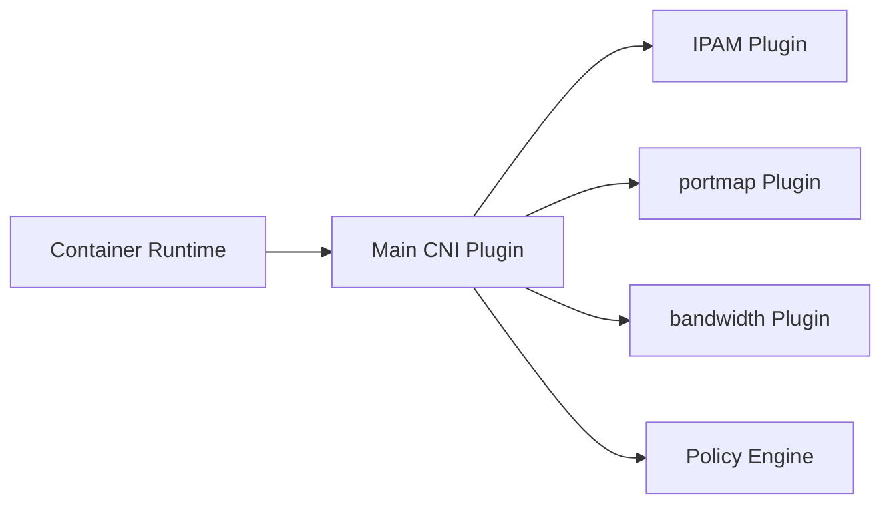

Example responsibilities:

- `bridge`, `calico`, `cilium-cni`, `aws-cni`, or similar: primary networking.
- `host-local`, cloud IPAM, or plugin-native IPAM: address allocation.
- `portmap`: implements container port mappings.
- `bandwidth`: optional ingress/egress shaping.

### CNI Failure Symptoms

Common symptoms:

- Pods stuck in `ContainerCreating`.
- Events mention `FailedCreatePodSandBox`.
- Node reports `NetworkPluginNotReady`.
- Pod has no IP.
- Cross-node traffic fails but same-node traffic works.
- NetworkPolicy has no effect because the selected CNI does not enforce it.

---

## Common CNI Plugins

The right CNI depends on scale, platform, security requirements, operational maturity, and cloud provider.

| Plugin | Common Strengths | Notes |
|---|---|---|
| Calico | NetworkPolicy, BGP routing, IP-in-IP/VXLAN, mature operations | Popular in cloud and on-prem clusters |
| Cilium | eBPF datapath, advanced observability, kube-proxy replacement, L7 policy options | Strong for high-scale and deep visibility |
| Flannel | Simple overlay networking | Historically common for simple clusters; limited policy by itself |
| Weave Net | Simple overlay and encryption options | Less common in newer production builds |
| Antrea | Open vSwitch-based networking and policy | Common in VMware/Tanzu and multi-platform environments |
| AWS VPC CNI | Pods get VPC IPs | Native AWS integration; plan subnet IP capacity carefully |
| Azure CNI | Pods integrate with Azure virtual networks | Multiple modes exist; behavior depends on AKS configuration |
| Google Cloud Dataplane V2 | Managed GKE datapath using eBPF concepts | GKE-specific managed behavior |

Evaluation checklist:

- Does it enforce Kubernetes `NetworkPolicy`?
- Does it support IPv6 or dual-stack if required?
- Does it support Windows nodes if required?
- Does it support encryption in transit?
- Does it support observability and flow logs?
- How does it scale with node count, Pod count, Service count, and policy count?
- Does it replace kube-proxy or depend on kube-proxy?
- What are the operational upgrade and rollback procedures?

---

## Services and Service Discovery

Services provide stable access to one or more backend endpoints. Most Services select Pods using labels. Kubernetes then creates EndpointSlices representing the selected ready backends.

### Service Basics

Example:

```yaml
apiVersion: v1
kind: Service
metadata:
  name: web
  namespace: app
spec:
  selector:
    app: web
  ports:
    - name: http
      protocol: TCP
      port: 80
      targetPort: 8080
```

Key fields:

| Field | Meaning |
|---|---|
| `spec.selector` | Labels used to find backend Pods |
| `spec.ports[].port` | Service port clients connect to |
| `spec.ports[].targetPort` | Backend Pod port, numeric or named |
| `spec.ports[].protocol` | Usually TCP or UDP; SCTP also exists |
| `spec.type` | Exposure model |
| `spec.clusterIP` | Stable virtual IP for the Service |
| `spec.clusterIPs` | Single-stack or dual-stack list of cluster IPs |
| `spec.ipFamilyPolicy` | SingleStack, PreferDualStack, or RequireDualStack |
| `spec.internalTrafficPolicy` | Cluster or Local for internal routing |
| `spec.externalTrafficPolicy` | Cluster or Local for external routing |
| `spec.sessionAffinity` | Optional client IP stickiness |
| `spec.trafficDistribution` | Preference hints such as same-zone or same-node routing where supported |

### ClusterIP Service

Default Service type.

Characteristics:

- Exposes a stable virtual IP inside the cluster.
- Reachable from Pods and nodes that can reach the cluster network.
- Not normally reachable from outside the cluster.
- Used as the backend for most Ingress and Gateway routes.

```yaml
apiVersion: v1
kind: Service
metadata:
  name: api
spec:
  type: ClusterIP
  selector:
    app: api
  ports:
    - port: 443
      targetPort: 8443
```

### NodePort Service

Exposes a Service on a port on each node.

Characteristics:

- Allocates or uses a port from the configured NodePort range, commonly `30000-32767`.
- Clients connect to `NodeIP:nodePort`.
- Often used behind an external load balancer.
- May expose the service on all node addresses or a configured subset, depending on kube-proxy mode and settings.

```yaml
apiVersion: v1
kind: Service
metadata:
  name: api-nodeport
spec:
  type: NodePort
  selector:
    app: api
  ports:
    - port: 80
      targetPort: 8080
      nodePort: 30080
```

Operational notes:

- `externalTrafficPolicy: Local` preserves client source IP in many implementations and only routes to local node endpoints.
- `externalTrafficPolicy: Cluster` can load balance to endpoints on any node but may SNAT client IPs.
- Firewall rules must allow the NodePort range.

### LoadBalancer Service

Requests an external load balancer from a cloud provider or load balancer controller.

Characteristics:

- Usually creates a cloud load balancer.
- Typically also allocates a NodePort unless the implementation supports direct Pod or node routing without it.
- Good for exposing a single TCP/UDP service.
- Less expressive than Ingress or Gateway for HTTP routing.

```yaml
apiVersion: v1
kind: Service
metadata:
  name: public-api
spec:
  type: LoadBalancer
  selector:
    app: api
  ports:
    - port: 443
      targetPort: 8443
```

Production concerns:

- Cloud cost.
- Health check behavior.
- Source IP preservation.
- Load balancer idle timeouts.
- TLS termination location.
- Security group or firewall updates.
- Internal versus internet-facing configuration.

### ExternalName Service

Maps a Kubernetes Service name to an external DNS name using a CNAME record.

```yaml
apiVersion: v1
kind: Service
metadata:
  name: external-db
spec:
  type: ExternalName
  externalName: db.example.com
```

Characteristics:

- No selector.
- No ClusterIP.
- No kube-proxy routing.
- DNS returns a CNAME to the external name.

Use cases:

- Stable in-cluster alias for an external dependency.
- Migration from in-cluster to external service.

Limitations:

- Not a TCP proxy.
- Protocols that expect the original hostname, especially TLS and HTTP virtual hosting, may need careful configuration.

### Headless Service

A headless Service has `clusterIP: None`.

```yaml
apiVersion: v1
kind: Service
metadata:
  name: database
spec:
  clusterIP: None
  selector:
    app: database
  ports:
    - port: 5432
      targetPort: 5432
```

Characteristics:

- No virtual Service IP.
- DNS returns backend Pod IPs directly.
- Common with StatefulSets.
- Useful when clients need direct endpoint identity.

StatefulSet DNS pattern:

```text
<pod-name>.<headless-service>.<namespace>.svc.<cluster-domain>
```

Example:

```text
postgres-0.postgres.database.svc.cluster.local
```

### Services Without Selectors

Services can point to manually managed endpoints using EndpointSlices.

Use cases:

- External database behind a stable cluster Service name.
- Migration to Kubernetes while preserving external backends.
- Service abstraction over non-Pod workloads.

Important: for selectorless Services, do not rely on legacy `Endpoints` objects. Use EndpointSlice resources directly.

### Session Affinity

Service session affinity can route traffic from the same client IP to the same backend for a configurable period:

```yaml
spec:
  sessionAffinity: ClientIP
  sessionAffinityConfig:
    clientIP:
      timeoutSeconds: 10800
```

Use sparingly. Application-level session management is usually more predictable.

### Traffic Policies

`internalTrafficPolicy`:

- `Cluster`: route internal traffic to all healthy endpoints.
- `Local`: route internal traffic only to endpoints on the same node as the source.

`externalTrafficPolicy`:

- `Cluster`: route external traffic to all healthy endpoints.
- `Local`: route external traffic only to local endpoints, often preserving source IP.

`trafficDistribution`:

- Allows routing preferences such as same-zone or same-node where supported by the Kubernetes version and implementation.
- It is a preference, not the same as a strict traffic policy.

---

## EndpointSlices

EndpointSlices are the scalable API used to represent Service backends.

### Why EndpointSlices Exist

The older `Endpoints` API stored all endpoints for a Service in one object. That became inefficient for large Services. EndpointSlices split endpoint data into smaller resources.

EndpointSlices:

- Are stable in modern Kubernetes.
- Are usually created automatically for Services with selectors.
- Track backend IPs, ports, readiness, node, and zone metadata.
- Are watched by kube-proxy, CoreDNS, ingress controllers, gateway controllers, and service meshes.
- Default to a limited number of endpoints per slice; the controller can be configured up to a larger maximum.

Example:

```yaml
apiVersion: discovery.k8s.io/v1
kind: EndpointSlice
metadata:
  name: api-abc123
  labels:
    kubernetes.io/service-name: api
addressType: IPv4
ports:
  - name: http
    protocol: TCP
    port: 8080
endpoints:
  - addresses:
      - "10.244.1.10"
    conditions:
      ready: true
    nodeName: worker-1
    zone: us-east-1a
```

### Endpoint Conditions

Important endpoint conditions include:

- `ready`: endpoint should receive normal traffic.
- `serving`: endpoint is serving traffic, even if terminating.
- `terminating`: endpoint is associated with a terminating Pod.

Controllers may use these conditions for graceful shutdown and traffic draining.

### EndpointSlice Troubleshooting

Useful commands:

```bash
kubectl get endpointslice -n app -l kubernetes.io/service-name=api
kubectl describe endpointslice -n app -l kubernetes.io/service-name=api
kubectl get pods -n app -l app=api -o wide
kubectl describe svc -n app api
```

If a Service has no endpoints:

1. Check that Pod labels match the Service selector.
2. Check that Pods are Ready.
3. Check readiness probes.
4. Check that `targetPort` matches the container port name or number.
5. Check EndpointSlices directly.

---

## kube-proxy and Service Routing

kube-proxy implements the virtual IP mechanism for most Services unless replaced by another datapath, such as an eBPF-based service implementation.

### What kube-proxy Watches

kube-proxy watches:

- Services.
- EndpointSlices.
- Node-related local state.

It then programs the node datapath so traffic to a Service virtual IP and port is redirected to a backend endpoint.

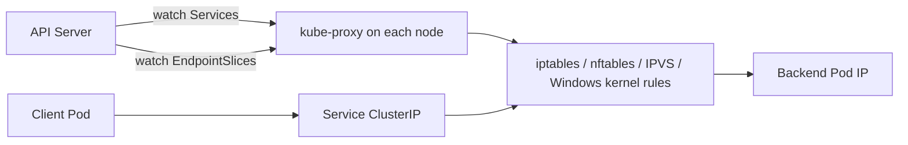

### kube-proxy Modes

| Mode | Platform | Status and Notes |
|---|---|---|
| `iptables` | Linux | Long-standing default in many Kubernetes versions; uses netfilter iptables rules |
| `nftables` | Linux | Modern Linux datapath; designed to improve scalability and performance over iptables |
| `ipvs` | Linux | Deprecated in recent Kubernetes; historically used for scale/performance but has API fit limitations |
| `kernelspace` | Windows | Uses Windows kernel networking facilities |

Operational guidance:

- Explicitly configure kube-proxy mode rather than relying on default changes across upgrades.
- For large clusters, monitor kube-proxy sync duration and rule counts.
- Understand CNI-specific kube-proxy replacement behavior before disabling kube-proxy.
- Treat nftables as the modern Linux direction where kernel and distribution support are available.

### iptables Mode

iptables mode creates rules for Services and endpoints. It performs destination NAT to selected endpoints.

Pros:

- Mature and widely supported.
- Works on many Linux distributions.

Cons:

- Large rule sets can become operationally heavy.
- Debugging requires understanding chains and conntrack.

### nftables Mode

nftables mode uses the successor to iptables in the Linux netfilter subsystem.

Pros:

- Better scaling characteristics for large numbers of Services and endpoints.
- More efficient rule updates.

Considerations:

- Requires sufficiently modern Linux kernel support.
- Some NodePort and firewall interactions differ from iptables mode.
- Verify local firewall behavior during migration.

### IPVS Mode

IPVS mode uses kernel IPVS plus iptables. It is deprecated in current Kubernetes documentation and should generally be avoided for new deployments unless there is a specific operational reason and version support is understood.

### kube-proxy Replacement

Some CNIs implement Service load balancing without kube-proxy.

Potential benefits:

- Lower latency.
- Better scale.
- Better observability.
- Direct server return or eBPF acceleration.

Risks:

- Behavior becomes plugin-specific.
- Troubleshooting commands differ.
- Upgrades require careful CNI release notes review.

---

## DNS and CoreDNS

Kubernetes DNS allows workloads to discover Services by name.

### DNS Names

Common Service DNS format:

```text
<service>.<namespace>.svc.<cluster-domain>
```

Default cluster domain:

```text
cluster.local
```

Example:

```text
api.app.svc.cluster.local
```

From a Pod in the same namespace, short names usually work:

```text
api
```

From a different namespace:

```text
api.app
api.app.svc
api.app.svc.cluster.local
```

### Pod DNS Configuration

Inside a Pod:

```bash
cat /etc/resolv.conf
```

Typical contents:

```text
nameserver 10.96.0.10
search app.svc.cluster.local svc.cluster.local cluster.local
options ndots:5
```

`ndots:5` means many names are first tried through search domains before being treated as fully qualified. This can surprise applications that do frequent external DNS lookups.

### CoreDNS

CoreDNS is the standard DNS server used by Kubernetes clusters.

CoreDNS usually runs in `kube-system`:

```bash
kubectl get deploy -n kube-system coredns
kubectl get pods -n kube-system -l k8s-app=kube-dns -o wide
kubectl get configmap -n kube-system coredns -o yaml
```

CoreDNS responsibilities:

- Resolve Service names.
- Resolve headless Service endpoints.
- Watch Services, EndpointSlices, Pods, and Namespaces where configured.
- Forward external DNS queries to upstream resolvers.
- Apply caching and plugin behavior configured in the Corefile.

### DNS Records

ClusterIP Service:

- Returns Service ClusterIP as A or AAAA record.

Headless Service:

- Returns endpoint Pod IPs directly.

SRV records:

```text
_<port-name>._<protocol>.<service>.<namespace>.svc.<cluster-domain>
```

Example:

```text
_http._tcp.api.app.svc.cluster.local
```

### DNS Troubleshooting

Deploy a temporary DNS test Pod:

```bash
kubectl run dnsutils --image=registry.k8s.io/e2e-test-images/agnhost:2.39 --restart=Never -- sleep 3600
kubectl exec -it dnsutils -- nslookup kubernetes.default
kubectl exec -it dnsutils -- nslookup api.app.svc.cluster.local
```

Check CoreDNS:

```bash
kubectl logs -n kube-system deploy/coredns
kubectl describe clusterrole system:coredns
kubectl get endpointslice -A | grep kube-dns
```

Common DNS causes:

- Querying the wrong namespace.
- Service has no endpoints.
- CoreDNS cannot list/watch EndpointSlices.
- Upstream DNS failure.
- NetworkPolicy blocks Pod-to-CoreDNS traffic.
- NodeLocal DNSCache issue if enabled.
- Application resolver behavior with `ndots`.

---

## Ingress

Ingress exposes HTTP and HTTPS routes from outside the cluster to Services inside the cluster.

Important current status:

- Ingress is stable.
- The Ingress API is frozen.
- Kubernetes recommends Gateway API for new advanced use cases.
- Ingress still remains widely used and is not planned for removal.

### Ingress Components

| Component | Purpose |
|---|---|
| Ingress resource | Declares host/path routing rules |
| IngressClass | Selects the controller implementation |
| Ingress controller | Implements the rules using a proxy or load balancer |
| Service | Backend target |
| Secret | Often stores TLS certificates |

Example:

```yaml
apiVersion: networking.k8s.io/v1
kind: Ingress
metadata:
  name: web
  namespace: app
spec:
  ingressClassName: nginx
  tls:
    - hosts:
        - web.example.com
      secretName: web-tls
  rules:
    - host: web.example.com
      http:
        paths:
          - path: /
            pathType: Prefix
            backend:
              service:
                name: web
                port:
                  number: 80
```

### Ingress Limitations

- Primarily HTTP and HTTPS.
- Controller-specific annotations are common and reduce portability.
- Advanced traffic shaping, cross-namespace routing, and role separation are limited compared with Gateway API.
- Behavior differs across controllers.

---

## Gateway API

Gateway API is the modern Kubernetes API family for exposing and routing network traffic. It provides more expressive, role-oriented, and extensible networking than Ingress.

### Why Gateway API Matters

Gateway API improves:

- Separation of infrastructure and application roles.
- Multi-tenant control.
- Protocol-aware routing.
- Extensibility.
- Portability through conformance profiles.
- Advanced traffic management.

### Main Gateway API Resources

| Resource | Owner | Purpose |
|---|---|---|
| `GatewayClass` | Infrastructure/platform team | Defines the gateway implementation |
| `Gateway` | Cluster operator/platform team | Defines listener addresses, ports, protocols, TLS behavior |
| `HTTPRoute` | Application team | Defines HTTP routing to Services |
| `GRPCRoute` | Application team | Defines gRPC routing |
| `TLSRoute` | Application/platform team | Defines TLS routing where supported |
| `TCPRoute` / `UDPRoute` | Application/platform team | Defines L4 routing where supported |
| `ReferenceGrant` | Resource owner | Allows controlled cross-namespace references |

Basic flow:

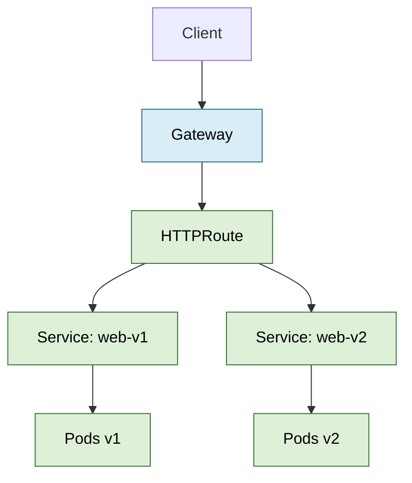

Example:

```yaml
apiVersion: gateway.networking.k8s.io/v1
kind: Gateway
metadata:
  name: public
  namespace: infra
spec:
  gatewayClassName: example
  listeners:
    - name: https
      protocol: HTTPS
      port: 443
      hostname: "*.example.com"
      tls:
        mode: Terminate
        certificateRefs:
          - name: wildcard-example-tls
      allowedRoutes:
        namespaces:
          from: All
---
apiVersion: gateway.networking.k8s.io/v1
kind: HTTPRoute
metadata:
  name: web
  namespace: app
spec:
  parentRefs:
    - name: public
      namespace: infra
  hostnames:
    - web.example.com
  rules:
    - matches:
        - path:
            type: PathPrefix
            value: /
      backendRefs:
        - name: web
          port: 80
```

### Gateway API Versus Ingress

| Area | Ingress | Gateway API |
|---|---|---|
| API maturity | Stable, frozen | Modern extensible API family |
| Primary use | HTTP/HTTPS ingress | HTTP, gRPC, TLS, TCP, UDP depending on implementation |
| Role separation | Limited | Designed for infra, cluster, and app roles |
| Cross-namespace references | Limited/controller-specific | Explicit with `ReferenceGrant` |
| Advanced routing | Often annotations | First-class route resources |
| Portability | Controller annotations reduce portability | Conformance aims to improve portability |

---

## NetworkPolicy

NetworkPolicy controls allowed traffic to and from Pods at Layer 3 and Layer 4. It requires a CNI plugin that implements policy enforcement.

### Default Behavior

Without NetworkPolicies selecting a Pod:

- Ingress traffic to the Pod is allowed by default.
- Egress traffic from the Pod is allowed by default.

Once a NetworkPolicy selects a Pod for ingress or egress, allowed traffic is the union of all matching policies. Policies are additive; there are no explicit deny rules in the standard Kubernetes NetworkPolicy API.

### Basic Default Deny

Default deny ingress:

```yaml
apiVersion: networking.k8s.io/v1
kind: NetworkPolicy
metadata:
  name: default-deny-ingress
  namespace: app
spec:
  podSelector: {}
  policyTypes:
    - Ingress
```

Default deny egress:

```yaml
apiVersion: networking.k8s.io/v1
kind: NetworkPolicy
metadata:
  name: default-deny-egress
  namespace: app
spec:
  podSelector: {}
  policyTypes:
    - Egress
```

### Allow Same Namespace

```yaml
apiVersion: networking.k8s.io/v1
kind: NetworkPolicy
metadata:
  name: allow-same-namespace
  namespace: app
spec:
  podSelector: {}
  policyTypes:
    - Ingress
  ingress:
    - from:
        - podSelector: {}
```

### Allow From Specific Namespace and App

```yaml
apiVersion: networking.k8s.io/v1
kind: NetworkPolicy
metadata:
  name: allow-frontend-to-api
  namespace: app
spec:
  podSelector:
    matchLabels:
      app: api
  policyTypes:
    - Ingress
  ingress:
    - from:
        - namespaceSelector:
            matchLabels:
              kubernetes.io/metadata.name: app
          podSelector:
            matchLabels:
              app: frontend
      ports:
        - protocol: TCP
          port: 8080
```

### Allow DNS Egress

When using default-deny egress, remember DNS:

```yaml
apiVersion: networking.k8s.io/v1
kind: NetworkPolicy
metadata:
  name: allow-dns-egress
  namespace: app
spec:
  podSelector: {}
  policyTypes:
    - Egress
  egress:
    - to:
        - namespaceSelector:
            matchLabels:
              kubernetes.io/metadata.name: kube-system
          podSelector:
            matchLabels:
              k8s-app: kube-dns
      ports:
        - protocol: UDP
          port: 53
        - protocol: TCP
          port: 53
```

Labels for CoreDNS may differ across distributions. Verify them before applying policy.

### What Standard NetworkPolicy Cannot Do Well

Standard Kubernetes NetworkPolicy does not natively provide:

- Explicit deny rules.
- Fully qualified domain name policy.
- Layer 7 HTTP path or method policy.
- Cluster-wide global policies.
- Node-level firewalling.
- Complete service-aware policy in every implementation.
- Guaranteed enforcement for `hostNetwork` Pods.

Some CNIs add extended policy APIs for these features.

### NetworkPolicy Troubleshooting

Checklist:

1. Confirm the CNI supports NetworkPolicy.
2. Confirm the policy is in the same namespace as the selected Pods.
3. Check `podSelector` labels.
4. Check `namespaceSelector` labels.
5. Check whether egress default deny blocks DNS.
6. Test TCP connectivity and DNS separately.
7. Review CNI policy logs or flow records.

Useful commands:

```bash
kubectl get netpol -A
kubectl describe netpol -n app
kubectl get pods -n app --show-labels
kubectl get ns --show-labels
kubectl exec -n app deploy/frontend -- nc -vz api 8080
kubectl exec -n app deploy/frontend -- nslookup api
```

---

## Traffic Flow Walkthroughs

### Pod to ClusterIP Service

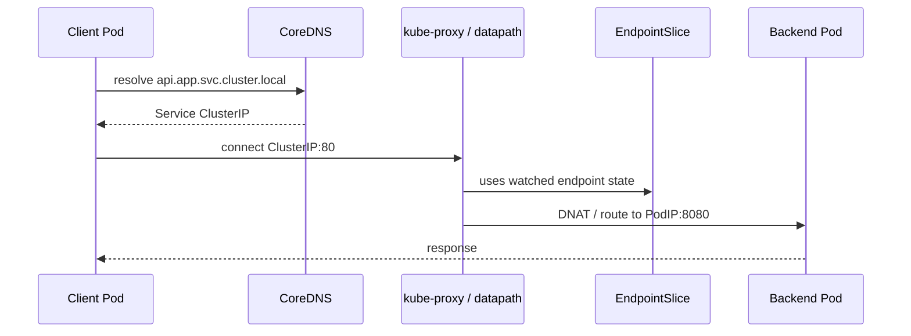

Failure points:

- DNS resolution failure.
- Service selector mismatch.
- Empty EndpointSlice.
- kube-proxy or replacement not programmed.
- NetworkPolicy blocks client to backend or DNS.
- Backend not listening on target port.

### External Client to Ingress

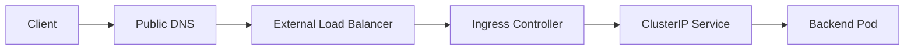

Failure points:

- Public DNS wrong.
- Load balancer health checks failing.
- Firewall/security group blocked.
- IngressClass mismatch.
- TLS Secret missing or invalid.
- Ingress route host/path mismatch.
- Service has no endpoints.

### External Client to Gateway API

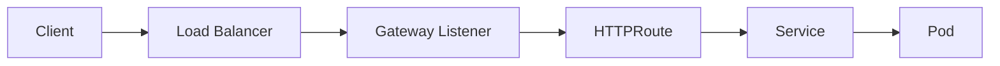

Failure points:

- GatewayClass controller not installed.
- Gateway not accepted or programmed.
- Listener hostname/protocol mismatch.
- HTTPRoute not attached.
- Cross-namespace reference not allowed.
- Backend Service or port incorrect.

### Pod to Internet Egress

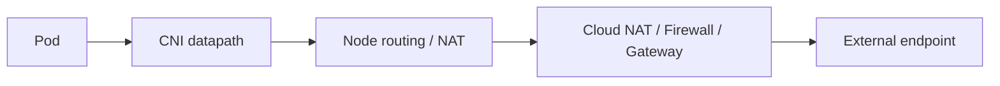

Failure points:

- NetworkPolicy egress block.
- CNI egress NAT disabled or misconfigured.
- Node route table missing.
- Cloud NAT unavailable.
- Firewall/security group denies traffic.
- DNS resolves to blocked IP family in dual-stack clusters.

---

## Namespaces and Networking

Namespaces organize Kubernetes objects and provide a scope for names, RBAC, quotas, and NetworkPolicies. They are not a network boundary by themselves.

Important points:

- Pods in different namespaces can communicate by default.
- Services are namespaced.
- NetworkPolicies are namespaced and select Pods only in their own namespace.
- A policy can allow traffic from other namespaces using `namespaceSelector`.
- DNS short names resolve first in the caller's namespace.

Example namespace-aware DNS:

```text
api              # api in the caller's namespace
api.payments     # api Service in payments namespace
api.payments.svc.cluster.local
```

Namespace label best practice:

```bash
kubectl label namespace payments team=payments environment=prod
```

Use stable namespace labels for policy. The label `kubernetes.io/metadata.name` is commonly available and useful for selecting a namespace by name.

---

## Dual-Stack IPv4 and IPv6

Kubernetes supports IPv4-only, IPv6-only, and IPv4/IPv6 dual-stack clusters, depending on platform support.

Dual-stack is stable and enables:

- Pod assignment with IPv4 and IPv6 addresses.
- Services with IPv4 and IPv6 cluster IPs.
- Pod egress using both address families.

### Key Service Fields

```yaml
spec:
  ipFamilyPolicy: PreferDualStack
  ipFamilies:
    - IPv4
    - IPv6
```

Policy values:

| Value | Meaning |
|---|---|
| `SingleStack` | Allocate one Service IP family |
| `PreferDualStack` | Allocate both families when supported, otherwise fall back |
| `RequireDualStack` | Require both families or fail |

### Dual-Stack Requirements

- Kubernetes version with dual-stack support.
- Cloud provider or infrastructure support.
- CNI support.
- kube-apiserver Service CIDRs for both families.
- kube-controller-manager cluster CIDRs for both families.
- kube-proxy configured for both families if used.
- Node IP configuration for both families, especially on bare metal.

### Dual-Stack Troubleshooting

```bash
kubectl get nodes -o wide
kubectl get pod -A -o wide
kubectl get svc -A -o jsonpath='{range .items[*]}{.metadata.namespace}/{.metadata.name}{" "}{.spec.ipFamilies}{" "}{.spec.clusterIPs}{"\n"}{end}'
kubectl describe svc -n app api
```

Common issues:

- Application listens only on IPv4.
- DNS returns IPv6 first and client cannot reach IPv6 path.
- NetworkPolicy allows only one family.
- Cloud load balancer does not support dual-stack.
- CNI supports Pod dual-stack but not all policy or egress features.

---

## Egress and External Connectivity

Egress is traffic from cluster workloads to destinations outside the cluster.

### Common Egress Designs

| Design | Description | Use Cases |
|---|---|---|
| Node SNAT | Pods egress through node IPs | Simple default in many clusters |
| Cloud NAT | Private nodes and Pods use managed NAT | Managed cloud clusters |
| Egress gateway | Selected traffic leaves through controlled gateway Pods/nodes | Auditing, fixed source IP, compliance |
| Firewall appliance | Traffic routed through security appliance | Enterprise networks |
| Service mesh egress | Mesh controls external service access | L7 controls, mTLS, telemetry |

### Important Egress Questions

- What source IP does the external service see?
- Is source IP stable enough for allowlisting?
- Is DNS controlled and observable?
- Are both TCP and UDP required?
- Is IPv6 egress supported?
- Are policies enforced before or after SNAT?
- How are exceptions approved and audited?

### External Access Into the Cluster

Options:

| Option | Best For |
|---|---|
| `kubectl port-forward` | Temporary operator access, debugging |
| NodePort | Simple L4 exposure or external LB backend |
| LoadBalancer | Single externally exposed service |
| Ingress | HTTP/HTTPS routing with mature ecosystem |
| Gateway API | Modern multi-tenant, extensible routing |
| Service mesh ingress gateway | Mesh-integrated north-south traffic |

---

## Observability

Networking observability should answer:

- Did DNS resolve?
- Which IP and port did the client try?
- Did the packet leave the source Pod?
- Was it blocked by policy?
- Did kube-proxy or CNI route it?
- Did it reach the destination Pod?
- Did the application accept the connection?
- Did response traffic return?

### Kubernetes-Level Signals

```bash
kubectl get events -A --sort-by=.lastTimestamp
kubectl describe pod -n app api-abc
kubectl describe svc -n app api
kubectl get endpointslice -n app -l kubernetes.io/service-name=api -o wide
kubectl logs -n kube-system deploy/coredns
kubectl logs -n kube-system ds/kube-proxy
```

### Node-Level Signals

On Linux nodes, depending on access:

```bash
ip addr
ip route
ip rule
ss -lntup
conntrack -L
iptables-save
nft list ruleset
tcpdump -ni any port 80
```

### Metrics to Watch

Useful metric categories:

- CoreDNS request count, latency, errors, cache hits.
- kube-proxy sync duration and errors.
- API watch errors for networking controllers.
- CNI agent health.
- Dropped packets.
- NetworkPolicy denies.
- Load balancer health check status.
- Ingress/Gateway request rate, latency, 4xx, 5xx.
- Node conntrack usage.
- Pod restart counts caused by probe failures.

### Flow Logs

Flow logs are often the fastest way to debug policy and routing.

Sources may include:

- CNI-native flow logs.
- Cloud VPC flow logs.
- Service mesh telemetry.
- eBPF observability tools.
- Firewall logs.
- Load balancer access logs.

---

## Security

### Networking Security Principles

- Default-deny sensitive namespaces.
- Allow only required ingress and egress.
- Keep DNS egress explicit when using egress deny.
- Separate public, internal, and management ingress paths.
- Avoid exposing NodePorts unnecessarily.
- Restrict cloud load balancer source ranges.
- Use TLS for external and sensitive internal traffic.
- Prefer mTLS through service mesh or application design where required.
- Protect metadata services in cloud environments.
- Monitor policy drift and unused exposures.

### Common Controls

| Control | Purpose |
|---|---|
| NetworkPolicy | Pod-level L3/L4 segmentation |
| CNI extended policy | FQDN, L7, global policy, explicit deny depending on plugin |
| Ingress/Gateway TLS | Secure north-south traffic |
| WAF | Protect HTTP apps from common attacks |
| Cloud security groups/firewalls | Restrict node and load balancer exposure |
| Private clusters | Reduce public control-plane and node exposure |
| Egress gateway | Control outbound source and destinations |
| RBAC | Prevent unauthorized Service, Ingress, Gateway, Secret changes |
| Admission control | Enforce approved exposure patterns |

### Metadata Service Protection

Cloud metadata services can expose credentials or instance data. Protect them using:

- Cloud provider workload identity mechanisms.
- CNI policy blocking metadata IP except where needed.
- IMDSv2 or equivalent provider protections.
- Avoiding broad hostNetwork access.

---

## Troubleshooting Workflows

### Workflow 1: Service Not Reachable From a Pod

1. Confirm client Pod runs:

```bash
kubectl get pod -n app -o wide
```

2. Confirm Service exists:

```bash
kubectl get svc -n app api -o wide
kubectl describe svc -n app api
```

3. Confirm endpoints:

```bash
kubectl get endpointslice -n app -l kubernetes.io/service-name=api -o wide
```

4. Confirm Pod labels:

```bash
kubectl get pods -n app --show-labels
```

5. Test DNS:

```bash
kubectl exec -n app deploy/frontend -- nslookup api
```

6. Test direct Service connection:

```bash
kubectl exec -n app deploy/frontend -- curl -v http://api:80/
```

7. Test backend Pod IP directly:

```bash
kubectl exec -n app deploy/frontend -- curl -v http://10.244.1.10:8080/
```

Interpretation:

- Service fails, Pod IP works: kube-proxy/service routing issue or Service port mismatch.
- DNS fails, IP works: DNS/CoreDNS/search domain issue.
- Pod IP fails: CNI routing, NetworkPolicy, backend app, or node firewall.
- Only cross-node fails: CNI overlay/routing/MTU issue.

### Workflow 2: DNS Fails

```bash
kubectl get svc -n kube-system kube-dns
kubectl get endpointslice -n kube-system -l kubernetes.io/service-name=kube-dns
kubectl get pods -n kube-system -l k8s-app=kube-dns -o wide
kubectl logs -n kube-system deploy/coredns
kubectl exec -n app deploy/frontend -- cat /etc/resolv.conf
kubectl exec -n app deploy/frontend -- nslookup kubernetes.default.svc.cluster.local
```

Check:

- Is CoreDNS running?
- Does kube-dns Service have endpoints?
- Can the client reach UDP/TCP 53?
- Does NetworkPolicy allow DNS?
- Are CoreDNS RBAC permissions intact?
- Are upstream resolvers working?

### Workflow 3: Ingress or Gateway Returns 404 or 503

For Ingress:

```bash
kubectl get ingress -A
kubectl describe ingress -n app web
kubectl get ingressclass
kubectl logs -n ingress-nginx deploy/ingress-nginx-controller
kubectl get svc -n app web
kubectl get endpointslice -n app -l kubernetes.io/service-name=web
```

For Gateway API:

```bash
kubectl get gatewayclass
kubectl get gateway -A
kubectl describe gateway -n infra public
kubectl get httproute -A
kubectl describe httproute -n app web
kubectl get referencegrant -A
```

Interpretation:

- 404 usually means host/path route did not match.
- 503 usually means route matched but backend unavailable.
- TLS errors often point to Secret, hostname, certificate chain, or listener mismatch.

### Workflow 4: External LoadBalancer Pending

```bash
kubectl describe svc -n app public-api
kubectl get events -n app --sort-by=.lastTimestamp
kubectl get pods -n kube-system
kubectl logs -n kube-system deploy/cloud-controller-manager
```

Check:

- Cloud controller manager installed and healthy.
- Required annotations are correct.
- Subnets are tagged correctly.
- Quotas are not exhausted.
- Firewall/security group permissions exist.
- Load balancer class is correct.

### Workflow 5: Cross-Node Pod Traffic Fails

```bash
kubectl get pods -A -o wide
kubectl get nodes -o wide
kubectl describe node <node>
kubectl logs -n kube-system -l k8s-app=<cni-agent-label>
```

Check:

- CNI DaemonSet healthy on all nodes.
- Pod CIDRs assigned.
- Node routes present.
- Overlay ports allowed, such as VXLAN UDP 4789 where applicable.
- MTU settings correct.
- Cloud/firewall rules allow node-to-node traffic.
- IP forwarding enabled where required.

### Workflow 6: NetworkPolicy Blocks Unexpectedly

```bash
kubectl get netpol -n app
kubectl describe netpol -n app
kubectl get pod -n app --show-labels
kubectl get ns --show-labels
kubectl exec -n app deploy/frontend -- nc -vz api 8080
kubectl exec -n app deploy/frontend -- nslookup api
```

Check:

- Multiple policies are additive.
- Empty `podSelector: {}` selects all Pods in the namespace.
- `namespaceSelector` and `podSelector` indentation changes meaning.
- Egress deny blocks DNS unless DNS is explicitly allowed.
- Some traffic from the node to the Pod may be treated specially.

---

## Common Failure Scenarios

### Service Has No Endpoints

Symptoms:

- `kubectl describe svc` shows `Endpoints: <none>`.
- Ingress/Gateway returns 503.

Causes:

- Selector labels do not match Pods.
- Pods are not Ready.
- Readiness probe fails.
- Wrong namespace.

Fix:

- Align labels and selectors.
- Fix readiness probe.
- Verify container port and `targetPort`.

### DNS Works in One Namespace But Not Another

Symptoms:

- `curl http://api` works in one namespace but not another.

Cause:

- Short DNS name resolves only in caller namespace.

Fix:

- Use `api.<namespace>` or full FQDN.

### NodePort Not Reachable

Causes:

- Firewall blocks NodePort range.
- kube-proxy binds only selected node addresses.
- No local endpoints with `externalTrafficPolicy: Local`.
- Cloud security group missing rule.
- Node is not reachable from client network.

### LoadBalancer Stuck in Pending

Causes:

- No cloud controller.
- Unsupported environment.
- Missing bare-metal load balancer controller, such as MetalLB or equivalent.
- Cloud quota or subnet tagging issue.

### ExternalName TLS Failure

Cause:

- Client connects to Kubernetes Service name, but upstream certificate is for external hostname.

Fix:

- Configure the application to use the real hostname for TLS SNI or use a proper proxy pattern.

### MTU Blackhole

Symptoms:

- Small requests work; large responses hang.
- Cross-node traffic only.

Causes:

- Overlay encapsulation reduces effective MTU.
- Path MTU discovery blocked.

Fix:

- Set CNI MTU correctly.
- Allow ICMP fragmentation-needed messages where relevant.
- Test with packet size tools.

### Conntrack Exhaustion

Symptoms:

- Random connection resets or timeouts.
- Node-level networking unstable.

Check:

```bash
conntrack -S
sysctl net.netfilter.nf_conntrack_count
sysctl net.netfilter.nf_conntrack_max
```

Fix:

- Increase conntrack limits carefully.
- Reduce connection churn.
- Tune application keepalives.
- Use connection pooling.

---

## Production Best Practices

### Design

- Choose a CNI based on required policy, scale, observability, platform, and operational support.
- Decide whether kube-proxy or a CNI replacement owns Service routing.
- Use Gateway API for new, complex, or multi-tenant ingress designs.
- Keep Ingress for simple or existing HTTP exposure where it is already standardized.
- Use Services for stable internal access; do not depend on Pod IPs.
- Prefer named ports where they improve clarity, but keep names consistent.
- Use headless Services for StatefulSets and direct endpoint discovery.
- Plan Pod CIDR, Service CIDR, and node CIDR ranges before cluster creation.
- Avoid overlapping cluster CIDRs with corporate, VPC, VPN, or peered networks.

### Security

- Apply default-deny NetworkPolicies to sensitive namespaces.
- Explicitly allow DNS, required ingress, and required egress.
- Restrict external exposure through approved ingress/gateway classes.
- Enforce TLS for public traffic.
- Use private load balancers for internal services.
- Do not expose dashboards, databases, brokers, or admin ports through public LoadBalancer Services.
- Protect cloud metadata endpoints.

### Operations

- Monitor CoreDNS, kube-proxy, CNI agents, ingress/gateway controllers, and cloud controllers.
- Keep CNI and ingress/gateway controllers upgraded with Kubernetes compatibility in mind.
- Test CNI upgrades in non-production clusters.
- Document how to capture packets on nodes and Pods.
- Maintain a known-good debug Pod image.
- Track network-related SLOs: DNS latency, ingress latency, error rates, connection failures.
- Validate NetworkPolicy in CI or pre-production.
- Keep emergency rollback plans for CNI and ingress controller changes.

### Scale

- Watch EndpointSlice counts and controller performance.
- Avoid very large Services when sharding is architecturally better.
- Use topology-aware routing or traffic distribution where useful and supported.
- Tune kube-proxy sync settings only with metrics and testing.
- Prefer modern datapaths for very large clusters.

### Cloud and Bare Metal

- Cloud: understand load balancer annotations, subnet tags, firewall automation, and source IP behavior.
- Bare metal: plan external load balancing with BGP, ARP/NDP, or external appliances.
- For on-prem clusters, coordinate Pod and Service CIDRs with network teams.
- For hybrid networks, explicitly document routes between cluster, datacenter, VPN, and cloud networks.

---

## Command Reference

### Inventory

```bash
kubectl get nodes -o wide
kubectl get pods -A -o wide
kubectl get svc -A -o wide
kubectl get endpointslice -A
kubectl get ingress -A
kubectl get gatewayclass
kubectl get gateway -A
kubectl get httproute -A
kubectl get netpol -A
```

### Describe

```bash
kubectl describe pod -n <namespace> <pod>
kubectl describe svc -n <namespace> <service>
kubectl describe endpointslice -n <namespace> <slice>
kubectl describe ingress -n <namespace> <ingress>
kubectl describe gateway -n <namespace> <gateway>
kubectl describe httproute -n <namespace> <route>
kubectl describe netpol -n <namespace> <policy>
```

### DNS Tests

```bash
kubectl exec -n <namespace> <pod> -- cat /etc/resolv.conf
kubectl exec -n <namespace> <pod> -- nslookup kubernetes.default
kubectl exec -n <namespace> <pod> -- nslookup <service>.<namespace>.svc.cluster.local
kubectl exec -n <namespace> <pod> -- dig <service>.<namespace>.svc.cluster.local
```

### Connectivity Tests

```bash
kubectl exec -n <namespace> <pod> -- curl -v http://<service>:<port>/
kubectl exec -n <namespace> <pod> -- nc -vz <service> <port>
kubectl exec -n <namespace> <pod> -- wget -S -O- http://<service>:<port>/
kubectl port-forward -n <namespace> svc/<service> 8080:<service-port>
```

### Logs

```bash
kubectl logs -n kube-system deploy/coredns
kubectl logs -n kube-system ds/kube-proxy
kubectl logs -n <ingress-namespace> deploy/<ingress-controller>
kubectl logs -n <cni-namespace> ds/<cni-agent>
```

### JSONPath Helpers

Service selectors:

```bash
kubectl get svc -n app api -o jsonpath='{.spec.selector}'
```

Service IP families:

```bash
kubectl get svc -A -o jsonpath='{range .items[*]}{.metadata.namespace}/{.metadata.name}{" "}{.spec.ipFamilies}{" "}{.spec.clusterIPs}{"\n"}{end}'
```

Pod IPs:

```bash
kubectl get pods -A -o jsonpath='{range .items[*]}{.metadata.namespace}/{.metadata.name}{" "}{.status.podIPs}{"\n"}{end}'
```

EndpointSlices for one Service:

```bash
kubectl get endpointslice -n app -l kubernetes.io/service-name=api -o yaml
```

---

## Interview Questions

### Fundamentals

1. What are the main rules of the Kubernetes network model?
2. Why does every Pod get its own IP address?
3. How do containers inside the same Pod communicate?
4. Why should applications not depend on Pod IPs?
5. What is the difference between Pod networking and Service networking?

### CNI

1. What does a CNI plugin do in Kubernetes?
2. What happens during Pod sandbox creation from a networking perspective?
3. Compare overlay networking and native routed Pod networking.
4. Why might cross-node Pod traffic fail while same-node traffic works?
5. How do Calico and Cilium differ at a high level?
6. Why does NetworkPolicy depend on the CNI plugin?

### Services

1. What problem does a Service solve?
2. Explain ClusterIP, NodePort, LoadBalancer, ExternalName, and headless Services.
3. What is the difference between `port`, `targetPort`, and `nodePort`?
4. What happens when a Service selector does not match any Pods?
5. How does `externalTrafficPolicy: Local` affect source IP and routing?
6. When would you use a headless Service?

### EndpointSlices

1. Why did Kubernetes introduce EndpointSlices?
2. How are EndpointSlices related to Services?
3. What information does an EndpointSlice contain?
4. How do EndpointSlices improve scaling?
5. How would you troubleshoot a Service with empty EndpointSlices?

### kube-proxy

1. What does kube-proxy do?
2. What objects does kube-proxy watch?
3. Compare iptables, nftables, IPVS, and Windows kernelspace modes.
4. Why is IPVS deprecated in recent Kubernetes?
5. What are the risks of replacing kube-proxy with a CNI datapath?

### DNS

1. What DNS name is created for a Service?
2. How does DNS behavior differ for ClusterIP and headless Services?
3. What is CoreDNS?
4. Why can `ndots` cause unexpected external DNS lookup behavior?
5. What would you check if DNS fails only from one namespace?

### Ingress and Gateway API

1. What is an Ingress?
2. Why is the Ingress API described as frozen?
3. What is the role of an Ingress controller?
4. What problems does Gateway API solve compared with Ingress?
5. Explain GatewayClass, Gateway, HTTPRoute, and ReferenceGrant.
6. When would you choose LoadBalancer Service instead of Ingress or Gateway?

### NetworkPolicy

1. What is the default traffic behavior when no NetworkPolicy selects a Pod?
2. Are NetworkPolicies allow-list or deny-list based?
3. Why are multiple NetworkPolicies additive?
4. How do `podSelector` and `namespaceSelector` interact?
5. Why does default-deny egress often break DNS?
6. What can standard Kubernetes NetworkPolicy not express?

### Troubleshooting

1. A Service returns connection refused. What do you check?
2. A Service times out. How is that different from connection refused?
3. DNS resolves but curl fails. What next?
4. Direct Pod IP works but Service IP fails. What does that suggest?
5. Ingress returns 404. What does that usually indicate?
6. Ingress returns 503. What does that usually indicate?
7. LoadBalancer is stuck pending. What are common causes?
8. How do you debug an MTU issue?
9. How do you prove NetworkPolicy is blocking traffic?
10. How do you debug cross-node Pod connectivity?

### Production Design

1. How do you choose Pod and Service CIDRs?
2. How do you design egress for fixed source IP requirements?
3. What monitoring should exist for Kubernetes networking?
4. How would you secure a multi-tenant cluster network?
5. What should be tested before upgrading a CNI plugin?

---

## Reference Manifests

### Debug Pod

```yaml
apiVersion: v1
kind: Pod
metadata:
  name: net-debug
  namespace: default
spec:
  restartPolicy: Never
  containers:
    - name: debug
      image: nicolaka/netshoot:latest
      command:
        - sleep
        - "3600"
```

### ClusterIP Service and Deployment

```yaml
apiVersion: apps/v1
kind: Deployment
metadata:
  name: web
  namespace: app
spec:
  replicas: 3
  selector:
    matchLabels:
      app: web
  template:
    metadata:
      labels:
        app: web
    spec:
      containers:
        - name: web
          image: nginx:1.27
          ports:
            - name: http
              containerPort: 80
---
apiVersion: v1
kind: Service
metadata:
  name: web
  namespace: app
spec:
  selector:
    app: web
  ports:
    - name: http
      port: 80
      targetPort: http
```

### Headless Service for StatefulSet

```yaml
apiVersion: v1
kind: Service
metadata:
  name: postgres
  namespace: database
spec:
  clusterIP: None
  selector:
    app: postgres
  ports:
    - name: postgres
      port: 5432
      targetPort: 5432
```

### Default Deny and Allow App Traffic

```yaml
apiVersion: networking.k8s.io/v1
kind: NetworkPolicy
metadata:
  name: default-deny
  namespace: app
spec:
  podSelector: {}
  policyTypes:
    - Ingress
    - Egress
---
apiVersion: networking.k8s.io/v1
kind: NetworkPolicy
metadata:
  name: allow-frontend-api-dns
  namespace: app
spec:
  podSelector:
    matchLabels:
      app: api
  policyTypes:
    - Ingress
  ingress:
    - from:
        - podSelector:
            matchLabels:
              app: frontend
      ports:
        - protocol: TCP
          port: 8080
```

### Gateway API HTTP Routing

```yaml
apiVersion: gateway.networking.k8s.io/v1
kind: HTTPRoute
metadata:
  name: web
  namespace: app
spec:
  parentRefs:
    - name: public
      namespace: infra
  hostnames:
    - web.example.com
  rules:
    - matches:
        - path:
            type: PathPrefix
            value: /
      backendRefs:
        - name: web
          port: 80
```

---

## Official References

These references were used to verify current Kubernetes networking behavior:

- Kubernetes Services, Load Balancing, and Networking: <https://kubernetes.io/docs/concepts/services-networking/>
- Kubernetes Service concept: <https://kubernetes.io/docs/concepts/services-networking/service/>
- Kubernetes Virtual IPs and Service Proxies: <https://kubernetes.io/docs/reference/networking/virtual-ips/>
- Kubernetes EndpointSlices: <https://kubernetes.io/docs/concepts/services-networking/endpoint-slices/>
- Kubernetes DNS for Services and Pods: <https://kubernetes.io/docs/concepts/services-networking/dns-pod-service/>
- Kubernetes Debugging DNS Resolution: <https://kubernetes.io/docs/tasks/administer-cluster/dns-debugging-resolution/>
- Kubernetes Ingress: <https://kubernetes.io/docs/concepts/services-networking/ingress/>
- Kubernetes Gateway API: <https://kubernetes.io/docs/concepts/services-networking/gateway/>
- Kubernetes NetworkPolicy API: <https://kubernetes.io/docs/reference/kubernetes-api/networking/network-policy-v1/>
- Kubernetes Network Plugins: <https://kubernetes.io/docs/concepts/extend-kubernetes/compute-storage-net/network-plugins/>
- Kubernetes IPv4/IPv6 dual-stack: <https://kubernetes.io/docs/concepts/services-networking/dual-stack/>
- CoreDNS Kubernetes plugin: <https://coredns.io/plugins/kubernetes/>
