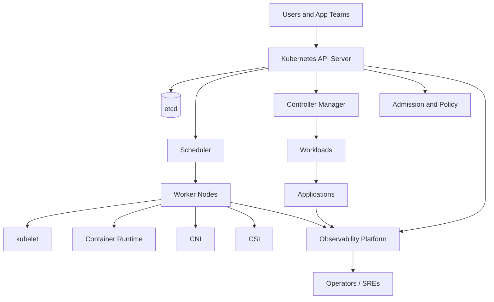
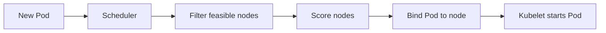
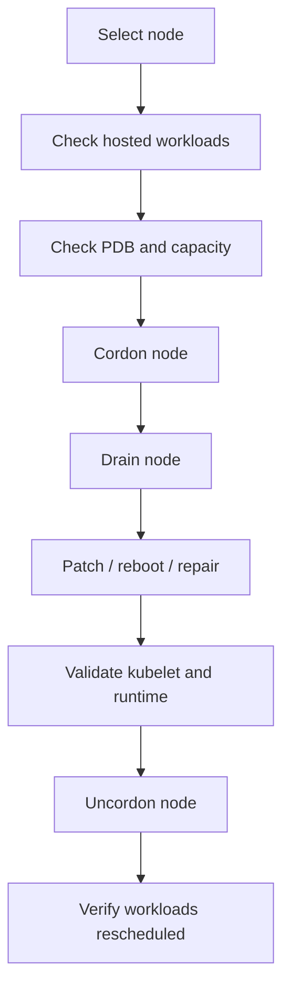
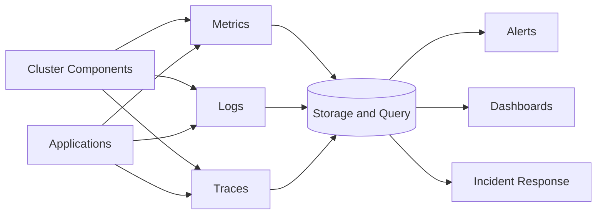
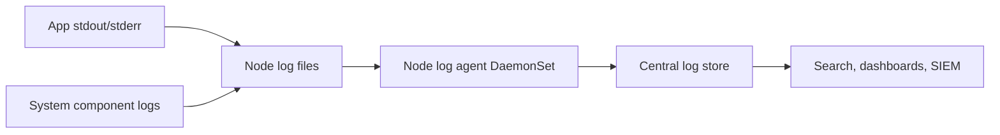
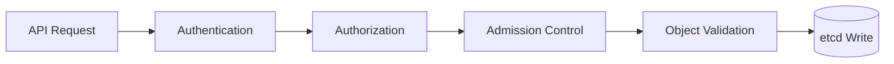
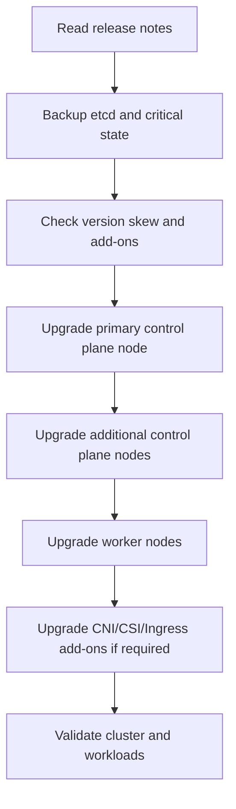
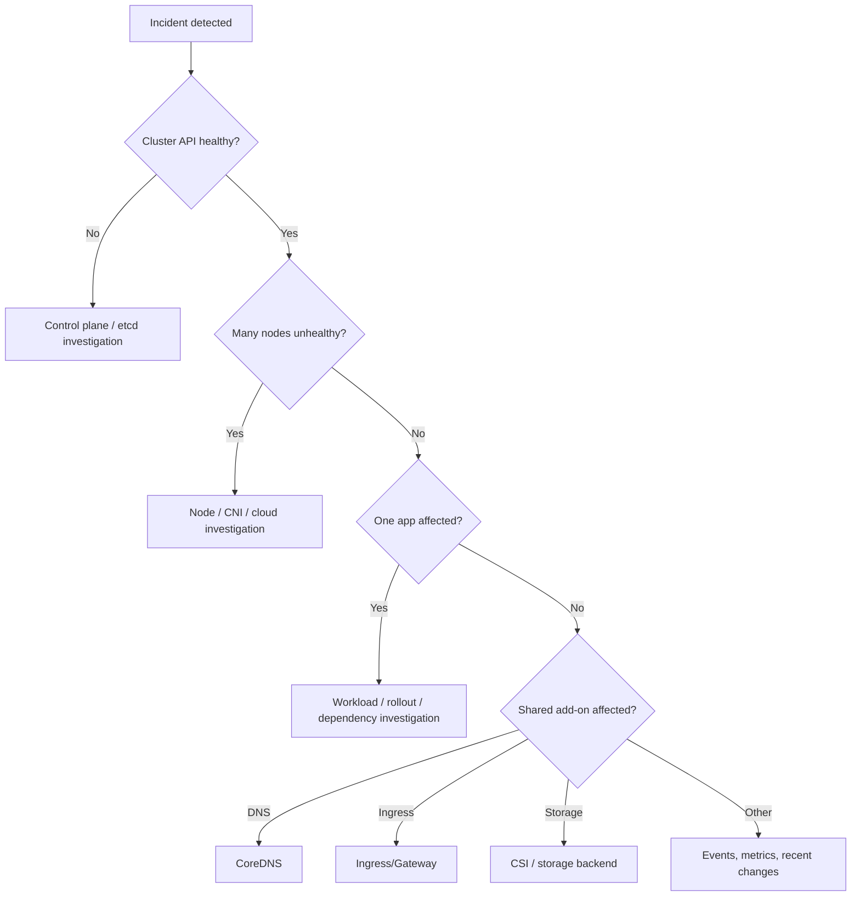

# Kubernetes Operations Study and Reference Guide

Last verified: 2026-09-01  
Audience: IT professionals, Kubernetes administrators, DevOps engineers, SREs, platform engineers, and production support teams

> This guide covers day-2 Kubernetes operations: cluster administration, workload operations, upgrades, backup and restore, observability, troubleshooting, reliability, security operations, scaling, and production practices. Exact commands can vary by Kubernetes distribution, cloud provider, CNI, CSI, ingress controller, and installation method.

---

## Table of Contents

1. [Kubernetes Operations at a Glance](#kubernetes-operations-at-a-glance)
2. [Operational Responsibility Model](#operational-responsibility-model)
3. [Cluster Architecture Review](#cluster-architecture-review)
4. [Daily Cluster Health Checks](#daily-cluster-health-checks)
5. [kubectl Operations Fundamentals](#kubectl-operations-fundamentals)
6. [Workload Operations](#workload-operations)
7. [Rollouts, Rollbacks, and Release Safety](#rollouts-rollbacks-and-release-safety)
8. [Probes and Application Health](#probes-and-application-health)
9. [Resource Management](#resource-management)
10. [Scheduling, Taints, Tolerations, and Affinity](#scheduling-taints-tolerations-and-affinity)
11. [Autoscaling](#autoscaling)
12. [Node Operations](#node-operations)
13. [Control Plane Operations](#control-plane-operations)
14. [etcd Operations, Backup, and Restore](#etcd-operations-backup-and-restore)
15. [Certificate and kubeconfig Operations](#certificate-and-kubeconfig-operations)
16. [Namespaces, Quotas, and Multi-Tenancy](#namespaces-quotas-and-multi-tenancy)
17. [Storage Operations](#storage-operations)
18. [Networking Operations](#networking-operations)
19. [Observability](#observability)
20. [Logging and Audit Logging](#logging-and-audit-logging)
21. [Security Operations](#security-operations)
22. [Upgrades and Version Management](#upgrades-and-version-management)
23. [Backup, Restore, and Disaster Recovery](#backup-restore-and-disaster-recovery)
24. [Incident Response Workflows](#incident-response-workflows)
25. [Common Failure Scenarios](#common-failure-scenarios)
26. [Production Best Practices](#production-best-practices)
27. [Command Reference](#command-reference)
28. [Operational Runbooks](#operational-runbooks)
29. [Interview Questions](#interview-questions)
30. [Reference Manifests](#reference-manifests)
31. [Official References](#official-references)

---

## Kubernetes Operations at a Glance

Kubernetes operations is the discipline of keeping clusters, workloads, and platform services healthy after installation. It includes:

- Monitoring cluster health.
- Managing workloads safely.
- Performing upgrades.
- Handling node maintenance.
- Backing up and restoring critical state.
- Managing certificates and access.
- Controlling resource usage.
- Operating storage and networking.
- Enforcing security controls.
- Responding to incidents.
- Improving reliability and cost efficiency.

High-level operating model:



---

## Operational Responsibility Model

Responsibilities differ depending on whether the cluster is self-managed, managed by a cloud provider, or provided by an internal platform team.

| Area | Self-Managed Cluster | Managed Kubernetes | Application Team |
|---|---|---|---|
| Control plane availability | Platform team | Cloud provider mostly | Consumes API |
| etcd backup | Platform team | Provider or platform team depending on service | Usually not responsible |
| Node OS patching | Platform team | Shared or provider-managed | Usually not responsible |
| CNI / CSI / ingress controllers | Platform team | Shared depending on add-on model | Consumes platform services |
| Workload manifests | Shared | Shared | Usually primary owner |
| Resource requests and limits | Shared | Shared | Primary owner |
| Autoscaling config | Shared | Shared | Primary owner |
| NetworkPolicy | Shared | Shared | App and platform teams |
| Secrets and RBAC | Shared | Shared | App and platform teams |
| Monitoring and alerts | Shared | Shared | Shared |

Always document ownership for:

- Cluster upgrades.
- Add-on upgrades.
- On-call response.
- Security patching.
- Backup validation.
- Disaster recovery testing.
- Public exposure approvals.
- Namespace onboarding and offboarding.

---

## Cluster Architecture Review

Before operating a cluster, know its architecture.

### Core Components

| Component | Role | Operational Concern |
|---|---|---|
| kube-apiserver | Front door to Kubernetes API | Availability, latency, authn/authz, admission, certificates |
| etcd | Stores cluster state | Backup, quorum, disk latency, encryption, compaction |
| kube-scheduler | Places Pods on nodes | Scheduling failures, constraints, resource requests |
| kube-controller-manager | Runs core controllers | Reconciliation health, leader election, controller errors |
| cloud-controller-manager | Integrates with cloud APIs | Load balancers, node addresses, routes, volumes |
| kubelet | Node agent | Pod lifecycle, probes, volume mounts, node status |
| container runtime | Runs containers | Image pulls, runtime health, logs |
| kube-proxy or replacement | Service routing | Service connectivity, rules/datapath health |
| CNI plugin | Pod networking and policy | Pod IP allocation, routing, policy |
| CSI drivers | Storage integration | Volume provisioning, attach, mount, snapshots |
| CoreDNS | Cluster DNS | Service discovery and DNS latency |

### Static Pod Control Plane

In many kubeadm clusters, control plane components run as static Pods. Their manifests are stored on the control plane node:

```text
/etc/kubernetes/manifests/
```

The kubelet watches this directory and restarts static Pods when manifests change.

### Managed Control Plane

In managed Kubernetes, control plane internals may not be directly visible. Operations focus more on:

- Kubernetes version.
- Node pools.
- Cluster add-ons.
- API availability and limits.
- Cloud IAM integration.
- Load balancer and storage integrations.
- Provider-specific maintenance windows.

---

## Daily Cluster Health Checks

A practical daily or shift-start check:

```bash
kubectl get nodes -o wide
kubectl get pods -A
kubectl get events -A --sort-by=.lastTimestamp
kubectl get componentstatuses
kubectl get --raw='/readyz?verbose'
kubectl get --raw='/livez?verbose'
```

Note: `componentstatuses` is deprecated in some contexts and may not work in modern clusters. Prefer `/readyz`, `/livez`, metrics, and component-specific checks.

### What Healthy Looks Like

- All expected nodes are `Ready`.
- Critical system Pods are running.
- CoreDNS has healthy replicas.
- CNI, CSI, kube-proxy, ingress, and monitoring DaemonSets are ready.
- No large wave of new warnings in events.
- No pending Pods caused by capacity or scheduling constraints.
- No CrashLoopBackOff in platform namespaces.
- API `/readyz` returns success.

### System Namespace Check

Common namespaces:

```bash
kubectl get pods -n kube-system
kubectl get pods -n ingress-nginx
kubectl get pods -n cert-manager
kubectl get pods -n monitoring
kubectl get pods -n logging
```

Your cluster may use different namespaces.

---

## kubectl Operations Fundamentals

### Context and Namespace Safety

Check current context:

```bash
kubectl config current-context
kubectl config get-contexts
```

Set namespace for a context:

```bash
kubectl config set-context --current --namespace=app
```

Avoid accidental production changes:

- Use clear context names.
- Prefer read-only access for investigation.
- Use `--dry-run=server -o yaml` before applying changes.
- Use GitOps or change review for production.
- Keep break-glass credentials controlled and audited.

### Explain Resources

```bash
kubectl explain deployment.spec.strategy
kubectl explain pod.spec.containers.resources
kubectl explain hpa.spec
```

### Get, Describe, Logs, Exec

Most operations start with:

```bash
kubectl get <resource>
kubectl describe <resource> <name>
kubectl logs <pod>
kubectl exec -it <pod> -- sh
```

Use `describe` for events, selected fields, and controller messages. Use logs for application and component output. Use `exec` only when necessary and permitted.

### Server-Side Dry Run

```bash
kubectl apply --dry-run=server -f manifest.yaml
```

This validates against the API server, admission webhooks, and schema as much as possible without persisting the object.

### Diff

```bash
kubectl diff -f manifest.yaml
```

This shows what would change before applying.

---

## Workload Operations

### Main Workload Controllers

| Controller | Purpose | Common Operations |
|---|---|---|
| Deployment | Stateless replicated apps | rollout, rollback, scale |
| ReplicaSet | Deployment-managed replica controller | usually inspect only |
| StatefulSet | Stateful apps with stable identity | ordered rollout, PVC handling |
| DaemonSet | One Pod per node or selected nodes | node agents |
| Job | Run-to-completion task | retry, inspect completions |
| CronJob | Scheduled Jobs | schedule, suspend, history |

### Deployment Operations

Inspect:

```bash
kubectl get deploy -n app
kubectl describe deploy -n app web
kubectl get rs -n app
kubectl get pods -n app -l app=web -o wide
```

Scale:

```bash
kubectl scale deploy -n app web --replicas=5
```

Restart:

```bash
kubectl rollout restart deploy -n app web
```

Watch rollout:

```bash
kubectl rollout status deploy -n app web
```

Rollback:

```bash
kubectl rollout history deploy -n app web
kubectl rollout undo deploy -n app web
```

### StatefulSet Operations

StatefulSets are sensitive because each Pod has stable identity and usually persistent storage.

Inspect:

```bash
kubectl get sts -n database
kubectl describe sts -n database postgres
kubectl get pod -n database -l app=postgres -o wide
kubectl get pvc -n database
```

Important considerations:

- Pod names are stable, such as `postgres-0`.
- PVCs are not automatically deleted when StatefulSet Pods are deleted.
- Rolling updates may proceed in ordinal order.
- Headless Services often provide stable DNS.
- Quorum-based systems need careful disruption budgets.

### DaemonSet Operations

DaemonSets are used for node-level agents such as CNI, log collectors, monitoring agents, and storage plugins.

```bash
kubectl get ds -A
kubectl describe ds -n kube-system <daemonset>
kubectl rollout status ds -n kube-system <daemonset>
```

Operational concern:

- A broken DaemonSet can affect every node.
- CNI and CSI DaemonSet failures can block new Pods or volume mounts.
- During node drains, DaemonSet Pods are normally ignored by `kubectl drain`.

### Jobs and CronJobs

```bash
kubectl get jobs -n batch
kubectl describe job -n batch report
kubectl logs -n batch job/report
kubectl get cronjobs -n batch
kubectl create job -n batch manual-run --from=cronjob/nightly-report
```

Check:

- `backoffLimit`.
- `activeDeadlineSeconds`.
- failed Pods.
- schedule timezone behavior if configured.
- concurrency policy.
- job history limits.

---

## Rollouts, Rollbacks, and Release Safety

### Deployment Strategy

Default Deployment strategy is rolling update.

Key fields:

```yaml
strategy:
  type: RollingUpdate
  rollingUpdate:
    maxSurge: 25%
    maxUnavailable: 25%
```

Meaning:

- `maxSurge`: extra Pods allowed above desired replicas.
- `maxUnavailable`: unavailable Pods allowed during rollout.

### Safe Rollout Checklist

Before release:

- Confirm image tag is immutable or digest-pinned.
- Confirm readiness probe is meaningful.
- Confirm resource requests are set.
- Confirm HPA behavior with new version.
- Confirm database migrations are backward compatible.
- Confirm PDB allows planned disruption.
- Confirm dashboards and alerts exist.

During release:

```bash
kubectl rollout status deploy -n app web
kubectl get pods -n app -l app=web -w
kubectl logs -n app deploy/web --follow
```

After release:

- Check error rate.
- Check latency.
- Check restarts.
- Check HPA events.
- Check ingress/gateway 5xx.
- Check application-specific metrics.

### Rollback Limits

`kubectl rollout undo` rolls back the Pod template to a previous ReplicaSet. It does not automatically:

- Roll back database migrations.
- Restore deleted data.
- Revert ConfigMap or Secret changes outside the Deployment history.
- Fix external dependency changes.

Use release engineering practices that handle full system rollback.

---

## Probes and Application Health

Kubernetes supports three main probe types:

| Probe | Purpose | Failure Action |
|---|---|---|
| Startup probe | Determines whether slow-starting app has started | Blocks liveness/readiness until success; restarts after failure threshold |
| Readiness probe | Determines whether app should receive traffic | Removes Pod from Service endpoints when failing |
| Liveness probe | Determines whether app is stuck and should restart | Restarts container when failing |

### Probe Types

| Type | Example Use |
|---|---|
| HTTP GET | Web app health endpoint |
| TCP socket | Basic port open check |
| exec | Run command inside container |
| gRPC | gRPC health check where supported |

Example:

```yaml
readinessProbe:
  httpGet:
    path: /ready
    port: 8080
  initialDelaySeconds: 5
  periodSeconds: 10
livenessProbe:
  httpGet:
    path: /live
    port: 8080
  initialDelaySeconds: 30
  periodSeconds: 10
startupProbe:
  httpGet:
    path: /startup
    port: 8080
  failureThreshold: 30
  periodSeconds: 10
```

### Probe Best Practices

- Readiness should fail when the app cannot serve traffic.
- Liveness should fail only when restart is the right recovery action.
- Startup probes should protect slow applications from premature liveness restarts.
- Avoid expensive probe endpoints.
- Avoid checking every downstream dependency in liveness probes.
- Make readiness reflect local serving ability and critical dependencies.
- Tune failure thresholds to avoid cascading restarts during load spikes.

Bad liveness probes can create outages by restarting overloaded but recoverable applications.

---

## Resource Management

### Requests and Limits

Requests affect scheduling. Limits affect runtime enforcement.

| Resource | Request | Limit |
|---|---|---|
| CPU | Scheduler reservation and relative weight under contention | Throttling ceiling |
| Memory | Scheduler reservation and eviction priority signal | OOM kill boundary |
| Ephemeral storage | Scheduler and eviction accounting | Local storage cap |

Example:

```yaml
resources:
  requests:
    cpu: "250m"
    memory: "256Mi"
  limits:
    cpu: "1000m"
    memory: "512Mi"
```

### CPU

- `1000m` equals one CPU.
- CPU limits cause throttling, not container termination.
- CPU requests help scheduling and fair sharing.
- Excessively low CPU limits can cause latency problems.

### Memory

- Memory limits can cause OOM kills.
- Memory requests influence scheduling and eviction behavior.
- If a limit is set without a request, Kubernetes may default the request to the limit unless admission policies change this.
- Be careful with suffixes: `400Mi` is memory; `400m` means 0.4 bytes.

### Quality of Service Classes

| QoS Class | Condition | Eviction Priority |
|---|---|---|
| Guaranteed | Every container has equal CPU and memory request/limit | Lowest eviction priority |
| Burstable | At least one request/limit set, not Guaranteed | Middle |
| BestEffort | No CPU or memory requests/limits | Highest eviction priority |

### ResourceQuota and LimitRange

ResourceQuota limits aggregate namespace usage:

```yaml
apiVersion: v1
kind: ResourceQuota
metadata:
  name: compute-quota
  namespace: app
spec:
  hard:
    requests.cpu: "20"
    requests.memory: 40Gi
    limits.cpu: "40"
    limits.memory: 80Gi
    pods: "100"
```

LimitRange sets defaults and per-object constraints:

```yaml
apiVersion: v1
kind: LimitRange
metadata:
  name: default-limits
  namespace: app
spec:
  limits:
    - type: Container
      defaultRequest:
        cpu: 100m
        memory: 128Mi
      default:
        cpu: 500m
        memory: 512Mi
```

### Resource Troubleshooting

```bash
kubectl top nodes
kubectl top pods -A
kubectl describe node <node>
kubectl describe pod -n app <pod>
kubectl get events -n app --sort-by=.lastTimestamp
```

Common messages:

- `Insufficient cpu`
- `Insufficient memory`
- `OOMKilled`
- `Evicted`
- `DiskPressure`
- `MemoryPressure`
- `CPU throttling` in metrics

---

## Scheduling, Taints, Tolerations, and Affinity

### Scheduling Flow



### Node Selector

Simple label selection:

```yaml
nodeSelector:
  workload: batch
```

### Node Affinity

More expressive scheduling:

```yaml
affinity:
  nodeAffinity:
    requiredDuringSchedulingIgnoredDuringExecution:
      nodeSelectorTerms:
        - matchExpressions:
            - key: nodepool
              operator: In
              values:
                - compute
```

### Pod Anti-Affinity

Spread replicas across nodes:

```yaml
affinity:
  podAntiAffinity:
    preferredDuringSchedulingIgnoredDuringExecution:
      - weight: 100
        podAffinityTerm:
          labelSelector:
            matchLabels:
              app: web
          topologyKey: kubernetes.io/hostname
```

### Topology Spread Constraints

Preferred for modern even distribution:

```yaml
topologySpreadConstraints:
  - maxSkew: 1
    topologyKey: topology.kubernetes.io/zone
    whenUnsatisfiable: DoNotSchedule
    labelSelector:
      matchLabels:
        app: web
```

### Taints and Tolerations

Taint a node:

```bash
kubectl taint nodes node1 dedicated=gpu:NoSchedule
```

Tolerate it:

```yaml
tolerations:
  - key: dedicated
    operator: Equal
    value: gpu
    effect: NoSchedule
```

Effects:

| Effect | Meaning |
|---|---|
| `NoSchedule` | Do not schedule Pods unless they tolerate |
| `PreferNoSchedule` | Avoid if possible |
| `NoExecute` | Evict existing Pods unless tolerated |

---

## Autoscaling

### Horizontal Pod Autoscaler

HPA scales workload replicas based on metrics.

Common metrics:

- CPU utilization.
- Memory utilization.
- Custom metrics.
- External metrics.

Example:

```yaml
apiVersion: autoscaling/v2
kind: HorizontalPodAutoscaler
metadata:
  name: web
  namespace: app
spec:
  scaleTargetRef:
    apiVersion: apps/v1
    kind: Deployment
    name: web
  minReplicas: 3
  maxReplicas: 20
  metrics:
    - type: Resource
      resource:
        name: cpu
        target:
          type: Utilization
          averageUtilization: 70
```

Inspect:

```bash
kubectl get hpa -A
kubectl describe hpa -n app web
kubectl top pods -n app
```

HPA requirements:

- Metrics pipeline, commonly metrics-server for resource metrics.
- Resource requests for CPU utilization calculations.
- Scalable target, such as Deployment or StatefulSet.

### Vertical Pod Autoscaler

VPA recommends or adjusts resource requests. It is often used for right-sizing workloads.

Operational caution:

- VPA may evict Pods when applying changes, depending on mode.
- HPA and VPA can conflict if both control CPU/memory in incompatible ways.

### Cluster Autoscaler and Node Autoscaling

Cluster autoscaling adjusts node count based on unschedulable Pods and node utilization.

Check:

- Pending Pods due to insufficient resources.
- Node group min/max.
- PodDisruptionBudgets blocking scale-down.
- Local storage restrictions.
- System Pods and DaemonSets.
- Cloud quota.

### Autoscaling Failure Patterns

| Symptom | Likely Cause |
|---|---|
| HPA shows unknown metrics | metrics-server or custom metrics issue |
| HPA never scales | missing resource requests or wrong metric |
| Pods pending after scale-up | node group constraints, taints, quota |
| Cluster autoscaler cannot scale down | PDB, local storage, non-evictable Pods |
| Thrashing | aggressive thresholds or short stabilization |

---

## Node Operations

### Node States

```bash
kubectl get nodes -o wide
kubectl describe node <node>
```

Common conditions:

- `Ready`
- `MemoryPressure`
- `DiskPressure`
- `PIDPressure`
- `NetworkUnavailable`

### Cordoning and Draining

Cordoning prevents new Pods from scheduling:

```bash
kubectl cordon <node>
```

Draining safely evicts Pods, respecting PodDisruptionBudgets:

```bash
kubectl drain <node> --ignore-daemonsets
```

Uncordon after maintenance:

```bash
kubectl uncordon <node>
```

Important:

- Drain one node at a time unless capacity and PDBs are designed for parallel drains.
- DaemonSet Pods are not drained in the usual way.
- Static Pods and mirror Pods require special handling.
- Pods with local data may block drain unless force options are used.
- Avoid force flags unless you understand the data and availability impact.

### Node Maintenance Workflow



### Kubelet and Runtime Checks

On a Linux node:

```bash
systemctl status kubelet
journalctl -u kubelet -n 200
systemctl status containerd
journalctl -u containerd -n 200
crictl ps
crictl images
```

### Node Pressure

Node pressure can cause evictions.

Check:

```bash
kubectl describe node <node>
kubectl get events --field-selector involvedObject.kind=Node
```

Common causes:

- Disk full under image storage or container logs.
- Memory exhaustion.
- Too many processes.
- CNI failure.
- Runtime failure.

---

## Control Plane Operations

### API Server Health

```bash
kubectl get --raw='/livez?verbose'
kubectl get --raw='/readyz?verbose'
kubectl get --raw='/version'
```

Watch for:

- High API latency.
- Authentication or authorization failures.
- Admission webhook timeouts.
- etcd latency.
- Request throttling.
- Certificate expiration.

### Controller Manager

Controller manager runs reconciliation loops for core resources.

Symptoms of trouble:

- Deployments not creating ReplicaSets.
- Nodes not updating status.
- EndpointSlices not updating.
- Jobs not progressing.
- ServiceAccount tokens or garbage collection issues.

### Scheduler

Scheduler problems appear as pending Pods.

```bash
kubectl describe pod -n app <pending-pod>
kubectl get events -n app --sort-by=.lastTimestamp
```

Common scheduling failures:

- Insufficient CPU or memory.
- Untolerated taints.
- Node affinity mismatch.
- PVC topology constraints.
- Quota exceeded.
- Pod topology spread constraints cannot be satisfied.

### Admission Webhooks

Admission webhooks can block cluster changes.

Failure symptoms:

- `kubectl apply` hangs or times out.
- Error mentions a validating or mutating webhook.
- New Pods cannot be created.
- Namespace deletion stuck.

Operational practices:

- Set reasonable `timeoutSeconds`.
- Use `failurePolicy` intentionally.
- Keep webhook backends highly available.
- Exclude system namespaces when appropriate.
- Monitor webhook latency and error rates.
- Test webhook compatibility before Kubernetes upgrades.

---

## etcd Operations, Backup, and Restore

etcd stores Kubernetes cluster state. Losing etcd without a valid backup can mean losing the cluster state.

### etcd Health

For kubeadm-style local etcd:

```bash
kubectl get pods -n kube-system -l component=etcd
kubectl logs -n kube-system etcd-<control-plane-node>
```

With etcdctl:

```bash
ETCDCTL_API=3 etcdctl endpoint health
ETCDCTL_API=3 etcdctl endpoint status --write-out=table
```

Certificate flags are usually required in production:

```bash
ETCDCTL_API=3 etcdctl \
  --endpoints=https://127.0.0.1:2379 \
  --cacert=/etc/kubernetes/pki/etcd/ca.crt \
  --cert=/etc/kubernetes/pki/etcd/server.crt \
  --key=/etc/kubernetes/pki/etcd/server.key \
  endpoint status --write-out=table
```

### Backup

Snapshot backup:

```bash
ETCDCTL_API=3 etcdctl \
  --endpoints=https://127.0.0.1:2379 \
  --cacert=/etc/kubernetes/pki/etcd/ca.crt \
  --cert=/etc/kubernetes/pki/etcd/server.crt \
  --key=/etc/kubernetes/pki/etcd/server.key \
  snapshot save /backup/etcd-snapshot.db
```

Verify snapshot:

```bash
ETCDCTL_API=3 etcdctl snapshot status /backup/etcd-snapshot.db --write-out=table
```

Backup best practices:

- Encrypt snapshots at rest.
- Store backups outside the cluster.
- Test restore regularly.
- Back up before upgrades.
- Protect etcd certificates and snapshot files as sensitive data.
- Monitor backup freshness.

### Restore

Modern etcd guidance recommends using `etcdutl` for snapshot restore in etcd 3.5+:

```bash
etcdutl --data-dir /var/lib/etcd-restore snapshot restore /backup/etcd-snapshot.db
```

For static Pod etcd, restore commonly requires:

1. Stop or isolate the affected control plane.
2. Restore snapshot to a new data directory.
3. Update `/etc/kubernetes/manifests/etcd.yaml` to use the restored data directory.
4. Restart kubelet or wait for static Pod reconciliation.
5. Validate etcd health.
6. Validate API server health.

Never improvise etcd restore during a major incident without a documented runbook unless there is no alternative.

### etcd Production Concerns

- Use an odd number of members.
- Avoid resource starvation.
- Monitor disk latency.
- Keep stable low-latency network between members.
- Watch database size.
- Run defragmentation where appropriate and documented.
- Keep etcd version compatibility aligned with Kubernetes support.

---

## Certificate and kubeconfig Operations

Kubernetes clusters use certificates for control plane, kubelet, etcd, and client authentication.

### Check kubeadm Certificates

```bash
kubeadm certs check-expiration
```

### Renew kubeadm Certificates

```bash
kubeadm certs renew all
```

After renewal:

- Restart control plane components if needed.
- Redistribute kubeconfigs if required.
- Verify API access.
- Verify kubelet connectivity.

### Common Certificate Symptoms

| Symptom | Possible Cause |
|---|---|
| kubectl cannot connect | client cert expired or wrong kubeconfig |
| kubelet node NotReady | kubelet client/server certificate issue |
| API server fails to start | serving certificate or etcd client cert issue |
| etcd TLS errors | wrong etcd cert, CA, or SAN |
| webhook TLS error | expired webhook serving cert or CA bundle mismatch |

### kubeconfig Hygiene

- Store admin kubeconfigs securely.
- Avoid sharing cluster-admin kubeconfigs.
- Rotate credentials.
- Use short-lived credentials where possible.
- Separate human and automation identities.
- Audit kubeconfig distribution.

---

## Namespaces, Quotas, and Multi-Tenancy

Namespaces provide object scoping. They are not a strong security boundary by themselves.

### Namespace Onboarding Checklist

- Create namespace.
- Apply labels.
- Apply ResourceQuota.
- Apply LimitRange.
- Apply default NetworkPolicy.
- Bind RBAC roles.
- Configure image pull secrets if needed.
- Configure allowed ingress/gateway classes.
- Configure monitoring and log routing.
- Document owners and escalation path.

### Namespace Labels

```bash
kubectl label namespace payments team=payments environment=prod
```

### Quotas

Use ResourceQuota to prevent one team from exhausting cluster resources.

```bash
kubectl describe quota -n payments
```

Quota failures often appear as forbidden errors during object creation.

### Multi-Tenancy Controls

- RBAC per namespace.
- ResourceQuota and LimitRange.
- NetworkPolicy.
- Pod Security Admission.
- Separate node pools for sensitive workloads.
- Admission policies for image registries and resource requirements.
- Separate clusters for hard isolation requirements.

---

## Storage Operations

### Storage Objects

| Object | Purpose |
|---|---|
| PersistentVolumeClaim | User request for storage |
| PersistentVolume | Actual storage resource |
| StorageClass | Dynamic provisioning policy |
| VolumeSnapshot | Snapshot request where CSI supports it |
| CSI driver | Storage plugin implementation |

### Common Commands

```bash
kubectl get storageclass
kubectl get pvc -A
kubectl get pv
kubectl describe pvc -n app data
kubectl describe pv <pv>
kubectl get csidrivers
kubectl get volumeattachments
```

### PVC Pending

Causes:

- No default StorageClass.
- Wrong `storageClassName`.
- Provisioner not running.
- Cloud quota exhausted.
- Topology constraints.
- Access mode unsupported.

### Volume Mount Failure

Check:

```bash
kubectl describe pod -n app <pod>
kubectl get events -n app --sort-by=.lastTimestamp
kubectl logs -n kube-system ds/<csi-node-daemonset>
kubectl logs -n kube-system deploy/<csi-controller>
```

Common causes:

- CSI node plugin down.
- Attach/detach failure.
- Filesystem corruption.
- Secret missing.
- Node cannot reach storage backend.
- Multi-attach conflict with ReadWriteOnce volumes.

### Storage Best Practices

- Understand reclaim policies: `Delete` versus `Retain`.
- Use snapshots for supported workloads, but test restore.
- Do not assume filesystem consistency without application-aware backups.
- Use separate StorageClasses for different performance and retention needs.
- Monitor PVC usage from inside the workload or with storage metrics.

---

## Networking Operations

This guide only summarizes operations. For a deep networking reference, use the Kubernetes Networking guide.

### Key Components

- CNI plugin.
- kube-proxy or replacement.
- CoreDNS.
- Services and EndpointSlices.
- Ingress or Gateway API controller.
- Cloud load balancer controller.
- NetworkPolicy engine.

### Useful Checks

```bash
kubectl get pods -n kube-system -o wide
kubectl get svc -A -o wide
kubectl get endpointslice -A
kubectl get ingress -A
kubectl get gateway -A
kubectl get netpol -A
```

### DNS

```bash
kubectl logs -n kube-system deploy/coredns
kubectl exec -n app deploy/web -- nslookup kubernetes.default
```

### Service Connectivity

```bash
kubectl describe svc -n app api
kubectl get endpointslice -n app -l kubernetes.io/service-name=api
kubectl exec -n app deploy/web -- curl -v http://api:8080/
```

### Ingress and Gateway

```bash
kubectl describe ingress -n app web
kubectl describe gateway -n infra public
kubectl describe httproute -n app web
```

---

## Observability

Kubernetes observability relies on metrics, logs, and traces.



### Metrics

Common stack:

- metrics-server for resource metrics.
- Prometheus or compatible collector.
- kube-state-metrics.
- node-exporter.
- cAdvisor/kubelet metrics.
- Controller-specific metrics.
- Grafana or equivalent dashboards.

Essential alerts:

- Node NotReady.
- API server high latency or error rate.
- etcd leader changes, high fsync latency, no leader.
- CoreDNS high error rate or latency.
- Pods CrashLoopBackOff.
- Pending Pods.
- PVC almost full.
- Ingress/Gateway high 5xx.
- Certificate expiration.
- CNI or CSI DaemonSet unavailable.
- Kubelet down.

### Logs

Cluster-level logging needs a backend outside individual nodes because Pods and nodes are ephemeral.

Common pattern:



### Traces

Traces are valuable for:

- Microservice latency analysis.
- Request path debugging.
- Ingress to backend timing.
- Control plane request tracing where enabled.

OpenTelemetry is a common collection standard.

---

## Logging and Audit Logging

### Application Logs

Kubernetes captures container stdout and stderr. Access:

```bash
kubectl logs -n app pod/web-abc
kubectl logs -n app deploy/web
kubectl logs -n app pod/web-abc -c sidecar
kubectl logs -n app pod/web-abc --previous
```

Kubelet rotates container logs. Defaults are commonly around `containerLogMaxSize` and `containerLogMaxFiles`, but verify your kubelet configuration.

### System Logs

For components running as containers:

```bash
kubectl logs -n kube-system pod/<component-pod>
```

For kubelet and container runtime on systemd nodes:

```bash
journalctl -u kubelet
journalctl -u containerd
```

### Audit Logs

Audit logs record API activity by users, applications, and control plane components.

Use audit logs to answer:

- Who deleted this object?
- Who changed this role binding?
- What service account created these Pods?
- Which webhook denied this request?
- Was there suspicious API access?

Audit log operations:

- Define an audit policy.
- Store logs securely.
- Forward to SIEM or log backend.
- Protect against tampering.
- Tune policy to balance security and volume.

---

## Security Operations

### API Access Flow



### RBAC Checks

```bash
kubectl auth can-i create pods -n app
kubectl auth can-i '*' '*' --all-namespaces
kubectl get rolebinding,clusterrolebinding -A
kubectl describe clusterrolebinding <name>
```

Best practices:

- Least privilege.
- Avoid broad `cluster-admin`.
- Separate human and workload identities.
- Review ClusterRoleBindings regularly.
- Avoid binding default service accounts to powerful roles.

### Pod Security

Use Pod Security Admission labels:

```bash
kubectl label namespace app pod-security.kubernetes.io/enforce=restricted
kubectl label namespace app pod-security.kubernetes.io/audit=restricted
kubectl label namespace app pod-security.kubernetes.io/warn=restricted
```

Common workload hardening:

```yaml
securityContext:
  runAsNonRoot: true
  seccompProfile:
    type: RuntimeDefault
containers:
  - name: app
    securityContext:
      allowPrivilegeEscalation: false
      readOnlyRootFilesystem: true
      capabilities:
        drop:
          - ALL
```

### Secrets

Operational rules:

- Enable encryption at rest for Secrets where supported.
- Do not store Secrets in plain Git.
- Rotate Secrets.
- Scope Secret access with RBAC.
- Prefer external secret managers where appropriate.
- Avoid exposing Secrets through environment dumps, logs, or debug endpoints.

### Image Security

- Use trusted registries.
- Pin images by digest for high-control environments.
- Scan images.
- Block privileged and unsafe workloads through admission.
- Avoid `latest` tags in production.
- Keep base images patched.

### Network Security

- Use default-deny NetworkPolicy for sensitive namespaces.
- Restrict egress.
- Protect cloud metadata endpoints.
- Separate public and private ingress.
- Use TLS for external traffic.

---

## Upgrades and Version Management

Kubernetes upgrades require planning across control plane, nodes, add-ons, APIs, and workloads.

### Version Skew

Always check Kubernetes version skew policy for your target version. In general:

- Upgrade one minor version at a time.
- Keep kubelet versions within supported skew from the API server.
- Upgrade control plane before workers in typical kubeadm workflows.
- Upgrade add-ons with compatibility in mind.

### kubeadm Upgrade Flow

High-level kubeadm flow:



Typical sequence:

1. Read release notes.
2. Check deprecated and removed APIs.
3. Back up etcd and critical manifests.
4. Upgrade `kubeadm`.
5. Run `kubeadm upgrade plan`.
6. Upgrade first control plane.
7. Upgrade additional control plane nodes.
8. Drain and upgrade worker nodes.
9. Upgrade kubelet and kubectl.
10. Validate cluster and workloads.

Kubernetes does not support skipping minor versions in kubeadm upgrades.

### Upgrade Checklist

Before:

- Confirm backups.
- Confirm restore procedure.
- Confirm maintenance window.
- Confirm capacity for node drains.
- Confirm PDBs.
- Confirm CNI, CSI, ingress, cert-manager, and monitoring compatibility.
- Check deprecated APIs.
- Freeze risky application deployments.

During:

- Upgrade one control plane first.
- Watch API health.
- Drain workers in controlled batches.
- Respect PDBs.
- Monitor platform alerts.

After:

- Validate nodes Ready.
- Validate system Pods.
- Validate DNS, Service routing, ingress/gateway, storage provisioning.
- Validate autoscaling.
- Validate critical applications.
- Clean temporary backup directories where appropriate.

---

## Backup, Restore, and Disaster Recovery

### What to Back Up

| Item | Why |
|---|---|
| etcd | Kubernetes cluster state |
| Persistent data | Application state |
| Kubernetes manifests | Desired state and rebuild capability |
| Secrets | Required for app recovery, must be protected |
| Certificates and CA material | Cluster identity and trust |
| Ingress/Gateway DNS and LB config | External access |
| Storage snapshots | Volume recovery |
| GitOps repositories | Source of truth |

### Backup Strategy

- Use etcd snapshots for cluster state.
- Use application-aware backups for databases.
- Use CSI snapshots only when consistency requirements are understood.
- Store backups outside the cluster and region where required.
- Encrypt backups.
- Test restore.
- Define RPO and RTO.

### Restore Strategy

Types:

| Restore Type | Example |
|---|---|
| Object restore | Recover deleted Deployment or ConfigMap |
| Namespace restore | Recover one tenant namespace |
| Volume restore | Restore PVC from snapshot or backup |
| Cluster state restore | Restore etcd |
| Full rebuild | Recreate cluster from GitOps and backups |

Important:

- Restoring etcd rolls cluster state back in time.
- Workloads may not match external systems after etcd restore.
- Cloud load balancers, volumes, and DNS may need reconciliation.
- Application data restore is often more important than Kubernetes object restore.

---

## Incident Response Workflows

### First Five Minutes

1. Identify user impact.
2. Determine scope: one app, namespace, node pool, whole cluster, region.
3. Check recent changes.
4. Check cluster health.
5. Stabilize before optimizing.

Quick commands:

```bash
kubectl get nodes
kubectl get pods -A | grep -E 'Pending|CrashLoopBackOff|ImagePullBackOff|Error|Evicted'
kubectl get events -A --sort-by=.lastTimestamp | tail -50
kubectl get --raw='/readyz?verbose'
```

### Recent Change Investigation

Check:

- GitOps sync history.
- Deployment rollout history.
- Admission policy changes.
- CNI/CSI/ingress upgrades.
- Node pool changes.
- Cloud provider incidents.
- Certificate rotations.
- Secret or ConfigMap updates.

### Decision Tree



### Communication

During incidents, communicate:

- Impact.
- Start time.
- Current status.
- Suspected cause.
- Mitigation underway.
- Next update time.

After incidents:

- Write a post-incident review.
- Capture timeline.
- Identify detection gaps.
- Add or improve runbooks.
- Fix root causes and contributing factors.

---

## Common Failure Scenarios

### Pods Pending

Common causes:

- Insufficient CPU or memory.
- Untolerated taints.
- Node affinity mismatch.
- PVC not bound.
- ResourceQuota exceeded.
- Image pull secret missing is usually after scheduling, not pending forever.

Commands:

```bash
kubectl describe pod -n app <pod>
kubectl get events -n app --sort-by=.lastTimestamp
kubectl describe node <node>
```

### CrashLoopBackOff

Common causes:

- App exits.
- Bad command or args.
- Missing config.
- Failed dependency.
- Liveness probe kills app.
- Permission or filesystem issue.

Commands:

```bash
kubectl logs -n app <pod>
kubectl logs -n app <pod> --previous
kubectl describe pod -n app <pod>
```

### ImagePullBackOff

Common causes:

- Wrong image name or tag.
- Registry unavailable.
- Missing imagePullSecret.
- Authentication failure.
- Rate limiting.
- Node cannot reach registry.

Commands:

```bash
kubectl describe pod -n app <pod>
kubectl get secret -n app
```

### OOMKilled

Common causes:

- Memory leak.
- Limit too low.
- Traffic spike.
- In-memory cache growth.
- Memory-backed `emptyDir`.

Commands:

```bash
kubectl describe pod -n app <pod>
kubectl top pod -n app
```

### Evicted Pods

Common causes:

- Node memory pressure.
- Disk pressure.
- PID pressure.
- Ephemeral storage overuse.

Commands:

```bash
kubectl describe pod -n app <pod>
kubectl describe node <node>
```

### Node NotReady

Common causes:

- kubelet down.
- container runtime down.
- node network broken.
- cloud VM stopped.
- disk full.
- certificate issue.

Commands:

```bash
kubectl describe node <node>
journalctl -u kubelet -n 200
systemctl status kubelet
systemctl status containerd
```

### Namespace Stuck Terminating

Common causes:

- Finalizers.
- APIService unavailable.
- Webhook issues.
- CRD controller not cleaning resources.

Commands:

```bash
kubectl get namespace <namespace> -o yaml
kubectl api-resources --verbs=list --namespaced -o name
kubectl get apiservice
```

### API Server Slow or Unavailable

Common causes:

- etcd latency.
- overloaded API server.
- failing admission webhook.
- network issue.
- certificate issue.
- cloud control plane issue.

Commands:

```bash
kubectl get --raw='/readyz?verbose'
kubectl get --raw='/metrics'
kubectl get events -A --sort-by=.lastTimestamp
```

---

## Production Best Practices

### Reliability

- Run multiple replicas for critical workloads.
- Use PodDisruptionBudgets.
- Spread workloads across nodes and zones.
- Set meaningful readiness probes.
- Avoid liveness probes that restart during normal overload.
- Define resource requests for all production workloads.
- Use HPA where workload demand varies.
- Keep spare cluster capacity for disruption and scaling.

### Operability

- Use GitOps or controlled release pipelines.
- Keep cluster add-ons versioned.
- Document runbooks.
- Monitor platform and application health.
- Keep debug tooling available.
- Practice restore procedures.
- Use standard labels and annotations.
- Define ownership metadata for namespaces and apps.

### Security

- Enforce least privilege RBAC.
- Use Pod Security Admission.
- Enable audit logging.
- Encrypt Secrets at rest where supported.
- Control image sources.
- Apply NetworkPolicy for sensitive apps.
- Rotate credentials.
- Limit public exposure.

### Cost and Capacity

- Right-size requests.
- Watch idle node pools.
- Use autoscaling with guardrails.
- Separate workload classes into node pools when useful.
- Track namespace cost allocation with labels.
- Clean unused PVCs, snapshots, Services, and load balancers.

### Change Management

- Read release notes.
- Test in lower environments.
- Use canaries for risky platform changes.
- Upgrade add-ons intentionally.
- Maintain rollback plans.
- Keep configuration in version control.

---

## Command Reference

### Cluster

```bash
kubectl cluster-info
kubectl version
kubectl get --raw='/readyz?verbose'
kubectl get --raw='/livez?verbose'
kubectl api-resources
kubectl api-versions
```

### Nodes

```bash
kubectl get nodes -o wide
kubectl describe node <node>
kubectl cordon <node>
kubectl drain <node> --ignore-daemonsets
kubectl uncordon <node>
kubectl top nodes
```

### Pods

```bash
kubectl get pods -A -o wide
kubectl describe pod -n <namespace> <pod>
kubectl logs -n <namespace> <pod>
kubectl logs -n <namespace> <pod> --previous
kubectl exec -it -n <namespace> <pod> -- sh
kubectl top pods -A
```

### Workloads

```bash
kubectl get deploy,sts,ds,job,cronjob -A
kubectl rollout status deploy -n <namespace> <name>
kubectl rollout history deploy -n <namespace> <name>
kubectl rollout undo deploy -n <namespace> <name>
kubectl scale deploy -n <namespace> <name> --replicas=<count>
```

### Events

```bash
kubectl get events -A --sort-by=.lastTimestamp
kubectl get events -n <namespace> --sort-by=.lastTimestamp
```

### Resources

```bash
kubectl get quota -A
kubectl describe quota -n <namespace>
kubectl get limitrange -A
kubectl top pods -n <namespace>
```

### RBAC

```bash
kubectl auth can-i get pods -n <namespace>
kubectl auth can-i create deployments -n <namespace> --as=<user>
kubectl get role,rolebinding -n <namespace>
kubectl get clusterrole,clusterrolebinding
```

### Storage

```bash
kubectl get storageclass
kubectl get pvc -A
kubectl get pv
kubectl describe pvc -n <namespace> <pvc>
kubectl get volumeattachments
```

### Networking

```bash
kubectl get svc -A -o wide
kubectl get endpointslice -A
kubectl get ingress -A
kubectl get gateway -A
kubectl get httproute -A
kubectl get netpol -A
```

---

## Operational Runbooks

### Runbook: Drain a Node

Pre-check:

```bash
kubectl describe node <node>
kubectl get pods -A -o wide --field-selector spec.nodeName=<node>
kubectl get pdb -A
```

Procedure:

```bash
kubectl cordon <node>
kubectl drain <node> --ignore-daemonsets
```

Perform maintenance, then:

```bash
kubectl uncordon <node>
kubectl get nodes
kubectl get pods -A -o wide --field-selector spec.nodeName=<node>
```

Rollback:

- If drain blocks, inspect PDBs and stuck Pods.
- If maintenance is cancelled, uncordon the node.

### Runbook: Application Rollback

```bash
kubectl rollout history deploy -n app web
kubectl rollout undo deploy -n app web
kubectl rollout status deploy -n app web
```

Then validate:

```bash
kubectl get pods -n app -l app=web
kubectl logs -n app deploy/web --tail=100
```

Also check application dashboards and dependency state.

### Runbook: etcd Snapshot

```bash
ETCDCTL_API=3 etcdctl \
  --endpoints=https://127.0.0.1:2379 \
  --cacert=/etc/kubernetes/pki/etcd/ca.crt \
  --cert=/etc/kubernetes/pki/etcd/server.crt \
  --key=/etc/kubernetes/pki/etcd/server.key \
  snapshot save /backup/etcd-snapshot-$(date +%F-%H%M%S).db
```

Verify:

```bash
ETCDCTL_API=3 etcdctl snapshot status /backup/etcd-snapshot.db --write-out=table
```

### Runbook: DNS Incident

```bash
kubectl get deploy -n kube-system coredns
kubectl get pods -n kube-system -l k8s-app=kube-dns -o wide
kubectl logs -n kube-system deploy/coredns
kubectl get svc -n kube-system kube-dns
kubectl get endpointslice -n kube-system -l kubernetes.io/service-name=kube-dns
kubectl exec -n app deploy/web -- nslookup kubernetes.default
```

Check NetworkPolicies if application namespaces cannot reach DNS.

### Runbook: Pending Pods

```bash
kubectl get pods -A | grep Pending
kubectl describe pod -n <namespace> <pod>
kubectl get events -n <namespace> --sort-by=.lastTimestamp
kubectl describe quota -n <namespace>
kubectl get nodes
```

Resolve based on scheduler message:

- Add capacity.
- Adjust requests.
- Fix affinity.
- Add toleration.
- Fix PVC.
- Increase quota.

---

## Interview Questions

### Cluster Operations

1. What checks do you perform to confirm a Kubernetes cluster is healthy?
2. What is the role of each control plane component?
3. How do you troubleshoot a slow Kubernetes API server?
4. What is the difference between `/livez` and `/readyz`?
5. How do you identify recent cluster-wide failures?

### Workloads

1. How do you roll back a Deployment?
2. What is the difference between Deployment and StatefulSet operations?
3. Why can a DaemonSet affect every node?
4. How do you debug CrashLoopBackOff?
5. What does ImagePullBackOff usually mean?

### Probes

1. Explain startup, readiness, and liveness probes.
2. Why can bad liveness probes cause outages?
3. What happens when a readiness probe fails?
4. What should a health endpoint check?
5. How do probes interact with rolling updates?

### Resources and Scheduling

1. What is the difference between resource requests and limits?
2. How does Kubernetes schedule Pods based on requests?
3. What causes OOMKilled?
4. Explain Guaranteed, Burstable, and BestEffort QoS.
5. How do taints and tolerations work?
6. When would you use topology spread constraints?

### Autoscaling

1. How does HPA work?
2. Why does HPA need metrics?
3. Why might HPA fail to scale?
4. What can block cluster autoscaler scale-down?
5. How can HPA and VPA conflict?

### Nodes

1. How do you safely drain a node?
2. What does cordon do?
3. Why do DaemonSet Pods remain during drain?
4. What are common causes of Node NotReady?
5. How do you investigate DiskPressure?

### etcd and Backup

1. Why is etcd critical?
2. How do you take an etcd snapshot?
3. Why should etcd backups be encrypted?
4. What is quorum and why use an odd number of members?
5. What are the risks of restoring etcd from an old snapshot?

### Security Operations

1. Explain Kubernetes authentication, authorization, and admission.
2. How do you check whether a user can perform an action?
3. What is Pod Security Admission?
4. How should Secrets be protected?
5. What should be included in audit logging?

### Upgrades

1. What is the safe order for kubeadm cluster upgrades?
2. Why should you not skip Kubernetes minor versions?
3. What do you check before upgrading a cluster?
4. How do PodDisruptionBudgets affect node upgrades?
5. What add-ons must be checked before a Kubernetes upgrade?

### Troubleshooting

1. A Pod is Pending. What is your workflow?
2. A Pod is Running but not receiving traffic. What do you check?
3. A namespace is stuck Terminating. What could cause it?
4. A PVC is Pending. What do you check?
5. Ingress returns 503. What does that usually suggest?
6. DNS fails from one namespace only. What do you inspect?

---

## Reference Manifests

### PodDisruptionBudget

```yaml
apiVersion: policy/v1
kind: PodDisruptionBudget
metadata:
  name: web
  namespace: app
spec:
  minAvailable: 2
  unhealthyPodEvictionPolicy: AlwaysAllow
  selector:
    matchLabels:
      app: web
```

### Deployment With Operational Defaults

```yaml
apiVersion: apps/v1
kind: Deployment
metadata:
  name: web
  namespace: app
  labels:
    app: web
    owner: platform-example
spec:
  replicas: 3
  revisionHistoryLimit: 5
  strategy:
    type: RollingUpdate
    rollingUpdate:
      maxSurge: 1
      maxUnavailable: 0
  selector:
    matchLabels:
      app: web
  template:
    metadata:
      labels:
        app: web
    spec:
      terminationGracePeriodSeconds: 30
      containers:
        - name: web
          image: nginx:1.27
          ports:
            - name: http
              containerPort: 80
          resources:
            requests:
              cpu: 100m
              memory: 128Mi
            limits:
              cpu: 500m
              memory: 512Mi
          readinessProbe:
            httpGet:
              path: /
              port: http
            periodSeconds: 10
          livenessProbe:
            httpGet:
              path: /
              port: http
            initialDelaySeconds: 30
            periodSeconds: 10
          securityContext:
            allowPrivilegeEscalation: false
            capabilities:
              drop:
                - ALL
```

### HorizontalPodAutoscaler

```yaml
apiVersion: autoscaling/v2
kind: HorizontalPodAutoscaler
metadata:
  name: web
  namespace: app
spec:
  scaleTargetRef:
    apiVersion: apps/v1
    kind: Deployment
    name: web
  minReplicas: 3
  maxReplicas: 20
  metrics:
    - type: Resource
      resource:
        name: cpu
        target:
          type: Utilization
          averageUtilization: 70
```

### ResourceQuota and LimitRange

```yaml
apiVersion: v1
kind: ResourceQuota
metadata:
  name: namespace-quota
  namespace: app
spec:
  hard:
    requests.cpu: "10"
    requests.memory: 20Gi
    limits.cpu: "20"
    limits.memory: 40Gi
    pods: "50"
---
apiVersion: v1
kind: LimitRange
metadata:
  name: defaults
  namespace: app
spec:
  limits:
    - type: Container
      defaultRequest:
        cpu: 100m
        memory: 128Mi
      default:
        cpu: 500m
        memory: 512Mi
```

### Restricted Namespace Labels

```yaml
apiVersion: v1
kind: Namespace
metadata:
  name: app
  labels:
    pod-security.kubernetes.io/enforce: restricted
    pod-security.kubernetes.io/audit: restricted
    pod-security.kubernetes.io/warn: restricted
```

---

## Official References

These references were used to verify current Kubernetes operations behavior:

- Kubernetes administration with kubeadm: <https://kubernetes.io/docs/tasks/administer-cluster/kubeadm/>
- kubeadm upgrade: <https://kubernetes.io/docs/tasks/administer-cluster/kubeadm/kubeadm-upgrade/>
- kubeadm certificates: <https://kubernetes.io/docs/reference/setup-tools/kubeadm/kubeadm-certs/>
- Reconfiguring kubeadm clusters: <https://kubernetes.io/docs/tasks/administer-cluster/kubeadm/kubeadm-reconfigure/>
- Operating etcd clusters for Kubernetes: <https://kubernetes.io/docs/tasks/administer-cluster/configure-upgrade-etcd/>
- Safely drain a node: <https://kubernetes.io/docs/tasks/administer-cluster/safely-drain-node/>
- Kubernetes observability: <https://kubernetes.io/docs/concepts/cluster-administration/observability/>
- Kubernetes logging architecture: <https://kubernetes.io/docs/concepts/cluster-administration/logging/>
- Kubernetes system logs: <https://kubernetes.io/docs/concepts/cluster-administration/system-logs/>
- Kubernetes probes: <https://kubernetes.io/docs/concepts/workloads/pods/probes/>
- Kubernetes resource management: <https://kubernetes.io/docs/concepts/configuration/manage-resources-containers/>
- Kubernetes disruptions and PDBs: <https://kubernetes.io/docs/concepts/workloads/pods/disruptions/>
- Kubernetes PodDisruptionBudget API: <https://kubernetes.io/docs/reference/kubernetes-api/policy/pod-disruption-budget-v1/>
- Horizontal Pod Autoscaling: <https://kubernetes.io/docs/concepts/workloads/autoscaling/horizontal-pod-autoscale/>
- Kubernetes debugging tasks: <https://kubernetes.io/docs/tasks/debug/>
- Kubernetes security concepts: <https://kubernetes.io/docs/concepts/security/>
- Controlling access to the Kubernetes API: <https://kubernetes.io/docs/concepts/security/controlling-access/>
