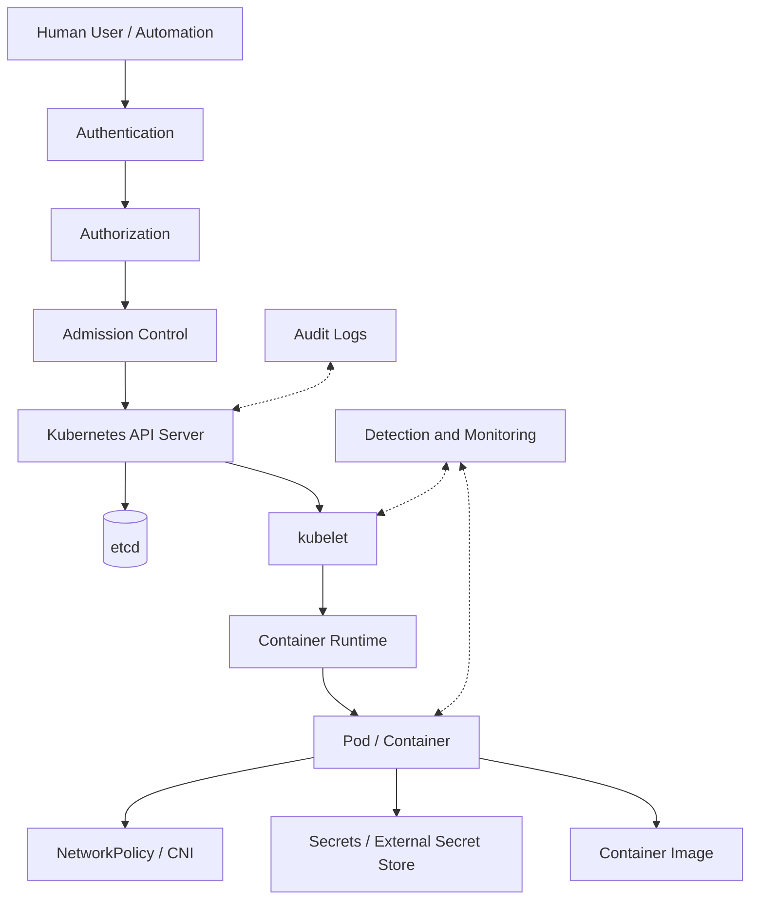
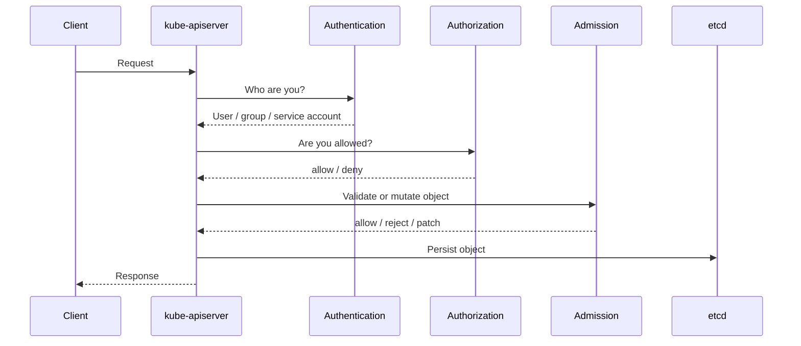
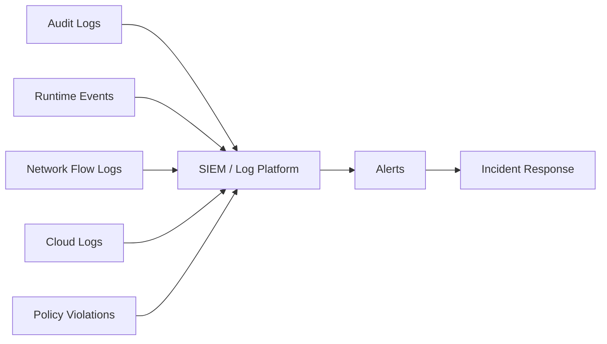

# Kubernetes Security Study and Reference Guide

Last verified: 2026-09-01  
Audience: IT professionals, Kubernetes administrators, DevOps engineers, SREs, platform engineers, security engineers, and CKS candidates

> This guide covers Kubernetes security from fundamentals through production hardening: API access, RBAC, service accounts, Pod Security Admission, workload hardening, Secrets, admission control, network security, supply chain security, audit logging, runtime security, multi-tenancy, incident response, and interview questions. Exact implementation details vary by Kubernetes distribution, cloud provider, CNI, CSI, ingress controller, identity provider, and security tooling.

---

## Table of Contents

1. [Kubernetes Security at a Glance](#kubernetes-security-at-a-glance)
2. [Threat Model and Shared Responsibility](#threat-model-and-shared-responsibility)
3. [Security Architecture](#security-architecture)
4. [API Server Security](#api-server-security)
5. [Authentication](#authentication)
6. [Authorization and RBAC](#authorization-and-rbac)
7. [Service Accounts and Workload Identity](#service-accounts-and-workload-identity)
8. [Admission Control](#admission-control)
9. [Pod Security Admission and Standards](#pod-security-admission-and-standards)
10. [Workload Hardening](#workload-hardening)
11. [Secrets and Confidential Data](#secrets-and-confidential-data)
12. [Encryption at Rest](#encryption-at-rest)
13. [Network Security](#network-security)
14. [Image and Supply Chain Security](#image-and-supply-chain-security)
15. [Node and Runtime Security](#node-and-runtime-security)
16. [Control Plane and etcd Security](#control-plane-and-etcd-security)
17. [Audit Logging](#audit-logging)
18. [Multi-Tenancy and Namespace Isolation](#multi-tenancy-and-namespace-isolation)
19. [Policy as Code](#policy-as-code)
20. [Ingress, Gateway, and Edge Security](#ingress-gateway-and-edge-security)
21. [Cloud Provider Security](#cloud-provider-security)
22. [Vulnerability Management](#vulnerability-management)
23. [Security Monitoring and Detection](#security-monitoring-and-detection)
24. [Incident Response](#incident-response)
25. [Security Troubleshooting Workflows](#security-troubleshooting-workflows)
26. [Common Security Misconfigurations](#common-security-misconfigurations)
27. [Production Security Best Practices](#production-security-best-practices)
28. [Command Reference](#command-reference)
29. [Security Runbooks](#security-runbooks)
30. [Interview Questions](#interview-questions)
31. [Reference Manifests](#reference-manifests)
32. [Official References](#official-references)

---

## Kubernetes Security at a Glance

Kubernetes security is not one feature. It is a layered operating model across identity, API access, workload isolation, network controls, node hardening, data protection, supply chain controls, monitoring, and incident response.



Security goals:

- Prevent unauthorized access to the Kubernetes API.
- Minimize privileges for users, automation, and workloads.
- Prevent unsafe Pods from running.
- Restrict network movement.
- Protect Secrets and sensitive data.
- Protect nodes and the container runtime.
- Reduce supply chain risk.
- Detect suspicious behavior.
- Recover quickly from compromise.

---

## Threat Model and Shared Responsibility

### Common Threats

| Threat | Example |
|---|---|
| Credential theft | Stolen kubeconfig, leaked service account token |
| Overprivileged RBAC | Workload can read all Secrets |
| Privileged workload escape | Pod with `privileged: true` gets node-level access |
| Host filesystem access | `hostPath: /` mounted into a container |
| Supply chain compromise | Malicious or vulnerable container image |
| Lateral movement | Compromised Pod reaches databases or API server |
| Data exposure | Secrets stored unencrypted in etcd |
| Admission bypass | Unsafe resources created through missing policy |
| Node compromise | Attacker controls kubelet, runtime, or host OS |
| Public exposure | Admin service exposed through LoadBalancer or Ingress |

### Shared Responsibility

| Area | Platform Team | Application Team | Cloud Provider |
|---|---|---|---|
| Cluster version and patching | Primary | Aware of compatibility | Managed control plane if applicable |
| RBAC model | Primary | Requests least privilege | IAM integration |
| Workload security context | Defines policy | Implements in manifests | Not usually responsible |
| Secrets management | Provides platform | Uses safely | KMS / secret manager services |
| Network policy | Defines baseline | Defines app flows | VPC/firewall controls |
| Image policy | Defines gates | Builds secure images | Registry and scanner integrations |
| Node hardening | Primary or shared | Not usually responsible | Managed node images in some services |
| Audit and detection | Primary | Provides app context | Provider logs and threat signals |

---

## Security Architecture

### API Request Flow



Security control points:

- TLS protects API communication.
- Authentication establishes identity.
- Authorization decides allowed actions.
- Admission control validates or mutates writes.
- etcd stores state and must be protected.
- Audit logs record API activity.

### Defense in Depth

| Layer | Control Examples |
|---|---|
| Identity | OIDC, client certificates, service accounts, workload identity |
| Authorization | RBAC, Node authorizer, webhook authorization |
| Admission | Pod Security Admission, ValidatingAdmissionPolicy, webhooks |
| Workload | securityContext, seccomp, AppArmor, non-root, read-only filesystem |
| Network | NetworkPolicy, CNI policy, ingress controls, egress controls |
| Data | Secrets, encryption at rest, KMS, external secret stores |
| Runtime | runtime security, detection, container isolation |
| Node | OS hardening, patching, kubelet protection |
| Supply chain | image scanning, signing, SBOM, registry policy |
| Monitoring | audit logs, runtime alerts, flow logs, SIEM |

---

## API Server Security

The Kubernetes API server is the primary control surface. Securing it is the most important cluster security task.

### API Server Protections

- Require TLS.
- Disable anonymous access unless explicitly required.
- Use strong authentication, commonly OIDC or managed cloud IAM.
- Use RBAC least privilege.
- Enable Node authorizer and NodeRestriction where appropriate.
- Enable audit logging.
- Use admission controls for security guardrails.
- Restrict API server network exposure.
- Protect kubeconfig files and client certificates.
- Monitor API latency and error rates.
- Keep API server and Kubernetes version patched.

### Sensitive API Operations

Treat these permissions as high risk:

- `*` on `*`.
- `create pods`, because Pods can mount service account tokens and run code.
- `create pods/exec`, `pods/attach`, `pods/portforward`.
- `create serviceaccounts/token`.
- `get/list/watch secrets`.
- `create/update rolebindings` or `clusterrolebindings`.
- `bind` and `escalate` verbs.
- `impersonate` verb.
- `create/update validatingwebhookconfigurations`.
- `create/update mutatingwebhookconfigurations`.
- `create/update validing admission policies or bindings`.
- `create persistentvolumes`.
- `use` privileged Pod Security or security context constraints where applicable.
- Access to certificate signing requests approval.

### API Server Hardening Checklist

- Confirm authentication method.
- Confirm RBAC is enabled.
- Confirm anonymous access is not broadly allowed.
- Confirm audit logging is enabled.
- Confirm admission controls are configured.
- Confirm encryption at rest is enabled for Secrets.
- Confirm API server certificates are valid.
- Confirm only trusted networks can reach the API endpoint.
- Confirm webhooks are highly available and have sane timeouts.

---

## Authentication

Authentication answers: "Who is making this request?"

Kubernetes supports several authentication methods:

| Method | Common Use |
|---|---|
| Client certificates | Admins, kubelets, control plane components |
| Bearer tokens | Service accounts, OIDC, external systems |
| OIDC | Human user authentication through identity provider |
| Webhook token authentication | External token validation |
| Bootstrap tokens | Node bootstrapping |

### Human Users

Kubernetes does not store normal user accounts as Kubernetes API objects. Human identity usually comes from:

- OIDC provider.
- Cloud IAM integration.
- Client certificate.
- Authentication proxy.

Best practices:

- Use centralized identity provider.
- Use groups for RBAC bindings.
- Avoid long-lived admin client certificates for daily use.
- Require MFA through the identity provider.
- Keep break-glass access separate, logged, and tested.

### kubeconfig Security

kubeconfig files can contain credentials or references to credentials.

Protect them:

- Store securely.
- Do not commit to Git.
- Avoid sharing admin kubeconfigs.
- Rotate credentials.
- Use separate contexts for prod and non-prod.
- Prefer short-lived tokens where available.

---

## Authorization and RBAC

Authorization answers: "Is this identity allowed to do this action?"

Kubernetes authorization is deny by default: a request must be allowed by an authorization mechanism to proceed.

### RBAC Objects

| Object | Scope | Purpose |
|---|---|---|
| Role | Namespace | Grants permissions within one namespace |
| ClusterRole | Cluster | Grants cluster-scoped permissions or reusable namespaced permissions |
| RoleBinding | Namespace | Binds Role or ClusterRole to subjects in one namespace |
| ClusterRoleBinding | Cluster | Binds ClusterRole across the cluster |

### RBAC Rule Example

```yaml
apiVersion: rbac.authorization.k8s.io/v1
kind: Role
metadata:
  name: read-pods
  namespace: app
rules:
  - apiGroups: [""]
    resources: ["pods"]
    verbs: ["get", "list", "watch"]
```

Bind to a service account:

```yaml
apiVersion: rbac.authorization.k8s.io/v1
kind: RoleBinding
metadata:
  name: read-pods
  namespace: app
subjects:
  - kind: ServiceAccount
    name: app-reader
    namespace: app
roleRef:
  kind: Role
  name: read-pods
  apiGroup: rbac.authorization.k8s.io
```

### RBAC Least Privilege

Good patterns:

- Bind permissions to groups, not individual users, where possible.
- Use namespaced Roles instead of ClusterRoles where possible.
- Avoid wildcard verbs and resources.
- Avoid broad access to Secrets.
- Separate deploy, read-only, admin, and break-glass roles.
- Review RoleBindings and ClusterRoleBindings regularly.

### Privilege Escalation Risks

Permissions that appear harmless can be dangerous:

| Permission | Risk |
|---|---|
| `create pods` | Can run code as any available service account in namespace |
| `get secrets` | Can steal credentials |
| `create serviceaccounts/token` | Can mint service account tokens |
| `impersonate` | Can act as another identity |
| `bind` | Can bind roles that user may not already have |
| `escalate` | Can create or update roles with permissions beyond current user |
| `update deployments` | Can change Pod spec to steal tokens or run privileged code |
| `create persistentvolumes` | Can create hostPath-backed volumes |
| `approve certificatesigningrequests` | Can issue powerful client certificates |
| `update webhooks` | Can intercept or mutate object creation |

### RBAC Commands

```bash
kubectl auth can-i get pods -n app
kubectl auth can-i create pods -n app --as=user@example.com
kubectl auth can-i '*' '*' --all-namespaces
kubectl get role,rolebinding -A
kubectl get clusterrole,clusterrolebinding
kubectl describe clusterrolebinding <name>
```

---

## Service Accounts and Workload Identity

ServiceAccounts provide identities for workloads and automation.

### Key Facts

- ServiceAccounts are namespaced.
- Every namespace gets a `default` ServiceAccount.
- If a Pod does not specify `serviceAccountName`, it uses the namespace default.
- In Kubernetes v1.22 and later, Pods normally receive short-lived rotating tokens using the TokenRequest API and projected volumes.
- Long-lived service account token Secrets are not recommended.

### Disable Automatic Token Mounting

For Pods that do not need the Kubernetes API:

```yaml
apiVersion: v1
kind: Pod
metadata:
  name: no-api-needed
spec:
  automountServiceAccountToken: false
  containers:
    - name: app
      image: nginx:1.27
```

Or at ServiceAccount level:

```yaml
apiVersion: v1
kind: ServiceAccount
metadata:
  name: app
  namespace: app
automountServiceAccountToken: false
```

### Dedicated ServiceAccount

```yaml
apiVersion: v1
kind: ServiceAccount
metadata:
  name: api-reader
  namespace: app
automountServiceAccountToken: true
---
apiVersion: apps/v1
kind: Deployment
metadata:
  name: api
  namespace: app
spec:
  selector:
    matchLabels:
      app: api
  template:
    metadata:
      labels:
        app: api
    spec:
      serviceAccountName: api-reader
      containers:
        - name: api
          image: example.com/api:1.0.0
```

### Workload Identity

Cloud-managed workload identity maps Kubernetes ServiceAccounts to cloud IAM identities.

Benefits:

- Avoids static cloud credentials in Secrets.
- Enables least privilege cloud access.
- Supports audit through cloud IAM.
- Reduces blast radius of leaked credentials.

Best practices:

- One service account per application component.
- Minimal Kubernetes RBAC.
- Minimal cloud IAM.
- Disable token mounting when unused.
- Avoid using the default ServiceAccount for production apps.

---

## Admission Control

Admission control intercepts API requests after authentication and authorization but before persistence.

Admission can:

- Validate requests.
- Mutate requests.
- Apply defaults.
- Reject unsafe objects.

Admission does not apply to normal read requests such as `get`, `list`, or `watch`.

### Admission Types

| Type | Purpose |
|---|---|
| Built-in admission controllers | Core Kubernetes admission logic |
| MutatingAdmissionWebhook | Calls external webhooks that can modify objects |
| ValidatingAdmissionWebhook | Calls external webhooks that can reject objects |
| ValidatingAdmissionPolicy | Uses CEL expressions for in-cluster validation |
| Pod Security Admission | Enforces Pod Security Standards at namespace level |

### Admission Security Uses

- Enforce non-root containers.
- Block privileged Pods.
- Require resource requests.
- Restrict hostPath volumes.
- Require approved image registries.
- Require labels and ownership metadata.
- Enforce ingress or gateway classes.
- Block LoadBalancer Services in unapproved namespaces.
- Require image signatures through external policy tools.

### Webhook Risks

Admission webhooks are powerful and can break clusters.

Risks:

- Webhook outage blocks deployments.
- Over-broad matching affects system namespaces.
- Mutating webhook injects unsafe config.
- Webhook reads sensitive object contents.
- Bad `failurePolicy` causes fail-open or fail-closed surprises.
- Long timeout harms API latency.

Best practices:

- Set low, realistic `timeoutSeconds`.
- Use `namespaceSelector` and `objectSelector`.
- Exclude critical system namespaces where appropriate.
- Run webhook backends highly available.
- Monitor latency and rejection rate.
- Use `failurePolicy: Fail` for critical security controls only when highly available.
- Use `failurePolicy: Ignore` only when fail-open is acceptable.

---

## Pod Security Admission and Standards

Pod Security Admission is the built-in replacement for removed PodSecurityPolicy.

Current status:

- PodSecurityPolicy was deprecated in Kubernetes v1.21 and removed in v1.25.
- Pod Security Admission is stable since Kubernetes v1.25.
- Enforcement is namespace-based.

### Pod Security Standards

| Level | Purpose |
|---|---|
| `privileged` | Unrestricted; for trusted system workloads only |
| `baseline` | Prevents known privilege escalation while allowing common workloads |
| `restricted` | Stronger hardening for security-sensitive workloads |

### Namespace Labels

Enforce restricted:

```bash
kubectl label namespace app pod-security.kubernetes.io/enforce=restricted
kubectl label namespace app pod-security.kubernetes.io/audit=restricted
kubectl label namespace app pod-security.kubernetes.io/warn=restricted
```

Pin to a Kubernetes version:

```bash
kubectl label namespace app pod-security.kubernetes.io/enforce-version=v1.37
```

### Modes

| Mode | Behavior |
|---|---|
| `enforce` | Rejects non-compliant Pods |
| `audit` | Records audit annotation for violations |
| `warn` | Shows warnings to users |

Recommended rollout:

1. Start with `warn` and `audit`.
2. Fix workloads.
3. Move to `enforce`.
4. Use `restricted` for most apps.
5. Use tightly controlled exceptions for platform components.

---

## Workload Hardening

Workload hardening reduces the damage a compromised container can cause.

### Secure securityContext

```yaml
securityContext:
  runAsNonRoot: true
  seccompProfile:
    type: RuntimeDefault
containers:
  - name: app
    image: example.com/app:1.0.0
    securityContext:
      allowPrivilegeEscalation: false
      readOnlyRootFilesystem: true
      capabilities:
        drop:
          - ALL
```

### Key Fields

| Field | Recommendation |
|---|---|
| `runAsNonRoot` | Set to `true` |
| `runAsUser` | Use non-zero UID |
| `allowPrivilegeEscalation` | Set to `false` |
| `privileged` | Avoid except tightly controlled system workloads |
| `readOnlyRootFilesystem` | Use where app supports it |
| `capabilities.drop` | Drop `ALL`, add only needed capabilities |
| `seccompProfile.type` | Use `RuntimeDefault` or custom profile |
| `hostNetwork` | Avoid unless required |
| `hostPID` / `hostIPC` | Avoid |
| `hostPath` | Avoid or tightly restrict |

### Linux Capabilities

Containers often do not need default Linux capabilities.

Dangerous capabilities include:

- `SYS_ADMIN`
- `NET_ADMIN`
- `SYS_PTRACE`
- `DAC_READ_SEARCH`
- `CHOWN` when unnecessary
- `SETUID` and `SETGID` when unnecessary

### seccomp

seccomp restricts Linux syscalls available to a process.

Use:

```yaml
securityContext:
  seccompProfile:
    type: RuntimeDefault
```

Important:

- Privileged containers run as `Unconfined`.
- Custom profiles require node-level profile availability.
- RuntimeDefault is a practical baseline for many workloads.

### AppArmor and SELinux

Depending on distribution:

- AppArmor can enforce per-container profiles.
- SELinux can enforce mandatory access controls.
- Managed platforms may have defaults or restrictions.

### Filesystem and Volume Hardening

- Use read-only root filesystem where possible.
- Mount writable temporary paths explicitly.
- Avoid mounting Docker socket or container runtime sockets.
- Avoid hostPath.
- Use least privilege file permissions.
- Avoid Secrets in environment variables when files are safer.

---

## Secrets and Confidential Data

Kubernetes Secret objects provide a way to store sensitive values, but they are not complete secret management by themselves.

### Secret Risks

- Base64 is encoding, not encryption.
- Anyone with `get secrets` can retrieve secret values.
- Secrets may be stored in etcd unless encryption at rest is enabled.
- Secrets in environment variables can leak through process inspection, logs, crash dumps, and debugging.
- Secret values can leak through application logs.

### Secret Best Practices

- Enable encryption at rest.
- Restrict RBAC access to Secrets.
- Prefer mounted files over environment variables for sensitive values.
- Use external secret managers where appropriate.
- Rotate Secrets.
- Avoid long-lived static credentials.
- Do not commit Secrets to Git.
- Disable service account token automount where unused.
- Use short-lived service account tokens.

### Secret Volume Example

```yaml
apiVersion: v1
kind: Secret
metadata:
  name: db-credentials
  namespace: app
type: Opaque
stringData:
  username: app
  password: change-me
---
apiVersion: v1
kind: Pod
metadata:
  name: app
  namespace: app
spec:
  containers:
    - name: app
      image: example.com/app:1.0.0
      volumeMounts:
        - name: db-credentials
          mountPath: /var/run/secrets/db
          readOnly: true
  volumes:
    - name: db-credentials
      secret:
        secretName: db-credentials
```

Use a real secret management process for production rather than placing cleartext values in manifests.

---

## Encryption at Rest

Kubernetes can encrypt API resource data before writing it to etcd.

Important current facts:

- By default, API resources may be stored unencrypted in etcd.
- `--encryption-provider-config` enables API data encryption.
- Secrets are the most common target.
- Modern Kubernetes can encrypt custom resources when configured.
- Wildcards can match broader resource sets in supported versions.
- KMS envelope encryption is preferred over local static keys for strong protection.

### Provider Concepts

The first provider in the list encrypts new writes. Providers later in the list can decrypt older data.

Common providers:

- `identity`: no encryption.
- `aescbc`: local key encryption.
- `aesgcm`: local key encryption.
- `kms`: envelope encryption using external KMS.

### Example EncryptionConfiguration

```yaml
apiVersion: apiserver.config.k8s.io/v1
kind: EncryptionConfiguration
resources:
  - resources:
      - secrets
    providers:
      - aescbc:
          keys:
            - name: key1
              secret: <base64-encoded-32-byte-key>
      - identity: {}
```

### Encryption Operations

After enabling encryption, rewrite existing Secrets so they are encrypted on next write:

```bash
kubectl get secrets --all-namespaces -o json | kubectl replace -f -
```

Key rotation pattern:

1. Add new key after old key on all API servers.
2. Restart API servers.
3. Move new key to first position.
4. Restart API servers.
5. Rewrite encrypted resources.
6. Remove old key only after verifying all data can be decrypted.

Critical warning: losing encryption keys can make API resources unreadable.

---

## Network Security

Network security limits lateral movement and exposure.

### Main Controls

- NetworkPolicy.
- CNI-specific global or L7 policy.
- Ingress/Gateway controls.
- Egress gateways.
- Service mesh mTLS and authorization.
- Cloud firewalls/security groups.
- Private clusters.
- DNS controls.

### NetworkPolicy Basics

NetworkPolicy is allow-list based. Policies are additive. There is no explicit deny in the standard API.

Default deny ingress:

```yaml
apiVersion: networking.k8s.io/v1
kind: NetworkPolicy
metadata:
  name: default-deny-ingress
  namespace: app
spec:
  podSelector: {}
  policyTypes:
    - Ingress
```

Default deny egress:

```yaml
apiVersion: networking.k8s.io/v1
kind: NetworkPolicy
metadata:
  name: default-deny-egress
  namespace: app
spec:
  podSelector: {}
  policyTypes:
    - Egress
```

Allow DNS egress:

```yaml
apiVersion: networking.k8s.io/v1
kind: NetworkPolicy
metadata:
  name: allow-dns
  namespace: app
spec:
  podSelector: {}
  policyTypes:
    - Egress
  egress:
    - to:
        - namespaceSelector:
            matchLabels:
              kubernetes.io/metadata.name: kube-system
      ports:
        - protocol: UDP
          port: 53
        - protocol: TCP
          port: 53
```

### Network Security Best Practices

- Confirm CNI enforces NetworkPolicy.
- Apply default-deny in sensitive namespaces.
- Explicitly allow app-to-app flows.
- Explicitly allow DNS.
- Restrict egress to external services.
- Protect cloud metadata service IPs.
- Avoid exposing NodePorts directly.
- Use private load balancers where possible.
- Monitor flow logs and denies.

---

## Image and Supply Chain Security

Supply chain security controls what code enters the cluster.

### Image Risks

- Vulnerable base images.
- Malicious dependencies.
- Mutable tags.
- Public images without provenance.
- Secrets baked into images.
- Running as root by default.
- Untrusted registries.

### Best Practices

- Use trusted registries.
- Avoid `latest` in production.
- Pin by digest for high-integrity workloads.
- Scan images for vulnerabilities.
- Generate and store SBOMs.
- Sign images and verify signatures through admission.
- Use minimal base images.
- Remove package managers and shells where practical.
- Run as non-root.
- Rebuild images regularly for patched dependencies.
- Prevent deployment of images from unapproved registries.

### Admission Policy Examples

Common policies:

- Require image registry prefix.
- Require digest pinning.
- Block privileged Pods.
- Require non-root.
- Require resource requests.
- Require labels.
- Require signed images through external tools.

---

## Node and Runtime Security

Nodes are high-value targets. A compromised node can often affect many workloads.

### Node Hardening

- Keep OS patched.
- Use minimal host OS.
- Restrict SSH access.
- Use strong host firewall rules.
- Protect kubelet credentials.
- Restrict access to container runtime socket.
- Enable kernel hardening options.
- Use image filesystem and log rotation controls.
- Monitor file integrity for critical paths.
- Separate untrusted workloads onto dedicated nodes.

### kubelet Security

Protect:

- kubelet API.
- kubelet client certificate.
- kubelet serving certificate.
- `/var/lib/kubelet`.
- container runtime socket.

Best practices:

- Disable unauthenticated kubelet access.
- Use webhook authorization where appropriate.
- Restrict node network access.
- Monitor kubelet logs.

### Runtime Security

Runtime security includes:

- Container runtime configuration.
- seccomp defaults.
- AppArmor or SELinux.
- RuntimeClass.
- Sandbox runtimes where required.
- Runtime threat detection.

RuntimeClass can select different runtime isolation profiles, such as sandboxed runtimes, where available.

---

## Control Plane and etcd Security

### Control Plane Security

- Protect control plane nodes.
- Limit network access to API server and etcd.
- Use TLS between components.
- Protect static Pod manifests.
- Protect `/etc/kubernetes/pki`.
- Keep admin kubeconfig secure.
- Enable audit logging.
- Use admission controls.
- Monitor control plane health and logs.

### etcd Security

etcd contains Kubernetes state, including Secrets unless protected.

Best practices:

- Restrict network access to etcd.
- Use mutual TLS.
- Encrypt backups.
- Encrypt Kubernetes API data at rest.
- Protect etcd certificates.
- Monitor etcd health, latency, leader changes.
- Store snapshots securely outside the cluster.
- Test restore.

### Sensitive Paths on kubeadm Nodes

```text
/etc/kubernetes/
/etc/kubernetes/pki/
/etc/kubernetes/admin.conf
/etc/kubernetes/manifests/
/var/lib/etcd/
/var/lib/kubelet/
```

Access to these paths can imply cluster compromise.

---

## Audit Logging

Kubernetes audit logging records API activity.

Audit logs answer:

- What happened?
- When did it happen?
- Who initiated it?
- What resource was affected?
- From where was it initiated?
- What was the response?

### Audit Stages

| Stage | Meaning |
|---|---|
| `RequestReceived` | Request received by audit handler |
| `ResponseStarted` | Response headers sent for long-running request |
| `ResponseComplete` | Response completed |
| `Panic` | Panic occurred |

### Audit Levels

| Level | Meaning |
|---|---|
| `None` | Do not log |
| `Metadata` | Log metadata only |
| `Request` | Log metadata and request body |
| `RequestResponse` | Log request and response bodies |

### Audit Policy Example

```yaml
apiVersion: audit.k8s.io/v1
kind: Policy
omitStages:
  - RequestReceived
rules:
  - level: Metadata
    resources:
      - group: ""
        resources: ["secrets"]
  - level: RequestResponse
    verbs: ["create", "update", "patch", "delete"]
    resources:
      - group: "rbac.authorization.k8s.io"
        resources: ["roles", "rolebindings", "clusterroles", "clusterrolebindings"]
  - level: Metadata
    verbs: ["create", "update", "patch", "delete"]
  - level: None
```

Avoid logging Secret response bodies unless there is a tightly controlled reason.

### Events to Alert On

- Creation of ClusterRoleBinding to `cluster-admin`.
- Access to many Secrets.
- Creation of privileged Pods.
- Use of `pods/exec` into sensitive workloads.
- Admission webhook configuration changes.
- Pod Security namespace label downgrade.
- CertificateSigningRequest approval.
- Use of impersonation.
- Deletion of audit policy, security tooling, or monitoring.

---

## Multi-Tenancy and Namespace Isolation

Namespaces are useful administrative boundaries, but not strong security boundaries by themselves.

### Namespace Risks

- Anyone who can create Pods in a namespace may be able to use service accounts in that namespace.
- Network is open by default unless policy is enforced.
- Namespace label changes can affect NetworkPolicy or Pod Security Admission.
- Shared nodes can expose side channels or noisy-neighbor risk.

### Multi-Tenancy Controls

- Namespace per team or application.
- RBAC least privilege.
- ResourceQuota and LimitRange.
- Pod Security Admission.
- NetworkPolicy.
- Dedicated node pools for sensitive tenants.
- Admission policies to prevent unsafe objects.
- Separate clusters for untrusted tenants or hard isolation.

### Namespace Onboarding Checklist

- Owner labels.
- RBAC bindings.
- ResourceQuota.
- LimitRange.
- Pod Security labels.
- Default-deny NetworkPolicy.
- Approved image registry policy.
- Logging and monitoring labels.
- Secret management configuration.

---

## Policy as Code

Policy as code makes security rules reviewable, testable, and repeatable.

### Native and Ecosystem Options

| Option | Use |
|---|---|
| Pod Security Admission | Built-in Pod security baseline/restricted enforcement |
| ValidatingAdmissionPolicy | CEL-based in-cluster validation |
| Admission webhooks | Custom or third-party validation/mutation |
| OPA Gatekeeper | Constraint-based policy |
| Kyverno | Kubernetes-native policy rules |
| Image policy tools | Signature and provenance verification |

### Common Policies

- Require `runAsNonRoot`.
- Block `privileged`.
- Block host namespaces.
- Restrict hostPath.
- Require `seccompProfile: RuntimeDefault`.
- Require resource requests and limits.
- Restrict image registries.
- Block `latest` image tag.
- Require labels: owner, app, environment, data classification.
- Restrict LoadBalancer Services.
- Restrict Ingress/Gateway hostnames.
- Prevent Pod Security label downgrades.

### Policy Rollout

1. Audit mode.
2. Warn mode.
3. Report violations.
4. Fix common workload patterns.
5. Enforce in non-prod.
6. Enforce in prod.
7. Maintain exception process with expiry.

---

## Ingress, Gateway, and Edge Security

### Ingress and Gateway Risks

- Public exposure of internal services.
- Weak TLS configuration.
- Wildcard hosts routed incorrectly.
- Controller-specific annotation abuse.
- Missing authentication.
- Path routing bypass.
- Backend service with no network restrictions.

### Best Practices

- Use approved IngressClass or GatewayClass only.
- Restrict who can create public routes.
- Use TLS with trusted certificates.
- Redirect HTTP to HTTPS where appropriate.
- Use WAF for internet-facing critical apps.
- Restrict source ranges for admin apps.
- Use separate public and private gateways.
- Monitor 4xx, 5xx, latency, and unusual paths.
- Keep ingress/gateway controllers patched.

### Gateway API Controls

Gateway API improves role separation:

- Platform team owns `GatewayClass`.
- Cluster operator owns `Gateway`.
- App team owns `HTTPRoute`.
- Cross-namespace references require explicit permission using `ReferenceGrant`.

This model is better for multi-tenant clusters than ad hoc Ingress annotations.

---

## Cloud Provider Security

Cloud-managed Kubernetes adds provider-specific controls.

### Common Cloud Controls

- Private cluster endpoint.
- Authorized API server networks.
- Cloud IAM integration.
- Workload identity.
- KMS integration.
- Security groups/firewalls.
- Private node pools.
- Managed node patching.
- Cloud audit logs.
- VPC flow logs.
- Container registry scanning.

### Metadata Service Protection

Cloud metadata services can expose credentials. Protect them:

- Use workload identity instead of node credentials.
- Block metadata IP from Pods unless required.
- Use cloud metadata protections such as IMDSv2 where available.
- Avoid privileged or hostNetwork Pods in untrusted namespaces.

---

## Vulnerability Management

### What to Track

- Kubernetes version.
- Container images.
- Node OS packages.
- Container runtime.
- CNI, CSI, ingress, gateway, cert-manager, external-dns.
- Helm charts and operators.
- Application dependencies.
- CRDs and controllers.

### Patch Strategy

- Subscribe to Kubernetes and vendor security advisories.
- Maintain supported Kubernetes minor versions.
- Upgrade patch releases promptly.
- Test add-on compatibility.
- Use staged rollout.
- Keep emergency patch process documented.

### Image Vulnerability Process

1. Scan image at build time.
2. Block critical vulnerabilities according to policy.
3. Generate SBOM.
4. Sign image.
5. Verify at admission.
6. Continuously rescan running images.
7. Rebuild images when base image patches are released.

---

## Security Monitoring and Detection

### Signals

- Kubernetes audit logs.
- Container runtime events.
- CNI flow logs.
- DNS logs.
- Ingress/Gateway logs.
- Cloud API logs.
- Node system logs.
- Image scan results.
- Admission policy violations.

### Suspicious Activity

- Unexpected `kubectl exec`.
- Secret listing across namespaces.
- New ClusterRoleBinding.
- Pod with privileged security context.
- hostPath mount to sensitive path.
- Deployment of unknown image registry.
- Namespace Pod Security labels changed to less restrictive level.
- ServiceAccount token creation by unusual actor.
- Admission webhook disabled.
- CNI or security agent deleted.
- Node suddenly NotReady after suspicious workload launch.

### Detection Architecture



---

## Incident Response

### First Response

1. Preserve evidence.
2. Identify scope.
3. Stop active damage.
4. Avoid deleting key evidence unless required for containment.
5. Rotate exposed credentials.
6. Review audit logs.
7. Isolate compromised workloads or nodes.
8. Rebuild from trusted sources.

### Compromised Pod

Actions:

- Capture Pod spec.
- Capture logs.
- Identify image digest.
- Identify service account.
- Check mounted Secrets and ConfigMaps.
- Check network access.
- Check node placement.
- Delete or isolate Pod after evidence capture.
- Rotate credentials accessible to the Pod.

Commands:

```bash
kubectl get pod -n app suspicious -o yaml
kubectl logs -n app suspicious --all-containers
kubectl describe pod -n app suspicious
kubectl get rolebinding,clusterrolebinding -A -o wide
kubectl auth can-i --as=system:serviceaccount:app:<sa-name> '*' '*' --all-namespaces
```

### Compromised Node

Actions:

- Cordon node.
- Consider isolating at cloud/network layer.
- Preserve disk or forensic snapshot if required.
- Drain only if safe and not destroying evidence.
- Rotate kubelet credentials if needed.
- Rebuild node from trusted image.
- Review Pods that ran on the node.

Commands:

```bash
kubectl cordon <node>
kubectl get pods -A -o wide --field-selector spec.nodeName=<node>
kubectl describe node <node>
```

### Leaked Secret

Actions:

- Identify all consumers.
- Rotate the external credential.
- Update Kubernetes Secret.
- Restart consumers if needed.
- Review audit logs for access.
- Search logs and repositories for exposure.

---

## Security Troubleshooting Workflows

### RBAC Denied

Symptom:

```text
Error from server (Forbidden)
```

Workflow:

```bash
kubectl auth can-i <verb> <resource> -n <namespace>
kubectl auth can-i <verb> <resource> -n <namespace> --as=<user>
kubectl get rolebinding -n <namespace>
kubectl get clusterrolebinding
kubectl describe rolebinding -n <namespace> <name>
```

Check:

- Correct namespace.
- Correct API group.
- RoleBinding subject kind/name/namespace.
- ClusterRoleBinding scope.
- Missing subresource permission such as `pods/log`.

### Pod Rejected by Pod Security Admission

Workflow:

```bash
kubectl get ns <namespace> --show-labels
kubectl describe pod -n <namespace> <pod>
kubectl get events -n <namespace> --sort-by=.lastTimestamp
```

Common fixes:

- Set `runAsNonRoot`.
- Drop capabilities.
- Disable privilege escalation.
- Set `seccompProfile: RuntimeDefault`.
- Remove host namespaces.
- Remove hostPath.

### Admission Webhook Blocks Deployment

Workflow:

```bash
kubectl get validatingwebhookconfiguration
kubectl get mutatingwebhookconfiguration
kubectl describe validatingwebhookconfiguration <name>
kubectl get pods -A | grep webhook
kubectl get events -A --sort-by=.lastTimestamp
```

Check:

- Webhook service endpoints.
- TLS CA bundle.
- Timeout.
- Failure policy.
- Namespace selector.
- Recent policy changes.

### NetworkPolicy Blocks Traffic

Workflow:

```bash
kubectl get netpol -n app
kubectl describe netpol -n app
kubectl get pod -n app --show-labels
kubectl get ns --show-labels
kubectl exec -n app deploy/frontend -- nslookup api
kubectl exec -n app deploy/frontend -- nc -vz api 8080
```

Check:

- CNI supports NetworkPolicy.
- Default deny egress blocking DNS.
- Pod labels match policy.
- Namespace labels match policy.
- Port and protocol match.

### Secret Access Investigation

Workflow:

```bash
kubectl auth can-i get secrets -n app --as=<identity>
kubectl get rolebinding,clusterrolebinding -A -o yaml | grep -n "secrets"
```

Use audit logs to determine who accessed or changed the Secret.

---

## Common Security Misconfigurations

| Misconfiguration | Risk | Safer Pattern |
|---|---|---|
| `cluster-admin` for CI/CD | Pipeline compromise becomes cluster compromise | Narrow deploy role |
| Default ServiceAccount used everywhere | Hard to audit and overpermission risk | Dedicated ServiceAccount per app |
| `automountServiceAccountToken` always enabled | Token exposure in Pods that do not need API | Disable where unused |
| `privileged: true` | Node compromise risk | Avoid or isolate |
| `hostPath: /` | Host filesystem exposure | Avoid hostPath |
| Secrets in ConfigMaps | Confidential data exposed | Use Secrets and encryption at rest |
| No NetworkPolicy | Easy lateral movement | Default deny and allow required flows |
| Public LoadBalancer for admin tools | Internet exposure | Private access, VPN, auth |
| Mutable image tags | Uncontrolled deployments | Digest pinning or immutable tags |
| No audit logs | Weak incident investigation | Enable audit policy and forwarding |
| Webhook without HA | API write outage | HA webhook backend and sane failure policy |
| Namespace label editing allowed | Policy bypass | Restrict namespace update permissions |

---

## Production Security Best Practices

### Baseline

- Use supported Kubernetes versions.
- Enable RBAC.
- Use centralized authentication.
- Apply least privilege.
- Enable audit logging.
- Enable encryption at rest for Secrets.
- Use Pod Security Admission.
- Use NetworkPolicy with a capable CNI.
- Disable unused service account token mounts.
- Use image scanning and trusted registries.
- Keep nodes and add-ons patched.

### Workloads

- Run as non-root.
- Drop Linux capabilities.
- Disable privilege escalation.
- Use `RuntimeDefault` seccomp.
- Use read-only root filesystem where possible.
- Set resource requests and limits.
- Use dedicated ServiceAccounts.
- Avoid host namespaces and hostPath.
- Use Secrets carefully.

### Platform

- Restrict cluster-admin.
- Protect admission controls from tampering.
- Protect control plane certificates and kubeconfigs.
- Use private API endpoints where possible.
- Monitor audit logs.
- Use policy as code.
- Separate high-risk workloads into separate nodes or clusters.
- Test incident response.

### Exceptions

Every exception should include:

- Owner.
- Reason.
- Scope.
- Expiration date.
- Compensating control.
- Approval record.

---

## Command Reference

### Identity and RBAC

```bash
kubectl auth can-i get pods -n app
kubectl auth can-i '*' '*' --all-namespaces
kubectl auth can-i get secrets -n app --as=system:serviceaccount:app:api
kubectl get roles,rolebindings -A
kubectl get clusterroles,clusterrolebindings
kubectl describe rolebinding -n app <name>
kubectl describe clusterrolebinding <name>
```

### Service Accounts

```bash
kubectl get serviceaccount -A
kubectl describe serviceaccount -n app api
kubectl create token -n app api
kubectl get pods -n app -o jsonpath='{range .items[*]}{.metadata.name}{" "}{.spec.serviceAccountName}{"\n"}{end}'
```

### Pod Security

```bash
kubectl get ns --show-labels
kubectl label namespace app pod-security.kubernetes.io/warn=restricted
kubectl label namespace app pod-security.kubernetes.io/audit=restricted
kubectl label namespace app pod-security.kubernetes.io/enforce=restricted
kubectl get events -n app --sort-by=.lastTimestamp
```

### Secrets

```bash
kubectl get secrets -A
kubectl describe secret -n app <secret>
kubectl auth can-i get secrets -n app --as=<identity>
```

### Admission

```bash
kubectl get validatingwebhookconfiguration
kubectl get mutatingwebhookconfiguration
kubectl get validatingadmissionpolicy
kubectl get validatingadmissionpolicybinding
kubectl describe validatingwebhookconfiguration <name>
```

### NetworkPolicy

```bash
kubectl get netpol -A
kubectl describe netpol -n app <policy>
kubectl get pods -n app --show-labels
kubectl get ns --show-labels
```

### Security Context Inspection

```bash
kubectl get pods -n app -o jsonpath='{range .items[*]}{.metadata.name}{" "}{.spec.securityContext}{"\n"}{end}'
kubectl get pod -n app <pod> -o yaml
```

### Audit and Events

```bash
kubectl get events -A --sort-by=.lastTimestamp
kubectl get --raw='/readyz?verbose'
```

Audit log retrieval depends on cluster configuration and provider.

---

## Security Runbooks

### Runbook: Review Cluster Admin Access

```bash
kubectl get clusterrolebinding -o wide
kubectl describe clusterrolebinding cluster-admin
kubectl get clusterrolebinding -o yaml | grep -n "cluster-admin"
```

Review:

- Human users.
- Groups.
- ServiceAccounts.
- CI/CD identities.
- Stale identities.

Actions:

- Remove unnecessary bindings.
- Replace with scoped roles.
- Document break-glass access.

### Runbook: Lock Down a Namespace

```bash
kubectl label namespace app pod-security.kubernetes.io/warn=restricted --overwrite
kubectl label namespace app pod-security.kubernetes.io/audit=restricted --overwrite
kubectl label namespace app pod-security.kubernetes.io/enforce=restricted --overwrite
```

Apply:

- ResourceQuota.
- LimitRange.
- Default-deny NetworkPolicy.
- Dedicated RBAC.
- Dedicated ServiceAccounts.

### Runbook: Investigate Suspicious Pod

```bash
kubectl get pod -n app suspicious -o yaml
kubectl describe pod -n app suspicious
kubectl logs -n app suspicious --all-containers
kubectl get pod -n app suspicious -o jsonpath='{.spec.serviceAccountName}'
kubectl get pod -n app suspicious -o jsonpath='{.spec.nodeName}'
```

Then:

- Identify image digest.
- Check RBAC of service account.
- Check mounted Secrets.
- Check network policies.
- Preserve evidence.
- Rotate exposed credentials.

### Runbook: Rotate a Kubernetes Secret

1. Identify consumers.
2. Rotate credential in source system.
3. Update Kubernetes Secret.
4. Restart or reload workloads.
5. Verify application health.
6. Confirm old credential no longer works.
7. Review logs for failed auth attempts.

Commands:

```bash
kubectl get deploy -n app -o yaml | grep -n "secretName"
kubectl apply -f updated-secret.yaml
kubectl rollout restart deploy -n app api
kubectl rollout status deploy -n app api
```

### Runbook: Respond to Leaked kubeconfig

1. Identify identity and permissions.
2. Revoke or rotate credential.
3. Search audit logs for use.
4. Review affected resources.
5. Rotate Secrets if accessed.
6. Reissue least-privilege access.
7. Document incident timeline.

---

## Interview Questions

### Fundamentals

1. What are the main layers of Kubernetes security?
2. Why is the API server the primary security boundary?
3. Explain authentication, authorization, and admission control.
4. Why are namespaces not strong security boundaries by themselves?
5. What is defense in depth in Kubernetes?

### RBAC

1. What is the difference between Role and ClusterRole?
2. What is the difference between RoleBinding and ClusterRoleBinding?
3. Why is `create pods` a sensitive permission?
4. Why is `get secrets` high risk?
5. What do the `bind`, `escalate`, and `impersonate` verbs do?
6. How do you check whether a user can perform an action?

### Service Accounts

1. What is a ServiceAccount?
2. What ServiceAccount does a Pod use by default?
3. Why should you avoid long-lived service account token Secrets?
4. How do you prevent token mounting into a Pod?
5. What is workload identity?

### Pod Security

1. What replaced PodSecurityPolicy?
2. What are the privileged, baseline, and restricted Pod Security levels?
3. How is Pod Security Admission enabled for a namespace?
4. Why should containers run as non-root?
5. What does `allowPrivilegeEscalation: false` do?
6. Why should capabilities be dropped?
7. What is seccomp?

### Secrets and Encryption

1. Are Kubernetes Secrets encrypted by default?
2. Why is base64 not encryption?
3. How does encryption at rest protect Secrets?
4. Why is KMS envelope encryption preferred?
5. How do you rotate encryption keys safely?
6. Why are Secrets in environment variables risky?

### Network Security

1. What does NetworkPolicy do?
2. Why does NetworkPolicy depend on the CNI?
3. What is default-deny?
4. Why does default-deny egress often break DNS?
5. How do you protect against lateral movement?
6. How do you protect cloud metadata services?

### Admission and Policy

1. What is the difference between validating and mutating admission?
2. What are risks of admission webhooks?
3. What is ValidatingAdmissionPolicy?
4. How would you enforce approved registries?
5. How would you prevent public LoadBalancer Services?

### Runtime and Nodes

1. Why is privileged container access dangerous?
2. Why is mounting the container runtime socket dangerous?
3. What are host namespaces?
4. How do you harden kubelet?
5. What is RuntimeClass used for?

### Audit and Incident Response

1. What questions do Kubernetes audit logs answer?
2. What audit events would you alert on?
3. What steps do you take after a service account token leak?
4. How do you investigate a suspicious Pod?
5. What do you do if a node is compromised?

---

## Reference Manifests

### Restricted Namespace

```yaml
apiVersion: v1
kind: Namespace
metadata:
  name: app
  labels:
    pod-security.kubernetes.io/enforce: restricted
    pod-security.kubernetes.io/audit: restricted
    pod-security.kubernetes.io/warn: restricted
```

### Hardened Deployment

```yaml
apiVersion: apps/v1
kind: Deployment
metadata:
  name: secure-web
  namespace: app
spec:
  replicas: 3
  selector:
    matchLabels:
      app: secure-web
  template:
    metadata:
      labels:
        app: secure-web
    spec:
      serviceAccountName: secure-web
      automountServiceAccountToken: false
      securityContext:
        runAsNonRoot: true
        seccompProfile:
          type: RuntimeDefault
      containers:
        - name: web
          image: nginx:1.27
          ports:
            - containerPort: 8080
          securityContext:
            allowPrivilegeEscalation: false
            readOnlyRootFilesystem: true
            capabilities:
              drop:
                - ALL
          resources:
            requests:
              cpu: 100m
              memory: 128Mi
            limits:
              cpu: 500m
              memory: 512Mi
```

### Read-Only RBAC

```yaml
apiVersion: v1
kind: ServiceAccount
metadata:
  name: app-reader
  namespace: app
automountServiceAccountToken: false
---
apiVersion: rbac.authorization.k8s.io/v1
kind: Role
metadata:
  name: app-reader
  namespace: app
rules:
  - apiGroups: [""]
    resources: ["pods", "services", "configmaps"]
    verbs: ["get", "list", "watch"]
  - apiGroups: ["apps"]
    resources: ["deployments", "replicasets"]
    verbs: ["get", "list", "watch"]
---
apiVersion: rbac.authorization.k8s.io/v1
kind: RoleBinding
metadata:
  name: app-reader
  namespace: app
subjects:
  - kind: ServiceAccount
    name: app-reader
    namespace: app
roleRef:
  kind: Role
  name: app-reader
  apiGroup: rbac.authorization.k8s.io
```

### Default-Deny NetworkPolicy

```yaml
apiVersion: networking.k8s.io/v1
kind: NetworkPolicy
metadata:
  name: default-deny-all
  namespace: app
spec:
  podSelector: {}
  policyTypes:
    - Ingress
    - Egress
```

### Audit Policy Baseline

```yaml
apiVersion: audit.k8s.io/v1
kind: Policy
omitStages:
  - RequestReceived
rules:
  - level: Metadata
    resources:
      - group: ""
        resources: ["secrets"]
  - level: RequestResponse
    verbs: ["create", "update", "patch", "delete"]
    resources:
      - group: "rbac.authorization.k8s.io"
        resources: ["roles", "rolebindings", "clusterroles", "clusterrolebindings"]
  - level: Metadata
    verbs: ["create", "update", "patch", "delete"]
  - level: None
```

---

## Official References

These references were used to verify current Kubernetes security behavior:

- Kubernetes Security concepts: <https://kubernetes.io/docs/concepts/security/>
- Kubernetes Security Checklist: <https://kubernetes.io/docs/concepts/security/security-checklist/>
- Pod Security Admission: <https://kubernetes.io/docs/concepts/security/pod-security-admission/>
- Pod Security Policy removal: <https://kubernetes.io/docs/concepts/security/pod-security-policy/>
- Kubernetes Authorization: <https://kubernetes.io/docs/reference/access-authn-authz/authorization/>
- RBAC good practices: <https://kubernetes.io/docs/concepts/security/rbac-good-practices/>
- Kubernetes Service Accounts: <https://kubernetes.io/docs/concepts/security/service-accounts/>
- Admission Controllers: <https://kubernetes.io/docs/reference/access-authn-authz/admission-controllers/>
- Manifest-based admission control: <https://kubernetes.io/docs/reference/access-authn-authz/manifest-admission-control/>
- Encrypting confidential data at rest: <https://kubernetes.io/docs/tasks/administer-cluster/encrypt-data/>
- Kubernetes audit logging: <https://kubernetes.io/docs/tasks/debug/debug-cluster/audit/>
- Seccomp tutorial: <https://kubernetes.io/docs/tutorials/security/seccomp/>
- Kubernetes NetworkPolicy API: <https://kubernetes.io/docs/reference/kubernetes-api/networking/network-policy-v1/>
