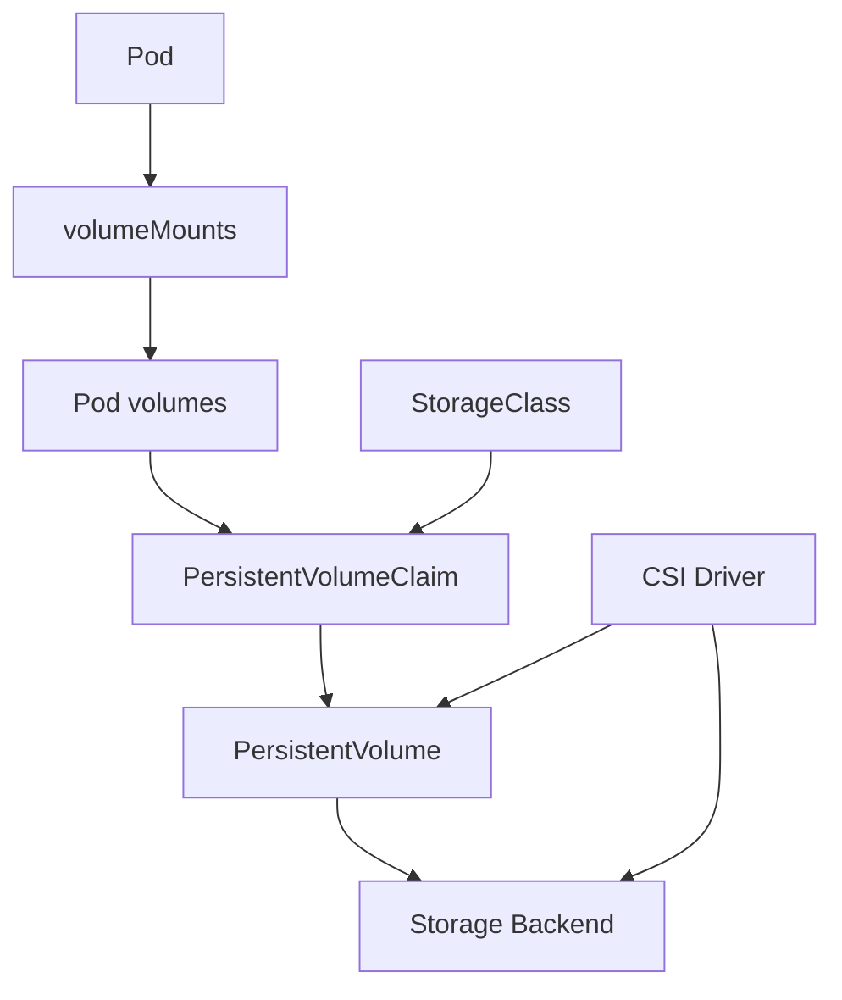
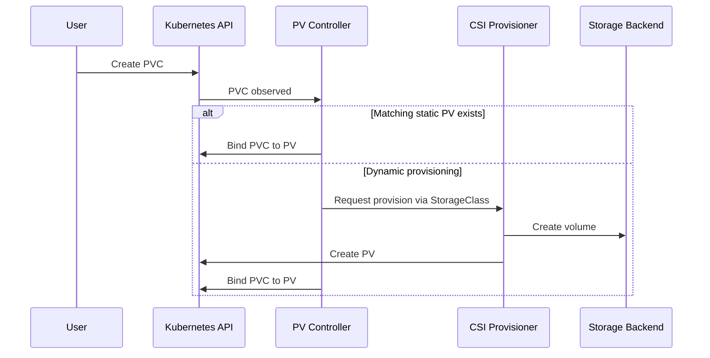
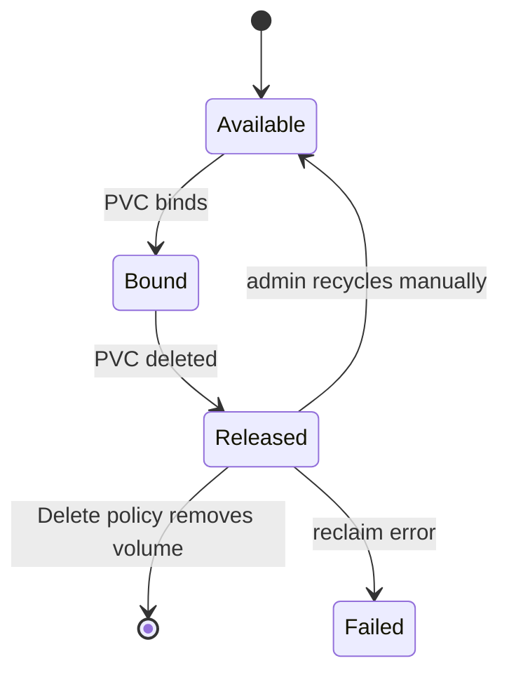
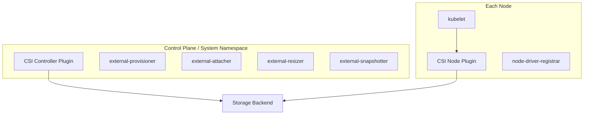
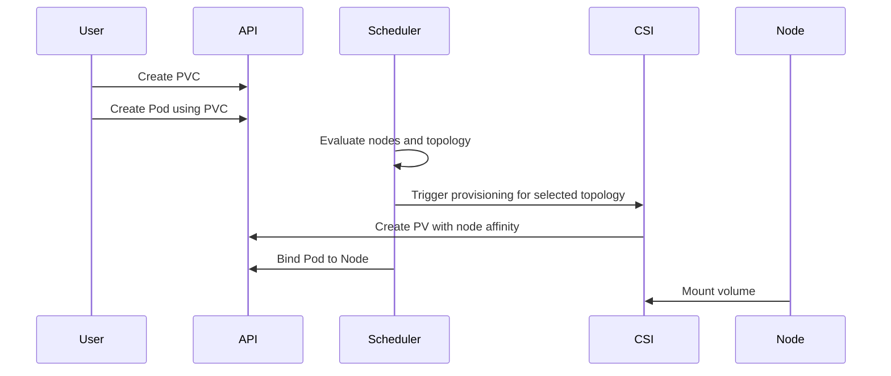
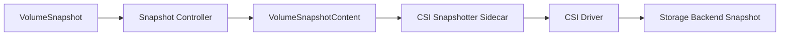

# Kubernetes Storage Study and Reference Guide

Last verified: 2026-09-01  
Audience: IT professionals, Kubernetes administrators, DevOps engineers, SREs, platform engineers, storage administrators, and CKA/CKS candidates

> This guide covers Kubernetes storage from fundamentals through production operations: volumes, PersistentVolumes, PersistentVolumeClaims, StorageClasses, CSI, access modes, reclaim policies, dynamic provisioning, snapshots, cloning, expansion, ephemeral storage, storage security, troubleshooting, and best practices. Exact behavior depends on the Kubernetes version, CSI driver, cloud provider, storage backend, node OS, and cluster distribution.

---

## Table of Contents

1. [Kubernetes Storage at a Glance](#kubernetes-storage-at-a-glance)
2. [Storage Concepts](#storage-concepts)
3. [Volume Types](#volume-types)
4. [PersistentVolumes and PersistentVolumeClaims](#persistentvolumes-and-persistentvolumeclaims)
5. [StorageClasses](#storageclasses)
6. [Dynamic Provisioning](#dynamic-provisioning)
7. [Access Modes](#access-modes)
8. [Volume Modes: Filesystem and Block](#volume-modes-filesystem-and-block)
9. [Reclaim Policies and Lifecycle](#reclaim-policies-and-lifecycle)
10. [Container Storage Interface](#container-storage-interface)
11. [CSI Sidecars and Storage Components](#csi-sidecars-and-storage-components)
12. [Volume Binding, Topology, and Scheduling](#volume-binding-topology-and-scheduling)
13. [StatefulSets and Stable Storage](#statefulsets-and-stable-storage)
14. [Ephemeral Storage and Ephemeral Volumes](#ephemeral-storage-and-ephemeral-volumes)
15. [ConfigMap, Secret, DownwardAPI, and Projected Volumes](#configmap-secret-downwardapi-and-projected-volumes)
16. [Volume Expansion](#volume-expansion)
17. [Volume Snapshots](#volume-snapshots)
18. [Volume Cloning and Data Sources](#volume-cloning-and-data-sources)
19. [VolumeAttributesClass](#volumeattributesclass)
20. [Local Persistent Volumes](#local-persistent-volumes)
21. [Cloud and Network Storage Patterns](#cloud-and-network-storage-patterns)
22. [Storage Security](#storage-security)
23. [Backup, Restore, and Disaster Recovery](#backup-restore-and-disaster-recovery)
24. [Storage Observability and Health](#storage-observability-and-health)
25. [Troubleshooting Workflows](#troubleshooting-workflows)
26. [Common Failure Scenarios](#common-failure-scenarios)
27. [Production Best Practices](#production-best-practices)
28. [Command Reference](#command-reference)
29. [Storage Runbooks](#storage-runbooks)
30. [Interview Questions](#interview-questions)
31. [Reference Manifests](#reference-manifests)
32. [Official References](#official-references)

---

## Kubernetes Storage at a Glance

Containers are ephemeral by default. Files written inside a container's writable layer can disappear when the container is restarted, replaced, or rescheduled. Kubernetes storage provides abstractions for temporary data, configuration data, shared data, and durable persistent data.

High-level model:



Main storage APIs:

| API/Object | Scope | Purpose |
|---|---|---|
| Volume | Pod spec | Mounts storage or data into containers |
| PersistentVolume | Cluster-scoped | Represents durable storage in the cluster |
| PersistentVolumeClaim | Namespaced | Requests durable storage |
| StorageClass | Cluster-scoped | Defines dynamic provisioning parameters |
| VolumeAttachment | Cluster-scoped | Tracks attach/detach intent for attachable volumes |
| CSIDriver | Cluster-scoped | Describes a CSI driver |
| CSINode | Cluster-scoped | Tracks CSI driver availability on nodes |
| VolumeSnapshot | Namespaced CRD | Requests a point-in-time snapshot |
| VolumeSnapshotContent | Cluster-scoped CRD | Represents an actual snapshot |
| VolumeSnapshotClass | Cluster-scoped CRD | Defines snapshot provisioning parameters |
| VolumeAttributesClass | Cluster-scoped | Defines mutable CSI volume attributes where supported |

---

## Storage Concepts

### Ephemeral Versus Persistent

| Type | Lifetime | Examples | Use Cases |
|---|---|---|---|
| Ephemeral | Tied to Pod or container lifetime | `emptyDir`, ConfigMap, Secret, projected, CSI ephemeral | Cache, scratch, config injection |
| Persistent | Independent of Pod lifetime | PV/PVC backed by CSI, NFS, iSCSI, local PV | Databases, queues, uploads, durable application state |

### Storage Responsibilities

Kubernetes itself provides APIs and orchestration. Actual storage behavior comes from:

- CSI drivers.
- Cloud storage services.
- Network filesystems.
- Storage arrays.
- Local disks.
- Backup/snapshot tools.
- Storage operators.

Kubernetes can request and mount storage, but it does not automatically make every application crash-consistent, replicated, encrypted, backed up, or highly available. Those properties depend on the application and storage backend.

### Core Storage Questions

Before choosing a storage design, answer:

- Does the data need to survive Pod deletion?
- Can the workload tolerate node failure?
- Does the workload need filesystem or raw block?
- Does one Pod write, or do many Pods write?
- Does the storage need zone awareness?
- What latency, IOPS, throughput, and durability are required?
- How will backups and restores work?
- How will data be encrypted?
- What happens during cluster or storage backend failure?

---

## Volume Types

Kubernetes supports many volume types. Modern production persistent storage should normally use CSI drivers.

### Common Pod Volume Types

| Volume Type | Persistent? | Typical Use |
|---|---|---|
| `emptyDir` | No | Scratch space shared by containers in a Pod |
| `configMap` | No | Configuration files |
| `secret` | No | Sensitive files mounted from Secret objects |
| `downwardAPI` | No | Pod metadata exposed as files |
| `projected` | No | Combine several sources into one directory |
| `persistentVolumeClaim` | Yes | Durable storage requested by PVC |
| `csi` | Depends | CSI inline or persistent CSI volumes |
| `hostPath` | Node-local | Node file access; high risk; testing or system agents |
| `local` | Yes, node-local | Local persistent disks with node affinity |
| `nfs` | Yes | Shared network filesystem |
| `iscsi` / `fc` | Yes | Enterprise block storage |

### In-Tree Plugin Direction

Kubernetes has moved away from many in-tree storage plugins toward CSI drivers.

Current guidance:

- Prefer CSI drivers for production storage.
- Many old in-tree cloud provider volume plugins are migrated, deprecated, or removed depending on type and Kubernetes version.
- `hostPath` is for single-node testing or tightly controlled system use, not general multi-node production persistence.
- Check your Kubernetes version and storage vendor support matrix before upgrades.

### Volume Mounts

Volumes are declared in `.spec.volumes` and mounted into containers using `.spec.containers[].volumeMounts`.

```yaml
apiVersion: v1
kind: Pod
metadata:
  name: app
spec:
  containers:
    - name: app
      image: nginx:1.27
      volumeMounts:
        - name: data
          mountPath: /usr/share/nginx/html
  volumes:
    - name: data
      emptyDir: {}
```

Each container must independently declare where it mounts a volume.

---

## PersistentVolumes and PersistentVolumeClaims

PersistentVolumes and PersistentVolumeClaims decouple storage consumption from storage implementation.

### PersistentVolume

A PersistentVolume, or PV, is cluster-scoped storage that has been statically created by an administrator or dynamically created by a provisioner.

PV includes:

- Capacity.
- Access modes.
- Volume mode.
- Reclaim policy.
- StorageClass name.
- Backend-specific source.
- Node affinity where needed.

### PersistentVolumeClaim

A PersistentVolumeClaim, or PVC, is a namespaced request for storage.

PVC includes:

- Requested capacity.
- Access modes.
- Volume mode.
- StorageClass name.
- Optional data source.
- Optional selector.

PVCs must be in the same namespace as Pods that use them.

### PV/PVC Binding



### Example PVC

```yaml
apiVersion: v1
kind: PersistentVolumeClaim
metadata:
  name: app-data
  namespace: app
spec:
  accessModes:
    - ReadWriteOnce
  storageClassName: fast
  resources:
    requests:
      storage: 20Gi
```

### Pod Using a PVC

```yaml
apiVersion: v1
kind: Pod
metadata:
  name: app
  namespace: app
spec:
  containers:
    - name: app
      image: nginx:1.27
      volumeMounts:
        - name: data
          mountPath: /data
  volumes:
    - name: data
      persistentVolumeClaim:
        claimName: app-data
```

---

## StorageClasses

StorageClass defines a storage offering for dynamic provisioning.

### StorageClass Fields

| Field | Purpose |
|---|---|
| `provisioner` | CSI or external provisioner name |
| `parameters` | Driver-specific provisioning parameters |
| `reclaimPolicy` | `Delete` or `Retain` behavior for dynamic PVs |
| `allowVolumeExpansion` | Whether PVC expansion is allowed |
| `mountOptions` | Mount options passed to volumes |
| `volumeBindingMode` | `Immediate` or `WaitForFirstConsumer` |
| `allowedTopologies` | Limits provisioning to certain topology segments |

Example:

```yaml
apiVersion: storage.k8s.io/v1
kind: StorageClass
metadata:
  name: fast
  annotations:
    storageclass.kubernetes.io/is-default-class: "true"
provisioner: example.csi.driver
parameters:
  type: ssd
reclaimPolicy: Delete
allowVolumeExpansion: true
volumeBindingMode: WaitForFirstConsumer
```

### Default StorageClass

A StorageClass can be marked default with:

```yaml
metadata:
  annotations:
    storageclass.kubernetes.io/is-default-class: "true"
```

If multiple default StorageClasses exist, Kubernetes uses the most recently created default StorageClass for new PVCs that omit `storageClassName`.

### Disabling Dynamic Provisioning for a PVC

Set:

```yaml
storageClassName: ""
```

This explicitly requests no StorageClass and prevents default dynamic provisioning.

### StorageClass Design

Common classes:

- `standard`: balanced general purpose.
- `fast`: SSD-backed high IOPS.
- `database`: durable and low-latency.
- `shared`: RWX filesystem.
- `backup-retain`: reclaim policy `Retain`.
- `encrypted`: provider-side encryption enabled.

---

## Dynamic Provisioning

Dynamic provisioning creates storage on demand when a PVC is created.

Requirements:

- StorageClass exists.
- Provisioner is installed and healthy.
- PVC requests that StorageClass or uses a default.
- Backend has capacity and permissions.
- Topology constraints can be satisfied.

Dynamic provisioning flow:


Benefits:

- Users do not need direct access to storage systems.
- Administrators expose controlled storage classes.
- Storage is created only when needed.
- Provisioning is repeatable and declarative.

Operational risks:

- Incorrect default StorageClass can create wrong volume type.
- `Delete` reclaim policy can remove underlying data when PVC is deleted.
- Cloud quotas can block provisioning.
- Zone-specific storage can conflict with scheduling.

---

## Access Modes

Access modes describe how a PV can be mounted.

| Access Mode | Abbreviation | Meaning |
|---|---|---|
| `ReadWriteOnce` | RWO | Read-write by a single node |
| `ReadOnlyMany` | ROX | Read-only by many nodes |
| `ReadWriteMany` | RWX | Read-write by many nodes |
| `ReadWriteOncePod` | RWOP | Read-write by a single Pod across the cluster |

Important details:

- `ReadWriteOncePod` is stable in modern Kubernetes and supported only for CSI volumes.
- `ReadWriteOnce` means one node, not one Pod. Multiple Pods on the same node may be able to mount the volume.
- Access modes are used for PV/PVC matching and attach/mount control. They are not a full application-level write-safety mechanism.
- Actual support depends on the storage backend and driver.

Typical choices:

| Workload | Common Mode |
|---|---|
| Single database primary | RWO or RWOP |
| Strict single-writer app | RWOP |
| Shared web content | RWX |
| Read-only model/config distribution | ROX or RWX read-only |
| StatefulSet per-replica storage | RWO |

---

## Volume Modes: Filesystem and Block

Kubernetes supports two volume modes:

| Mode | Use |
|---|---|
| `Filesystem` | Mount as filesystem; default |
| `Block` | Expose raw block device to container |

Filesystem PVC:

```yaml
spec:
  volumeMode: Filesystem
```

Block PVC:

```yaml
spec:
  volumeMode: Block
```

Pod using raw block:

```yaml
volumeDevices:
  - name: data
    devicePath: /dev/xvda
volumes:
  - name: data
    persistentVolumeClaim:
      claimName: block-data
```

Use raw block when the application manages the filesystem or expects a block device, such as some databases or storage systems.

---

## Reclaim Policies and Lifecycle

Reclaim policy controls what happens to the underlying PV after the PVC is deleted.

| Policy | Behavior |
|---|---|
| `Delete` | Delete PV and usually delete underlying storage |
| `Retain` | Keep PV and underlying storage for manual recovery or cleanup |
| `Recycle` | Deprecated legacy behavior; avoid |

### PV Phases

| Phase | Meaning |
|---|---|
| `Available` | Free and not bound |
| `Bound` | Bound to a PVC |
| `Released` | PVC deleted but PV not yet reclaimed |
| `Failed` | Reclaim failed |

Lifecycle:



### Retain Recovery Pattern

When using `Retain`, recovering a PV usually requires:

1. Delete old PVC.
2. Clear or update PV `claimRef` carefully.
3. Create a new PVC that binds to the PV, often using `volumeName`.
4. Validate data.

Never change reclaim policy or claimRef casually in production. Understand whether the underlying storage still contains sensitive or required data.

---

## Container Storage Interface

CSI is the standard interface for storage providers in Kubernetes.

CSI allows storage vendors to develop drivers outside the Kubernetes core tree. This avoids requiring Kubernetes releases for storage driver changes.

### CSI Responsibilities

Depending on driver capabilities, CSI can support:

- Dynamic provisioning.
- Attach/detach.
- Mount/unmount.
- Filesystem formatting.
- Raw block volumes.
- Online or offline expansion.
- Snapshots.
- Cloning.
- Ephemeral volumes.
- Topology-aware provisioning.
- Volume health reporting.
- Mutable volume attributes.

### CSI Driver Deployment

CSI drivers usually include:

- Controller plugin Deployment or StatefulSet.
- Node plugin DaemonSet.
- Sidecar containers.
- RBAC.
- CSIDriver object.
- StorageClasses.
- Optional snapshot classes.



---

## CSI Sidecars and Storage Components

Common CSI sidecars:

| Sidecar | Purpose |
|---|---|
| `external-provisioner` | Watches PVCs and creates PVs through CSI |
| `external-attacher` | Handles VolumeAttachment for attachable volumes |
| `external-resizer` | Handles PVC expansion |
| `external-snapshotter` | Handles snapshot operations with CSI driver |
| `node-driver-registrar` | Registers CSI driver with kubelet |
| `livenessprobe` | Reports CSI driver health |
| `external-health-monitor-controller` | Reports volume health where supported |

Troubleshooting often starts with these components.

```bash
kubectl get pods -A | grep -i csi
kubectl get csidrivers
kubectl get csinodes
kubectl get volumeattachments
```

---

## Volume Binding, Topology, and Scheduling

Storage can be topology-specific. For example, a cloud block volume might exist in one zone and attach only to nodes in that zone.

### Immediate Binding

`volumeBindingMode: Immediate`

- PVC is provisioned and bound immediately.
- Storage may be created before a Pod exists.
- Can cause scheduling conflicts if volume is created in a zone where no suitable node is available.

### WaitForFirstConsumer

`volumeBindingMode: WaitForFirstConsumer`

- PVC binding/provisioning waits until a Pod references the PVC.
- Scheduler considers Pod constraints and storage topology together.
- Recommended for topology-constrained storage.

```yaml
volumeBindingMode: WaitForFirstConsumer
```

Scheduling-aware flow:



### Allowed Topologies

StorageClasses can restrict provisioning to certain topology domains:

```yaml
allowedTopologies:
  - matchLabelExpressions:
      - key: topology.kubernetes.io/zone
        values:
          - us-east-1a
          - us-east-1b
```

Actual topology keys depend on the CSI driver.

---

## StatefulSets and Stable Storage

StatefulSets are the main Kubernetes workload API for stable network identity and per-replica storage.

### volumeClaimTemplates

StatefulSet creates one PVC per replica:

```yaml
volumeClaimTemplates:
  - metadata:
      name: data
    spec:
      accessModes:
        - ReadWriteOnce
      storageClassName: fast
      resources:
        requests:
          storage: 50Gi
```

For a StatefulSet named `postgres`, the PVCs may look like:

```text
data-postgres-0
data-postgres-1
data-postgres-2
```

### Operational Notes

- PVCs are not automatically deleted just because a StatefulSet Pod is deleted.
- Scaling down usually leaves PVCs behind.
- Deleting a StatefulSet does not necessarily delete its PVCs.
- Per-replica data must be backed up and restored with application consistency.
- Ordered rollout behavior matters for quorum systems.

### Stateful Storage Checklist

- Use anti-affinity or topology spread across zones where appropriate.
- Use PDBs for quorum systems.
- Understand attach limits and zone constraints.
- Test node failure recovery.
- Test backup and restore.
- Document PVC cleanup process.

---

## Ephemeral Storage and Ephemeral Volumes

Ephemeral storage is temporary storage tied to a Pod or node lifecycle.

### Local Ephemeral Storage

Pods use local ephemeral storage for:

- Container writable layers.
- `emptyDir`.
- Container logs.
- Some kubelet-managed files.

Requests and limits:

```yaml
resources:
  requests:
    ephemeral-storage: 1Gi
  limits:
    ephemeral-storage: 2Gi
```

Important:

- If a node fails, local ephemeral data can be lost.
- `emptyDir.medium: Memory` is charged to memory usage, not local ephemeral storage.
- ResourceQuota for `ephemeral-storage` requires Pods to set ephemeral-storage limits.
- Kubelet tracking depends on node filesystem layout.

### emptyDir

```yaml
volumes:
  - name: cache
    emptyDir:
      sizeLimit: 5Gi
```

Memory-backed:

```yaml
volumes:
  - name: scratch
    emptyDir:
      medium: Memory
      sizeLimit: 512Mi
```

Use cases:

- Scratch files.
- Shared files between containers in one Pod.
- Temporary cache.

Do not use for durable data.

### CSI Ephemeral Volumes

CSI ephemeral volumes are inline volumes created with the Pod by CSI drivers that support ephemeral mode.

Use cases:

- Temporary per-Pod storage from a special backend.
- Injecting driver-managed data.

Security note: inline CSI volumes expose `volumeAttributes` in the Pod spec. Administrators should restrict drivers and attributes if they expose sensitive backend options.

### Generic Ephemeral Volumes

Generic ephemeral volumes use a PVC template inside the Pod spec. Kubernetes creates a PVC owned by the Pod and normally deletes it when the Pod is deleted.

```yaml
volumes:
  - name: scratch
    ephemeral:
      volumeClaimTemplate:
        spec:
          accessModes:
            - ReadWriteOnce
          storageClassName: fast
          resources:
            requests:
              storage: 10Gi
```

Operational notes:

- Stable in modern Kubernetes.
- Uses normal dynamic provisioning.
- PVC name is deterministic from Pod name and volume name.
- Namespace PVC quotas still apply.
- Users who can create Pods may indirectly create PVCs this way, so apply admission controls if needed.

---

## ConfigMap, Secret, DownwardAPI, and Projected Volumes

These volumes inject Kubernetes data into Pods as files.

### ConfigMap Volume

```yaml
volumes:
  - name: config
    configMap:
      name: app-config
```

### Secret Volume

```yaml
volumes:
  - name: secret
    secret:
      secretName: db-credentials
```

Secret volumes are mounted read-only and backed by tmpfs on Linux.

### DownwardAPI Volume

Exposes Pod metadata:

```yaml
volumes:
  - name: podinfo
    downwardAPI:
      items:
        - path: namespace
          fieldRef:
            fieldPath: metadata.namespace
```

### Projected Volume

Projected volumes combine sources into one directory.

Supported sources include:

- Secret.
- ConfigMap.
- DownwardAPI.
- ServiceAccountToken.
- ClusterTrustBundle.
- PodCertificate.

```yaml
volumes:
  - name: projected
    projected:
      sources:
        - configMap:
            name: app-config
        - secret:
            name: app-secret
        - downwardAPI:
            items:
              - path: namespace
                fieldRef:
                  fieldPath: metadata.namespace
```

Important caveat:

- A container using ConfigMap or Secret through a `subPath` mount will not receive updates automatically.

---

## Volume Expansion

PVC expansion allows increasing requested storage size.

Requirements:

- StorageClass has `allowVolumeExpansion: true`.
- CSI driver supports expansion.
- Filesystem supports resize.
- For online expansion, driver and filesystem must support resizing while mounted.

Example:

```bash
kubectl patch pvc app-data -n app -p '{"spec":{"resources":{"requests":{"storage":"100Gi"}}}}'
```

Check:

```bash
kubectl describe pvc -n app app-data
kubectl get pvc -n app app-data
```

Important:

- You generally cannot shrink PVCs.
- Expansion may require Pod restart depending on driver and filesystem.
- Expansion can fail because of backend quota, max volume size, or unsupported driver.

---

## Volume Snapshots

VolumeSnapshots provide a standard Kubernetes API for point-in-time copies of volumes.

Important facts:

- `VolumeSnapshot`, `VolumeSnapshotContent`, and `VolumeSnapshotClass` are CRDs, not built-in core API objects.
- Snapshot support is for CSI drivers.
- Snapshot CRDs and snapshot controller must be installed by the distribution or administrator.
- CSI driver must include snapshot support and the `csi-snapshotter` sidecar.

### Snapshot Architecture



### VolumeSnapshotClass

```yaml
apiVersion: snapshot.storage.k8s.io/v1
kind: VolumeSnapshotClass
metadata:
  name: fast-snapshots
driver: example.csi.driver
deletionPolicy: Delete
```

Deletion policies:

| Policy | Behavior |
|---|---|
| `Delete` | Delete backend snapshot when VolumeSnapshotContent is deleted |
| `Retain` | Keep backend snapshot after Kubernetes object deletion |

### Create Snapshot

```yaml
apiVersion: snapshot.storage.k8s.io/v1
kind: VolumeSnapshot
metadata:
  name: app-data-snapshot
  namespace: app
spec:
  volumeSnapshotClassName: fast-snapshots
  source:
    persistentVolumeClaimName: app-data
```

### Restore from Snapshot

```yaml
apiVersion: v1
kind: PersistentVolumeClaim
metadata:
  name: app-data-restore
  namespace: app
spec:
  storageClassName: fast
  dataSource:
    name: app-data-snapshot
    kind: VolumeSnapshot
    apiGroup: snapshot.storage.k8s.io
  accessModes:
    - ReadWriteOnce
  resources:
    requests:
      storage: 20Gi
```

### Snapshot Consistency

Snapshots may be crash-consistent, not application-consistent.

For databases:

- Use database-native backup where possible.
- Quiesce writes if storage/application supports it.
- Flush data to disk.
- Test restore.
- Document RPO/RTO.

---

## Volume Cloning and Data Sources

CSI volume cloning creates a new PVC from an existing PVC.

Requirements:

- CSI driver supports cloning.
- Dynamic provisioner supports cloning.
- Source PVC exists in the same namespace.
- Source PVC is bound and available.
- Destination size is equal to or larger than source.
- Source and destination use the same `volumeMode`.

Example:

```yaml
apiVersion: v1
kind: PersistentVolumeClaim
metadata:
  name: clone-of-app-data
  namespace: app
spec:
  accessModes:
    - ReadWriteOnce
  storageClassName: fast
  resources:
    requests:
      storage: 20Gi
  dataSource:
    kind: PersistentVolumeClaim
    name: app-data
```

Use cases:

- Test database copy.
- Pre-populated development environment.
- Fast dataset duplication.
- Blue/green stateful testing.

Important:

- Clone is independent after creation.
- Changes to source do not affect destination.
- Changes to destination do not affect source.

---

## VolumeAttributesClass

VolumeAttributesClass lets administrators define mutable CSI volume attributes where the CSI driver supports modifying volumes.

Use cases:

- Change performance tier.
- Change IOPS.
- Change throughput.
- Apply driver-specific mutable attributes.

Example:

```yaml
apiVersion: storage.k8s.io/v1
kind: VolumeAttributesClass
metadata:
  name: gold
driverName: example.csi.driver
parameters:
  iops: "6000"
  throughput: "250"
```

PVC using it:

```yaml
apiVersion: v1
kind: PersistentVolumeClaim
metadata:
  name: app-data
  namespace: app
spec:
  storageClassName: fast
  volumeAttributesClassName: gold
  accessModes:
    - ReadWriteOnce
  resources:
    requests:
      storage: 100Gi
```

Operational notes:

- Works only with CSI drivers that support the required modify-volume behavior.
- Parameters are driver-specific.
- The class name in the PVC can be changed after provisioning when supported.
- Validate storage provider behavior and cost impact before enabling user self-service.

---

## Local Persistent Volumes

Local persistent volumes represent node-local disks.

Use cases:

- High-performance local SSD.
- Databases designed for replication at application layer.
- Caches where node-local data is acceptable.

Characteristics:

- Data is tied to a node.
- PV uses node affinity.
- If the node fails, data may be unavailable.
- Scheduling must place the Pod on the node that has the local volume.

Example PV:

```yaml
apiVersion: v1
kind: PersistentVolume
metadata:
  name: local-pv-1
spec:
  capacity:
    storage: 100Gi
  volumeMode: Filesystem
  accessModes:
    - ReadWriteOnce
  persistentVolumeReclaimPolicy: Retain
  storageClassName: local-storage
  local:
    path: /mnt/disks/ssd1
  nodeAffinity:
    required:
      nodeSelectorTerms:
        - matchExpressions:
            - key: kubernetes.io/hostname
              operator: In
              values:
                - worker-1
```

Best practices:

- Use `WaitForFirstConsumer`.
- Use a local volume provisioner where appropriate.
- Monitor node disk health.
- Plan node replacement carefully.
- Do not treat local PV as automatically highly available.

---

## Cloud and Network Storage Patterns

### Cloud Block Storage

Examples:

- AWS EBS via EBS CSI.
- Google Persistent Disk via PD CSI.
- Azure Disk via Azure Disk CSI.
- OpenStack Cinder via CSI.

Common properties:

- Usually RWO/RWOP.
- Often zone-specific.
- Attach/detach required.
- Good for databases and single-writer workloads.

### Cloud File Storage

Examples:

- AWS EFS.
- Azure Files.
- Google Filestore.

Common properties:

- Often RWX.
- Good for shared files.
- Performance and consistency vary.
- Can be more expensive or higher latency than block.

### Network File Systems

NFS and similar systems can provide RWX access.

Use cases:

- Shared media.
- User uploads.
- Legacy applications.

Risks:

- Single shared filesystem can become bottleneck.
- Permissions and UID/GID mapping must be designed.
- Backup and consistency need explicit planning.

### Object Storage

Object storage is usually not mounted as a normal POSIX filesystem in Kubernetes. Applications should normally use object storage APIs directly.

Use cases:

- Backups.
- Logs.
- Artifacts.
- Static assets.
- Data lake files.

Avoid forcing object storage into filesystem semantics unless the tool and consistency model are well understood.

---

## Storage Security

### Main Risks

- Unauthorized PVC/PV access.
- Accidental deletion of PVC with `Delete` reclaim policy.
- Secrets written to persistent disks.
- hostPath exposing node filesystem.
- RWX volumes allowing cross-application data access.
- Unencrypted backend storage.
- Unprotected backups and snapshots.
- Overprivileged CSI driver permissions.

### Security Controls

- RBAC for PV, PVC, StorageClass, VolumeSnapshot, and Secret access.
- Namespace isolation.
- StorageClasses with encryption enabled.
- Reclaim policy `Retain` for critical data where appropriate.
- Pod Security Admission to restrict hostPath and privileged Pods.
- NetworkPolicy around storage APIs where applicable.
- Cloud IAM least privilege for CSI drivers.
- Encrypt backups and snapshots.
- Audit PVC, PV, StorageClass, and Snapshot operations.

### hostPath Warning

`hostPath` can expose node files to containers.

High-risk examples:

- `/`
- `/etc`
- `/var/lib/kubelet`
- container runtime socket paths.
- `/var/run/docker.sock`
- `/run/containerd/containerd.sock`

Avoid hostPath for application workloads.

---

## Backup, Restore, and Disaster Recovery

Kubernetes PVs are not automatically backed up just because they are declared in the API.

### Backup Layers

| Layer | Backup Method |
|---|---|
| Kubernetes objects | GitOps, object backup tools |
| etcd | etcd snapshots |
| Persistent volumes | CSI snapshots, storage snapshots, backup agents |
| Application data | Database-native backup, application-aware backup |
| Object storage | Provider replication/versioning |

### Backup Best Practices

- Define RPO and RTO.
- Use application-consistent backups for databases.
- Store backups outside the cluster.
- Encrypt backups.
- Test restore regularly.
- Back up manifests and data together.
- Track PVC to application ownership.
- Monitor backup freshness.

### Restore Concerns

- Restored PVC must be mounted by the correct workload.
- Restore size must be at least source size.
- Restore may need same StorageClass or compatible backend.
- StatefulSet ordinal identity may matter.
- DNS, Secrets, ConfigMaps, and app version must match data compatibility.

---

## Storage Observability and Health

### What to Monitor

- PVC phase and age.
- PV phase.
- VolumeAttachment status.
- CSI controller and node plugin health.
- Provisioning latency.
- Attach/detach latency.
- Mount failures.
- Volume capacity and filesystem usage.
- Backend IOPS, throughput, latency.
- Snapshot success/failure.
- Backup success/failure.
- Node disk pressure.
- Kubelet volume operation errors.

### Useful Commands

```bash
kubectl get storageclass
kubectl get pvc -A
kubectl get pv
kubectl get volumeattachments
kubectl get csidrivers
kubectl get csinodes
kubectl describe pvc -n app app-data
kubectl describe pod -n app app-0
kubectl get events -n app --sort-by=.lastTimestamp
```

### CSI Volume Health

CSI volume health monitoring is an alpha feature in current Kubernetes documentation and depends on the CSI driver implementing health RPCs and the related feature gate/configuration.

When available, health can surface in:

- PVC status.
- Pod volume health status.
- CSINode storage health status.
- Kubelet metrics.

Kubernetes surfaces the health signal; it does not automatically reschedule or repair workloads based on reported volume health.

---

## Troubleshooting Workflows

### Workflow 1: PVC Stuck Pending

Commands:

```bash
kubectl describe pvc -n app app-data
kubectl get storageclass
kubectl describe storageclass fast
kubectl get events -n app --sort-by=.lastTimestamp
kubectl get pods -A | grep -i csi
```

Check:

1. Does the requested StorageClass exist?
2. Is there a default StorageClass if PVC omitted `storageClassName`?
3. Is `storageClassName: ""` intentionally disabling dynamic provisioning?
4. Is CSI provisioner running?
5. Does backend have capacity/quota?
6. Does PVC request an unsupported access mode?
7. Is `WaitForFirstConsumer` waiting for a Pod?
8. Are topology constraints satisfiable?

### Workflow 2: Pod Stuck ContainerCreating Due to Volume

Commands:

```bash
kubectl describe pod -n app app-0
kubectl get pvc -n app
kubectl describe pvc -n app app-data
kubectl get volumeattachments
kubectl get events -n app --sort-by=.lastTimestamp
kubectl logs -n kube-system ds/<csi-node-daemonset>
kubectl logs -n kube-system deploy/<csi-controller>
```

Check:

- PVC is bound.
- VolumeAttachment exists and is attached.
- CSI node plugin runs on target node.
- Node can reach storage backend.
- Filesystem mount options are valid.
- Secret for storage driver exists.
- No multi-attach conflict.

### Workflow 3: Multi-Attach Error

Symptoms:

```text
Multi-Attach error for volume
```

Common causes:

- RWO block volume still attached to old node.
- Pod rescheduled before detach completed.
- Node lost but cloud provider still thinks disk is attached.
- Two Pods try to use same single-writer volume.

Actions:

```bash
kubectl get pod -A -o wide | grep <pvc-or-app>
kubectl get volumeattachments | grep <pv-name>
kubectl describe pv <pv-name>
kubectl describe node <old-node>
```

Fix depends on backend. Avoid manually detaching volumes unless you understand data corruption risk.

### Workflow 4: Volume Mount Permission Denied

Check:

- Container user UID/GID.
- `fsGroup`.
- Storage backend permission model.
- NFS export options.
- SELinux/AppArmor.
- Read-only mounts.
- Windows versus Linux behavior.

Commands:

```bash
kubectl describe pod -n app app-0
kubectl exec -n app app-0 -- id
kubectl exec -n app app-0 -- ls -la /data
```

### Workflow 5: Disk Full or Ephemeral Storage Eviction

Commands:

```bash
kubectl describe node <node>
kubectl get events -A --sort-by=.lastTimestamp
kubectl describe pod -n app <pod>
kubectl top pods -A
```

Check:

- Container logs.
- `emptyDir` usage.
- Container writable layer.
- Image garbage collection.
- Node filesystem layout.
- Ephemeral-storage requests and limits.

### Workflow 6: Snapshot Fails

Commands:

```bash
kubectl get volumesnapshot -A
kubectl describe volumesnapshot -n app app-data-snapshot
kubectl get volumesnapshotclass
kubectl get volumesnapshotcontent
kubectl logs -n kube-system deploy/<snapshot-controller>
kubectl logs -n kube-system deploy/<csi-controller>
```

Check:

- Snapshot CRDs installed.
- Snapshot controller running.
- VolumeSnapshotClass driver matches PVC driver.
- CSI driver supports snapshots.
- Backend snapshot quota.
- Source PVC exists and is bound.

---

## Common Failure Scenarios

### PVC Pending

Likely causes:

- Missing StorageClass.
- No default StorageClass.
- Unsupported access mode.
- CSI provisioner down.
- Backend quota exhausted.
- Waiting for first consumer.
- Topology constraints.

### Pod Cannot Mount PVC

Likely causes:

- CSI node plugin missing on node.
- Volume attachment failure.
- Storage backend unreachable.
- Invalid mount options.
- Permission problem.
- Filesystem corruption.

### Data Lost After Pod Restart

Likely causes:

- Data was written to container writable layer.
- Data was written to `emptyDir`.
- PVC was not mounted where the app writes data.
- Reclaim policy deleted backend volume after PVC deletion.

### ReadWriteMany Not Working

Likely causes:

- Storage backend does not support RWX.
- Wrong StorageClass.
- Driver supports RWO only.
- Application expects POSIX locking behavior not provided by backend.

### PVC Expansion Stuck

Likely causes:

- StorageClass does not allow expansion.
- CSI driver does not support expansion.
- Backend quota or max size reached.
- Filesystem resize pending Pod restart.

### StatefulSet Recreated With Empty Data

Likely causes:

- New PVC names due to changed StatefulSet name or volumeClaimTemplate name.
- Old PVCs still exist but new Pods are using different claims.
- PVCs were deleted.
- Restore process created claims in wrong namespace.

### Snapshot Exists But Restore Fails

Likely causes:

- Restore PVC size smaller than source.
- StorageClass incompatible.
- SnapshotClass driver mismatch.
- Missing snapshot controller or CRDs.
- Backend snapshot deleted because deletion policy was `Delete`.

---

## Production Best Practices

### Design

- Use CSI drivers for production storage.
- Define StorageClasses by workload need, not just backend name.
- Use `WaitForFirstConsumer` for zonal/topology-aware storage.
- Use `Retain` for critical volumes where accidental PVC deletion must not delete data.
- Use RWOP for strict single-Pod writer requirements.
- Use RWX only where the storage backend and app are designed for shared writes.
- Avoid hostPath for application workloads.
- Use StatefulSets for stable per-replica storage.

### Operations

- Monitor PVC/PV status.
- Monitor CSI controller and node plugin health.
- Monitor attach, mount, provision, resize, snapshot, and backup failures.
- Track storage capacity and cloud quotas.
- Document manual recovery for retained PVs.
- Test volume expansion.
- Test snapshot restore.
- Test full application recovery.

### Security

- Encrypt volumes at rest using storage backend features.
- Encrypt backups and snapshots.
- Restrict StorageClass creation to platform administrators.
- Restrict direct PV creation.
- Avoid exposing host paths.
- Use RBAC around snapshots and restores.
- Audit PVC, PV, StorageClass, and snapshot operations.

### Reliability

- Understand zone constraints.
- Spread replicated stateful workloads across zones.
- Use application-level replication for high availability.
- Do not assume one PV means high availability.
- Use PDBs for stateful workloads.
- Avoid aggressive node drains without checking volume attach behavior.

### Cost

- Clean unused PVCs and retained PVs.
- Monitor orphaned cloud disks and snapshots.
- Choose appropriate storage tier.
- Use expansion instead of overprovisioning where supported.
- Apply quotas by namespace.

---

## Command Reference

### Inventory

```bash
kubectl get storageclass
kubectl get pvc -A
kubectl get pv
kubectl get volumeattachments
kubectl get csidrivers
kubectl get csinodes
kubectl get volumesnapshot -A
kubectl get volumesnapshotclass
kubectl get volumesnapshotcontent
kubectl get volumeattributesclass
```

### Describe

```bash
kubectl describe pvc -n <namespace> <pvc>
kubectl describe pv <pv>
kubectl describe storageclass <storageclass>
kubectl describe pod -n <namespace> <pod>
kubectl describe volumeattachment <name>
kubectl describe volumesnapshot -n <namespace> <snapshot>
```

### Events

```bash
kubectl get events -A --sort-by=.lastTimestamp
kubectl get events -n <namespace> --sort-by=.lastTimestamp
```

### CSI

```bash
kubectl get pods -A | grep -i csi
kubectl logs -n kube-system deploy/<csi-controller>
kubectl logs -n kube-system ds/<csi-node>
kubectl get csidrivers -o yaml
kubectl get csinodes -o yaml
```

### PVC Expansion

```bash
kubectl patch pvc <pvc> -n <namespace> -p '{"spec":{"resources":{"requests":{"storage":"100Gi"}}}}'
kubectl get pvc -n <namespace> <pvc> -w
```

### Find Pods Using a PVC

```bash
kubectl get pods -n <namespace> -o jsonpath='{range .items[*]}{.metadata.name}{" "}{range .spec.volumes[*]}{.persistentVolumeClaim.claimName}{" "}{end}{"\n"}{end}'
```

### StorageClass Defaults

```bash
kubectl get storageclass -o custom-columns=NAME:.metadata.name,DEFAULT:.metadata.annotations.storageclass\\.kubernetes\\.io/is-default-class,PROVISIONER:.provisioner,MODE:.volumeBindingMode,RECLAIM:.reclaimPolicy
```

---

## Storage Runbooks

### Runbook: Create a PVC and Mount It

1. Confirm StorageClass:

```bash
kubectl get storageclass
```

2. Create PVC:

```yaml
apiVersion: v1
kind: PersistentVolumeClaim
metadata:
  name: app-data
  namespace: app
spec:
  accessModes:
    - ReadWriteOnce
  storageClassName: fast
  resources:
    requests:
      storage: 20Gi
```

3. Mount in workload:

```yaml
volumes:
  - name: data
    persistentVolumeClaim:
      claimName: app-data
```

4. Verify:

```bash
kubectl get pvc -n app app-data
kubectl describe pod -n app <pod>
```

### Runbook: Safely Expand a PVC

Pre-check:

```bash
kubectl describe storageclass fast
kubectl describe pvc -n app app-data
```

Patch:

```bash
kubectl patch pvc app-data -n app -p '{"spec":{"resources":{"requests":{"storage":"100Gi"}}}}'
```

Verify:

```bash
kubectl get pvc -n app app-data -w
kubectl describe pvc -n app app-data
```

If filesystem resize is pending, check whether the driver requires Pod restart.

### Runbook: Snapshot and Restore PVC

Create snapshot:

```yaml
apiVersion: snapshot.storage.k8s.io/v1
kind: VolumeSnapshot
metadata:
  name: app-data-snapshot
  namespace: app
spec:
  volumeSnapshotClassName: fast-snapshots
  source:
    persistentVolumeClaimName: app-data
```

Restore:

```yaml
apiVersion: v1
kind: PersistentVolumeClaim
metadata:
  name: app-data-restore
  namespace: app
spec:
  storageClassName: fast
  dataSource:
    name: app-data-snapshot
    kind: VolumeSnapshot
    apiGroup: snapshot.storage.k8s.io
  accessModes:
    - ReadWriteOnce
  resources:
    requests:
      storage: 20Gi
```

Validate application data before switching traffic.

### Runbook: Recover a Retained PV

1. Confirm PV status:

```bash
kubectl describe pv <pv>
```

2. Confirm underlying data still exists.
3. Remove or update claimRef only if you understand the recovery process.
4. Create replacement PVC with `volumeName`.
5. Mount read-only first if possible.
6. Validate data.

### Runbook: Investigate Storage Add-On Failure

```bash
kubectl get pods -A | grep -i csi
kubectl get csidrivers
kubectl get csinodes
kubectl get volumeattachments
kubectl get events -A --sort-by=.lastTimestamp
kubectl logs -n kube-system deploy/<csi-controller> --tail=200
kubectl logs -n kube-system ds/<csi-node> --tail=200
```

Check:

- Controller replicas.
- Node plugin DaemonSet coverage.
- RBAC.
- Driver registration.
- Backend credentials.
- Cloud API errors.
- Version compatibility.

---

## Interview Questions

### Fundamentals

1. Why do containers need Kubernetes volumes?
2. What is the difference between ephemeral and persistent storage?
3. What is the difference between a Volume and a PersistentVolume?
4. What is a PersistentVolumeClaim?
5. Why are PVCs namespaced but PVs cluster-scoped?

### PV and PVC

1. Explain the PV/PVC binding process.
2. What happens when a PVC cannot find a matching PV?
3. What is dynamic provisioning?
4. How does a Pod use a PVC?
5. What is the purpose of `storageClassName: ""`?

### StorageClass

1. What does a StorageClass define?
2. What is a default StorageClass?
3. What happens if multiple default StorageClasses exist?
4. What is `volumeBindingMode`?
5. Why is `WaitForFirstConsumer` important for zonal storage?

### Access Modes

1. Explain RWO, ROX, RWX, and RWOP.
2. Why is RWO not the same as single-Pod access?
3. When should you use ReadWriteOncePod?
4. Why might RWX be risky for some applications?
5. Do access modes guarantee application-level write safety?

### CSI

1. What is CSI?
2. Why did Kubernetes move storage plugins out of tree?
3. What does the CSI controller plugin do?
4. What does the CSI node plugin do?
5. Name common CSI sidecars and their functions.

### Stateful Workloads

1. How does StatefulSet storage differ from Deployment storage?
2. What is `volumeClaimTemplates`?
3. What happens to PVCs when a StatefulSet is scaled down?
4. How do you back up a StatefulSet database?
5. Why does storage topology matter for StatefulSets?

### Snapshots and Cloning

1. What Kubernetes objects are involved in snapshots?
2. Are VolumeSnapshots core Kubernetes API objects?
3. What is the difference between VolumeSnapshot and VolumeSnapshotContent?
4. What is VolumeSnapshotClass?
5. What are crash-consistent and application-consistent snapshots?
6. What are the requirements for CSI volume cloning?

### Ephemeral Storage

1. What is `emptyDir`?
2. What data counts toward local ephemeral storage?
3. What happens if a Pod exceeds ephemeral-storage limits?
4. What is a generic ephemeral volume?
5. What is the security concern with generic ephemeral volumes?

### Troubleshooting

1. A PVC is Pending. What do you check?
2. A Pod is stuck ContainerCreating due to mount failure. What do you check?
3. What causes Multi-Attach errors?
4. A volume expansion is stuck. What are possible causes?
5. A snapshot restore fails. What do you check?
6. Data disappeared after Pod restart. What is your investigation path?

### Production

1. How do you choose a StorageClass for a database?
2. Why should backups be application-aware?
3. How do you prevent accidental data deletion?
4. What storage metrics matter in production?
5. How do you secure Kubernetes storage?

---

## Reference Manifests

### StorageClass

```yaml
apiVersion: storage.k8s.io/v1
kind: StorageClass
metadata:
  name: fast
  annotations:
    storageclass.kubernetes.io/is-default-class: "true"
provisioner: example.csi.driver
parameters:
  type: ssd
reclaimPolicy: Delete
allowVolumeExpansion: true
volumeBindingMode: WaitForFirstConsumer
```

### PVC

```yaml
apiVersion: v1
kind: PersistentVolumeClaim
metadata:
  name: app-data
  namespace: app
spec:
  accessModes:
    - ReadWriteOnce
  storageClassName: fast
  resources:
    requests:
      storage: 20Gi
```

### Deployment With PVC

```yaml
apiVersion: apps/v1
kind: Deployment
metadata:
  name: app
  namespace: app
spec:
  replicas: 1
  selector:
    matchLabels:
      app: app
  template:
    metadata:
      labels:
        app: app
    spec:
      containers:
        - name: app
          image: nginx:1.27
          volumeMounts:
            - name: data
              mountPath: /usr/share/nginx/html
      volumes:
        - name: data
          persistentVolumeClaim:
            claimName: app-data
```

### StatefulSet With volumeClaimTemplates

```yaml
apiVersion: apps/v1
kind: StatefulSet
metadata:
  name: postgres
  namespace: database
spec:
  serviceName: postgres
  replicas: 3
  selector:
    matchLabels:
      app: postgres
  template:
    metadata:
      labels:
        app: postgres
    spec:
      containers:
        - name: postgres
          image: postgres:16
          ports:
            - containerPort: 5432
          volumeMounts:
            - name: data
              mountPath: /var/lib/postgresql/data
  volumeClaimTemplates:
    - metadata:
        name: data
      spec:
        accessModes:
          - ReadWriteOnce
        storageClassName: fast
        resources:
          requests:
            storage: 50Gi
```

### VolumeSnapshot

```yaml
apiVersion: snapshot.storage.k8s.io/v1
kind: VolumeSnapshot
metadata:
  name: app-data-snapshot
  namespace: app
spec:
  volumeSnapshotClassName: fast-snapshots
  source:
    persistentVolumeClaimName: app-data
```

### Generic Ephemeral Volume

```yaml
apiVersion: v1
kind: Pod
metadata:
  name: scratch-app
  namespace: app
spec:
  containers:
    - name: app
      image: busybox:1.36
      command: ["sleep", "3600"]
      volumeMounts:
        - name: scratch
          mountPath: /scratch
  volumes:
    - name: scratch
      ephemeral:
        volumeClaimTemplate:
          spec:
            accessModes:
              - ReadWriteOnce
            storageClassName: fast
            resources:
              requests:
                storage: 10Gi
```

---

## Official References

These references were used to verify current Kubernetes storage behavior:

- Kubernetes Storage overview: <https://kubernetes.io/docs/concepts/storage/>
- Volumes: <https://kubernetes.io/docs/concepts/storage/volumes/>
- Persistent Volumes: <https://kubernetes.io/docs/concepts/storage/persistent-volumes/>
- StorageClasses: <https://kubernetes.io/docs/concepts/storage/storage-classes/>
- StorageClass API: <https://kubernetes.io/docs/reference/kubernetes-api/storage/storage-class-v1/>
- Dynamic Volume Provisioning: <https://kubernetes.io/docs/concepts/storage/dynamic-provisioning/>
- Ephemeral Volumes: <https://kubernetes.io/docs/concepts/storage/ephemeral-volumes/>
- Projected Volumes: <https://kubernetes.io/docs/concepts/storage/projected-volumes/>
- Local ephemeral storage resource management: <https://kubernetes.io/docs/concepts/configuration/manage-resources-containers/>
- Volume Snapshots: <https://kubernetes.io/docs/concepts/storage/volume-snapshots/>
- Volume Snapshot Classes: <https://kubernetes.io/docs/concepts/storage/volume-snapshot-classes/>
- CSI Volume Cloning: <https://kubernetes.io/docs/concepts/storage/volume-pvc-datasource/>
- VolumeAttributesClass: <https://kubernetes.io/docs/concepts/storage/volume-attributes-classes/>
- Storage Capacity: <https://kubernetes.io/docs/concepts/storage/storage-capacity/>
- Volume Health Monitoring: <https://kubernetes.io/docs/concepts/storage/volume-health-monitoring/>
- Windows Storage: <https://kubernetes.io/docs/concepts/storage/windows-storage/>
- Change PV access mode to ReadWriteOncePod: <https://kubernetes.io/docs/tasks/administer-cluster/change-pv-access-mode-readwriteoncepod/>
