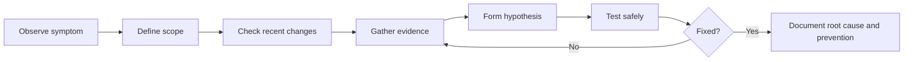
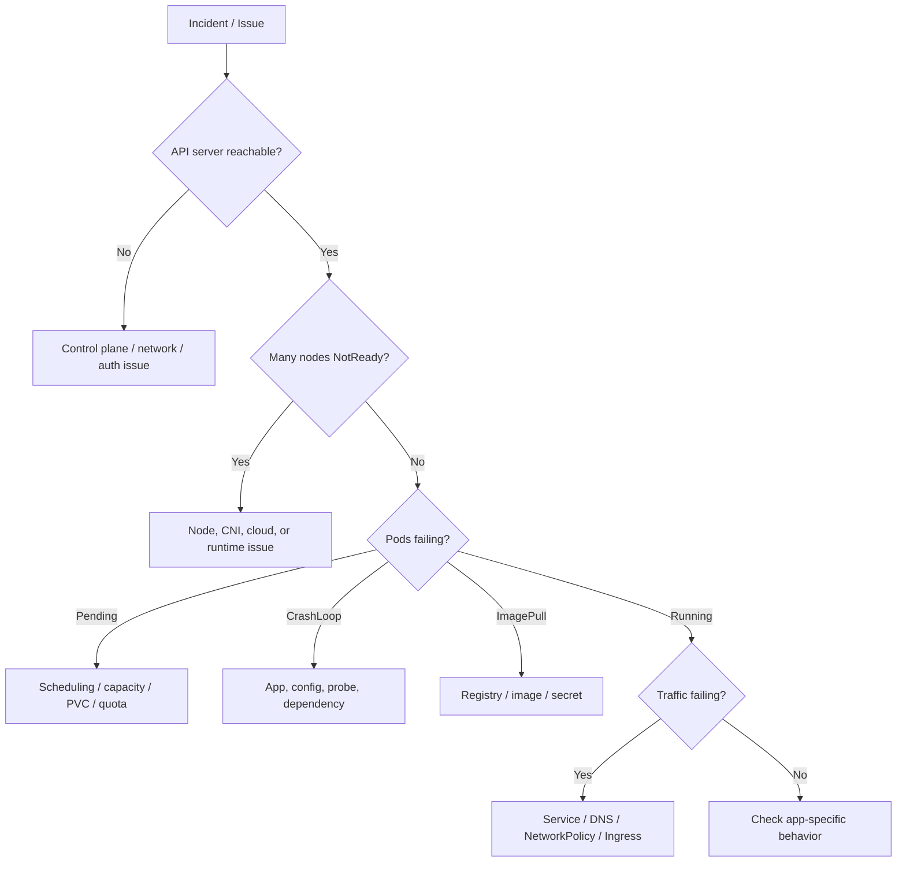
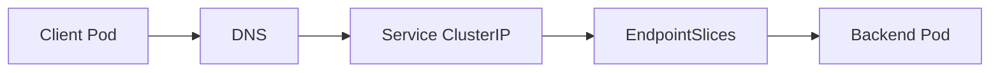
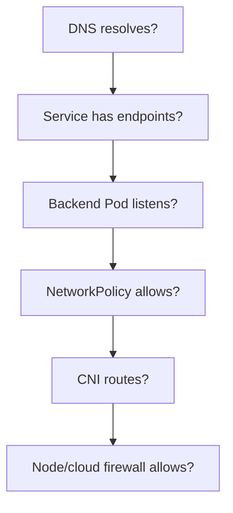

# Kubernetes Troubleshooting Study and Reference Guide

Last verified: 2026-09-01  
Audience: IT professionals, Kubernetes administrators, DevOps engineers, SREs, platform engineers, support engineers, and CKA/CKS candidates

> This guide is a practical long-term reference for troubleshooting Kubernetes clusters and workloads. It covers investigation method, kubectl workflows, Pods, Deployments, Services, DNS, Ingress/Gateway, NetworkPolicy, storage, nodes, control plane, scheduling, autoscaling, security, observability, common errors, runbooks, and interview questions. Exact behavior can vary by Kubernetes version, cloud provider, CNI, CSI, ingress/gateway controller, service mesh, and cluster distribution.

---

## Table of Contents

1. [Troubleshooting Mindset](#troubleshooting-mindset)
2. [Fast Triage Flow](#fast-triage-flow)
3. [Essential kubectl Commands](#essential-kubectl-commands)
4. [Reading Kubernetes Status](#reading-kubernetes-status)
5. [Events, Logs, Metrics, and Traces](#events-logs-metrics-and-traces)
6. [Debug Pods and Ephemeral Containers](#debug-pods-and-ephemeral-containers)
7. [Pod Troubleshooting](#pod-troubleshooting)
8. [Container State and Exit Codes](#container-state-and-exit-codes)
9. [Init Container Troubleshooting](#init-container-troubleshooting)
10. [Deployment and Rollout Troubleshooting](#deployment-and-rollout-troubleshooting)
11. [StatefulSet Troubleshooting](#statefulset-troubleshooting)
12. [Job and CronJob Troubleshooting](#job-and-cronjob-troubleshooting)
13. [Service Troubleshooting](#service-troubleshooting)
14. [DNS and CoreDNS Troubleshooting](#dns-and-coredns-troubleshooting)
15. [Ingress and Gateway Troubleshooting](#ingress-and-gateway-troubleshooting)
16. [NetworkPolicy and Connectivity Troubleshooting](#networkpolicy-and-connectivity-troubleshooting)
17. [Storage Troubleshooting](#storage-troubleshooting)
18. [Scheduling Troubleshooting](#scheduling-troubleshooting)
19. [Resource and Eviction Troubleshooting](#resource-and-eviction-troubleshooting)
20. [Node Troubleshooting](#node-troubleshooting)
21. [Control Plane Troubleshooting](#control-plane-troubleshooting)
22. [etcd Troubleshooting](#etcd-troubleshooting)
23. [Autoscaling Troubleshooting](#autoscaling-troubleshooting)
24. [Security and Admission Troubleshooting](#security-and-admission-troubleshooting)
25. [Image Pull Troubleshooting](#image-pull-troubleshooting)
26. [Probe Troubleshooting](#probe-troubleshooting)
27. [Performance Troubleshooting](#performance-troubleshooting)
28. [Common Failure Scenarios](#common-failure-scenarios)
29. [Production Troubleshooting Best Practices](#production-troubleshooting-best-practices)
30. [Command Reference](#command-reference)
31. [Runbooks](#runbooks)
32. [Interview Questions](#interview-questions)
33. [Reference Debug Manifests](#reference-debug-manifests)
34. [Official References](#official-references)

---

## Troubleshooting Mindset

Good Kubernetes troubleshooting is systematic. Avoid guessing from symptoms alone. Move from broad impact to specific failing component.

Core questions:

- What changed recently?
- Is the issue cluster-wide, namespace-wide, node-specific, or app-specific?
- Is the API server healthy?
- Are nodes Ready?
- Are system add-ons healthy?
- Is the workload scheduled?
- Did the container start?
- Is the app Ready?
- Does DNS resolve?
- Does direct Pod IP connectivity work?
- Does Service routing work?
- Is traffic blocked by policy, firewall, or security control?
- Is storage attached and mounted?
- Are resources exhausted?

Troubleshooting loop:



---

## Fast Triage Flow

Use this when something is broken and you need a first picture quickly.

```bash
kubectl config current-context
kubectl get nodes -o wide
kubectl get pods -A
kubectl get events -A --sort-by=.lastTimestamp
kubectl get --raw='/readyz?verbose'
```

If one application is affected:

```bash
kubectl get all -n <namespace>
kubectl get pods -n <namespace> -o wide
kubectl describe pod -n <namespace> <pod>
kubectl logs -n <namespace> <pod> --all-containers
kubectl get svc,endpointslice,ingress -n <namespace>
```

Decision tree:



---

## Essential kubectl Commands

### Cluster and Context

```bash
kubectl config current-context
kubectl config get-contexts
kubectl cluster-info
kubectl version
kubectl api-resources
kubectl api-versions
```

### Health

```bash
kubectl get --raw='/livez?verbose'
kubectl get --raw='/readyz?verbose'
kubectl get nodes -o wide
kubectl get pods -A -o wide
kubectl get events -A --sort-by=.lastTimestamp
```

### Workloads

```bash
kubectl get deploy,rs,sts,ds,job,cronjob -A
kubectl describe deploy -n <namespace> <name>
kubectl rollout status deploy -n <namespace> <name>
kubectl rollout history deploy -n <namespace> <name>
kubectl rollout undo deploy -n <namespace> <name>
```

### Pods

```bash
kubectl get pod -n <namespace> <pod> -o wide
kubectl describe pod -n <namespace> <pod>
kubectl logs -n <namespace> <pod>
kubectl logs -n <namespace> <pod> --previous
kubectl logs -n <namespace> <pod> --all-containers
kubectl exec -it -n <namespace> <pod> -- sh
```

### Networking

```bash
kubectl get svc -A -o wide
kubectl describe svc -n <namespace> <service>
kubectl get endpointslice -n <namespace> -l kubernetes.io/service-name=<service>
kubectl get ingress -A
kubectl get gateway,httproute -A
kubectl get netpol -A
```

### Storage

```bash
kubectl get storageclass
kubectl get pvc -A
kubectl get pv
kubectl get volumeattachments
kubectl describe pvc -n <namespace> <pvc>
```

---

## Reading Kubernetes Status

### Pod Phases

| Phase | Meaning |
|---|---|
| `Pending` | Accepted by API, not all containers running yet |
| `Running` | Pod scheduled and at least one container running |
| `Succeeded` | All containers terminated successfully |
| `Failed` | All containers terminated and at least one failed |
| `Unknown` | Pod state cannot be obtained |

### Common Pod Status Values

| Status | Common Meaning |
|---|---|
| `Pending` | Scheduling, PVC, image, or admission issue |
| `ContainerCreating` | Image pull, volume mount, CNI, or runtime setup |
| `ImagePullBackOff` | Image pull failed and kubelet is backing off |
| `ErrImagePull` | Initial image pull failed |
| `CrashLoopBackOff` | Container repeatedly exits |
| `RunContainerError` | Runtime failed to start container |
| `CreateContainerConfigError` | Bad config, missing Secret/ConfigMap, invalid env |
| `Init:CrashLoopBackOff` | Init container repeatedly failing |
| `Terminating` | Pod deletion in progress |
| `Evicted` | Kubelet evicted Pod due to node pressure |

### Container States

| State | Meaning |
|---|---|
| Waiting | Container not running; reason explains why |
| Running | Container is running |
| Terminated | Container exited; reason and exit code matter |

Use:

```bash
kubectl describe pod -n <namespace> <pod>
kubectl get pod -n <namespace> <pod> -o yaml
```

---

## Events, Logs, Metrics, and Traces

### Events

Events show scheduling, kubelet, image pull, volume, probe, and controller messages.

```bash
kubectl get events -n <namespace> --sort-by=.lastTimestamp
kubectl get events -A --sort-by=.lastTimestamp
```

Events are not a durable audit system. They are operational hints.

### Logs

Current container logs:

```bash
kubectl logs -n <namespace> <pod> -c <container>
```

Previous crashed container logs:

```bash
kubectl logs -n <namespace> <pod> -c <container> --previous
```

Deployment logs:

```bash
kubectl logs -n <namespace> deploy/<deployment> --all-containers
```

### Metrics

```bash
kubectl top nodes
kubectl top pods -A
```

Requires metrics-server or equivalent resource metrics pipeline.

### Traces

Traces help when requests cross many services. Use OpenTelemetry, service mesh telemetry, or application tracing to answer:

- Which service adds latency?
- Where does a request fail?
- Is the failure before or after ingress?
- Is the backend slow or unreachable?

---

## Debug Pods and Ephemeral Containers

### Temporary Debug Pod

```bash
kubectl run net-debug -it --rm --restart=Never --image=nicolaka/netshoot -- sh
```

BusyBox alternative:

```bash
kubectl run busybox -it --rm --restart=Never --image=registry.k8s.io/busybox:1.27.2 -- sh
```

### Exec Into a Running Container

```bash
kubectl exec -it -n <namespace> <pod> -c <container> -- sh
```

This works only if the container has a shell or the command you need.

### Ephemeral Debug Containers

Ephemeral containers are stable and useful when:

- The app image is distroless.
- The app container has no shell.
- You need debug tools inside the same Pod network namespace.
- You need to inspect a running Pod without rebuilding the image.

```bash
kubectl debug -it -n <namespace> <pod> --image=nicolaka/netshoot --target=<container>
```

Notes:

- `--target` depends on container runtime support.
- Ephemeral containers are not restarted.
- They are for troubleshooting, not normal app behavior.
- RBAC and Pod security policy controls may restrict use.

### Copy a Pod for Debugging

Change command:

```bash
kubectl debug -n <namespace> <pod> -it --copy-to=<pod>-debug --container=<container> -- sh
```

Change image:

```bash
kubectl debug -n <namespace> <pod> --copy-to=<pod>-debug --set-image=*=ubuntu
```

Clean up debug Pods.

---

## Pod Troubleshooting

### Pod Pending

Command:

```bash
kubectl describe pod -n <namespace> <pod>
```

Common causes:

- Insufficient CPU or memory.
- Untolerated taints.
- Node selector or affinity mismatch.
- Topology spread constraints impossible.
- PVC unbound.
- ResourceQuota exceeded.
- Admission webhook rejected or delayed creation.

### ContainerCreating

Common causes:

- Image pull still in progress.
- CNI failed to assign network.
- Volume mount failed.
- Secret or ConfigMap missing.
- Container runtime issue.
- Sandbox creation failure.

Commands:

```bash
kubectl describe pod -n <namespace> <pod>
kubectl get events -n <namespace> --sort-by=.lastTimestamp
kubectl get pvc -n <namespace>
kubectl logs -n kube-system ds/<cni-daemonset>
```

### CrashLoopBackOff

Commands:

```bash
kubectl logs -n <namespace> <pod> -c <container>
kubectl logs -n <namespace> <pod> -c <container> --previous
kubectl describe pod -n <namespace> <pod>
```

Common causes:

- Application exits due to error.
- Bad command or args.
- Missing configuration.
- Secret/ConfigMap content wrong.
- Dependency unavailable.
- Liveness probe kills container.
- Permission denied.
- OOMKilled.

### CreateContainerConfigError

Common causes:

- Referenced Secret missing.
- Referenced ConfigMap missing.
- Invalid environment variable source.
- Invalid volume reference.

Check:

```bash
kubectl describe pod -n <namespace> <pod>
kubectl get secret,configmap -n <namespace>
```

### Pod Stuck Terminating

Common causes:

- Long `terminationGracePeriodSeconds`.
- Finalizers.
- Node unreachable.
- Volume detach issue.
- Container runtime stuck.

Commands:

```bash
kubectl describe pod -n <namespace> <pod>
kubectl get pod -n <namespace> <pod> -o yaml
kubectl describe node <node>
```

Avoid force deletion unless you understand the storage and application impact.

---

## Container State and Exit Codes

### Important Exit Codes

| Exit Code | Meaning |
|---|---|
| 0 | Process completed successfully |
| 1 | General application error |
| 2 | Misuse of shell command or app-specific error |
| 126 | Command found but not executable |
| 127 | Command not found |
| 137 | Usually SIGKILL, often OOMKilled |
| 139 | Segmentation fault |
| 143 | SIGTERM, often graceful termination |

### OOMKilled

Check:

```bash
kubectl describe pod -n <namespace> <pod>
kubectl top pod -n <namespace> <pod>
```

Fix options:

- Increase memory limit.
- Fix memory leak.
- Reduce cache size.
- Set realistic requests.
- Check memory-backed `emptyDir`.

### Permission Denied

Check:

- `runAsUser`.
- `runAsGroup`.
- `fsGroup`.
- File ownership.
- read-only filesystem.
- mounted volume permissions.
- Pod Security restrictions.

---

## Init Container Troubleshooting

Init container status examples:

| Status | Meaning |
|---|---|
| `Init:0/2` | No init containers completed |
| `Init:1/2` | One of two completed |
| `Init:Error` | Init container failed |
| `Init:CrashLoopBackOff` | Init container repeatedly failed |
| `PodInitializing` | Init completed, app containers starting |

Commands:

```bash
kubectl get pod -n <namespace> <pod>
kubectl describe pod -n <namespace> <pod>
kubectl logs -n <namespace> <pod> -c <init-container>
kubectl get pod -n <namespace> <pod> -o jsonpath='{.status.initContainerStatuses}'
```

Common causes:

- Waiting for unavailable dependency.
- Bad migration script.
- Missing Secret/ConfigMap.
- DNS failure.
- RBAC failure.
- Image pull issue.
- Permissions issue on mounted volume.

---

## Deployment and Rollout Troubleshooting

### Rollout Stuck

Commands:

```bash
kubectl rollout status deploy -n <namespace> <deployment>
kubectl describe deploy -n <namespace> <deployment>
kubectl get rs -n <namespace>
kubectl get pods -n <namespace> -l <selector> -o wide
```

Common causes:

- New Pods fail readiness.
- Image pull fails.
- CrashLoopBackOff.
- Insufficient resources.
- PDB or scheduling constraints.
- Bad selector or labels.
- Progress deadline exceeded.

### Roll Back

```bash
kubectl rollout history deploy -n <namespace> <deployment>
kubectl rollout undo deploy -n <namespace> <deployment>
kubectl rollout status deploy -n <namespace> <deployment>
```

Remember:

- Rollback does not reverse database migrations.
- Rollback does not automatically restore ConfigMaps or Secrets outside the Deployment template history.

### Deployment Has No Pods

Check:

```bash
kubectl describe deploy -n <namespace> <deployment>
kubectl get rs -n <namespace>
kubectl describe rs -n <namespace> <replicaset>
```

Common causes:

- Replicas set to zero.
- Selector mismatch.
- Quota or admission rejection.
- Invalid Pod template.

---

## StatefulSet Troubleshooting

StatefulSets add storage and identity concerns.

Commands:

```bash
kubectl get sts -n <namespace>
kubectl describe sts -n <namespace> <statefulset>
kubectl get pods -n <namespace> -l <selector> -o wide
kubectl get pvc -n <namespace>
kubectl describe pvc -n <namespace> <pvc>
```

Common issues:

- PVC Pending.
- Volume attach failure.
- Pod stuck on a specific ordinal.
- Ordered rollout blocked by one failing Pod.
- Headless Service missing or wrong.
- DNS identity wrong.
- Quorum not available.

StatefulSet DNS pattern:

```text
<pod-name>.<headless-service>.<namespace>.svc.<cluster-domain>
```

---

## Job and CronJob Troubleshooting

### Job Fails

Commands:

```bash
kubectl get job -n <namespace>
kubectl describe job -n <namespace> <job>
kubectl get pods -n <namespace> -l job-name=<job>
kubectl logs -n <namespace> job/<job>
```

Check:

- `backoffLimit`.
- `activeDeadlineSeconds`.
- failed Pod logs.
- command and args.
- image pull.
- service account/RBAC.
- ConfigMap/Secret.

### CronJob Does Not Run

Commands:

```bash
kubectl get cronjob -n <namespace>
kubectl describe cronjob -n <namespace> <cronjob>
kubectl get jobs -n <namespace>
```

Common causes:

- Suspended CronJob.
- Wrong schedule.
- Time zone misunderstanding.
- `concurrencyPolicy`.
- missed start deadline.
- controller issue.

Manual run:

```bash
kubectl create job -n <namespace> manual-test --from=cronjob/<cronjob>
```

---

## Service Troubleshooting

Service debugging should prove each layer separately: backend Pod, EndpointSlice, Service, DNS, and proxy/datapath.



### Workflow

1. Check Service:

```bash
kubectl get svc -n <namespace> <service> -o wide
kubectl describe svc -n <namespace> <service>
```

2. Check endpoints:

```bash
kubectl get endpointslice -n <namespace> -l kubernetes.io/service-name=<service> -o wide
```

3. Check backend Pods:

```bash
kubectl get pods -n <namespace> --show-labels -o wide
kubectl describe pod -n <namespace> <backend-pod>
```

4. Test Pod IP directly:

```bash
kubectl exec -n <namespace> <client-pod> -- curl -v http://<pod-ip>:<target-port>/
```

5. Test Service:

```bash
kubectl exec -n <namespace> <client-pod> -- curl -v http://<service>:<port>/
```

Interpretation:

- Pod IP works, Service fails: Service port, kube-proxy/datapath, or NetworkPolicy issue.
- Service name fails, ClusterIP works: DNS issue.
- No endpoints: selector/readiness/labels issue.
- Endpoints exist but Pod IP fails: app, CNI, NetworkPolicy, or node routing.

---

## DNS and CoreDNS Troubleshooting

### DNS Test

```bash
kubectl run dnsutils --image=registry.k8s.io/e2e-test-images/agnhost:2.39 --restart=Never -- sleep 3600
kubectl exec -it dnsutils -- nslookup kubernetes.default
kubectl exec -it dnsutils -- nslookup <service>.<namespace>.svc.cluster.local
```

### Check CoreDNS

```bash
kubectl get deploy -n kube-system coredns
kubectl get pods -n kube-system -l k8s-app=kube-dns -o wide
kubectl get svc -n kube-system kube-dns
kubectl get endpointslice -n kube-system -l kubernetes.io/service-name=kube-dns
kubectl logs -n kube-system deploy/coredns
kubectl get configmap -n kube-system coredns -o yaml
```

### Common DNS Issues

- Querying short name from wrong namespace.
- CoreDNS Pods not running.
- kube-dns Service has no endpoints.
- NetworkPolicy blocks UDP/TCP 53.
- CoreDNS cannot list/watch Services or EndpointSlices.
- Upstream DNS failure.
- NodeLocal DNSCache issue.
- Application resolver behavior with `ndots`.

Check Pod resolver:

```bash
kubectl exec -n <namespace> <pod> -- cat /etc/resolv.conf
```

---

## Ingress and Gateway Troubleshooting

### Ingress

Commands:

```bash
kubectl get ingress -A
kubectl describe ingress -n <namespace> <ingress>
kubectl get ingressclass
kubectl get svc -n <namespace> <backend-service>
kubectl get endpointslice -n <namespace> -l kubernetes.io/service-name=<backend-service>
kubectl logs -n <ingress-namespace> deploy/<controller>
```

Common symptoms:

| Symptom | Likely Cause |
|---|---|
| 404 | Host/path did not match route |
| 503 | Backend Service has no healthy endpoints |
| TLS error | Secret, certificate, SNI, or hostname issue |
| Timeout | Load balancer, firewall, controller, or backend connectivity |

### Gateway API

Commands:

```bash
kubectl get gatewayclass
kubectl get gateway -A
kubectl describe gateway -n <namespace> <gateway>
kubectl get httproute -A
kubectl describe httproute -n <namespace> <route>
kubectl get referencegrant -A
```

Check:

- GatewayClass controller installed.
- Gateway accepted and programmed.
- Listener hostname/protocol/port.
- Route attached to Gateway.
- Backend references valid.
- Cross-namespace references permitted.

---

## NetworkPolicy and Connectivity Troubleshooting

### Connectivity Layers



### Commands

```bash
kubectl get netpol -n <namespace>
kubectl describe netpol -n <namespace> <policy>
kubectl get pods -n <namespace> --show-labels
kubectl get ns --show-labels
kubectl exec -n <namespace> <pod> -- nslookup <service>
kubectl exec -n <namespace> <pod> -- nc -vz <service> <port>
```

Common issues:

- CNI does not enforce NetworkPolicy.
- Default-deny egress blocks DNS.
- Labels do not match.
- Namespace selector misunderstood.
- Wrong port or protocol.
- Policy is in wrong namespace.

---

## Storage Troubleshooting

### PVC Pending

```bash
kubectl describe pvc -n <namespace> <pvc>
kubectl get storageclass
kubectl describe storageclass <storageclass>
kubectl get events -n <namespace> --sort-by=.lastTimestamp
kubectl get pods -A | grep -i csi
```

Common causes:

- StorageClass missing.
- No default StorageClass.
- Dynamic provisioner down.
- Cloud quota exhausted.
- Unsupported access mode.
- Waiting for first consumer.
- Topology conflict.

### Mount Failure

```bash
kubectl describe pod -n <namespace> <pod>
kubectl get volumeattachments
kubectl describe pvc -n <namespace> <pvc>
kubectl logs -n kube-system deploy/<csi-controller>
kubectl logs -n kube-system ds/<csi-node>
```

Common causes:

- CSI node plugin missing on node.
- Attach/detach issue.
- Multi-attach error.
- Permission problem.
- Backend unavailable.
- Invalid mount options.

### Data Missing

Check:

- Was PVC mounted at the application write path?
- Did the app write to container filesystem instead?
- Was an `emptyDir` used accidentally?
- Was PVC deleted and backend volume removed by `Delete` reclaim policy?
- Did StatefulSet name or volumeClaimTemplate name change?

---

## Scheduling Troubleshooting

Pending Pod scheduler messages are usually in `kubectl describe pod`.

Common causes:

| Message | Meaning |
|---|---|
| `Insufficient cpu` | No node has enough unallocated requested CPU |
| `Insufficient memory` | No node has enough unallocated requested memory |
| `had untolerated taint` | Pod lacks toleration |
| `didn't match Pod's node affinity/selector` | Node labels do not match |
| `pod has unbound immediate PersistentVolumeClaims` | PVC issue |
| `exceeded quota` | Namespace quota blocks creation |
| topology spread unsatisfiable | Placement rule impossible |

Commands:

```bash
kubectl describe pod -n <namespace> <pod>
kubectl describe node <node>
kubectl get nodes --show-labels
kubectl get quota -n <namespace>
kubectl get pvc -n <namespace>
```

---

## Resource and Eviction Troubleshooting

### Resource Usage

```bash
kubectl top nodes
kubectl top pods -A
kubectl describe node <node>
```

### Evictions

Common eviction pressures:

- MemoryPressure.
- DiskPressure.
- PIDPressure.
- Ephemeral storage pressure.

Commands:

```bash
kubectl describe pod -n <namespace> <evicted-pod>
kubectl describe node <node>
kubectl get events -A --sort-by=.lastTimestamp
```

### CPU Throttling

Symptoms:

- High latency.
- Low observed CPU usage but app slow.
- CPU limit too low.

Fix:

- Raise or remove CPU limit where appropriate.
- Set realistic CPU requests.
- Check application thread model.

---

## Node Troubleshooting

### Node NotReady

Commands:

```bash
kubectl describe node <node>
kubectl get pods -A -o wide --field-selector spec.nodeName=<node>
```

On node:

```bash
systemctl status kubelet
journalctl -u kubelet -n 200
systemctl status containerd
journalctl -u containerd -n 200
crictl ps
```

Common causes:

- kubelet down.
- container runtime down.
- node network issue.
- CNI broken.
- disk full.
- certificate issue.
- cloud instance stopped.

### Debug Node With kubectl

```bash
kubectl debug node/<node> -it --image=ubuntu
```

For deeper host access, cluster policy may require a debugging profile or privileged debug Pod. This requires elevated permissions and should be controlled.

### Node Drain Issues

```bash
kubectl cordon <node>
kubectl drain <node> --ignore-daemonsets
```

Common blockers:

- PodDisruptionBudget.
- local storage.
- mirror/static Pods.
- unmanaged Pods.
- terminating Pods.

---

## Control Plane Troubleshooting

### API Server

```bash
kubectl get --raw='/readyz?verbose'
kubectl get --raw='/livez?verbose'
kubectl get --raw='/version'
```

Common issues:

- etcd unavailable or slow.
- expired certificates.
- admission webhook latency/failure.
- API server overloaded.
- network path to API broken.
- authentication or authorization issue.

### Scheduler

Symptoms:

- Pods remain Pending.
- No scheduling events.

Check scheduler logs in control plane namespace or provider logs.

### Controller Manager

Symptoms:

- Deployments do not create ReplicaSets.
- EndpointSlices not updated.
- Jobs not progressing.
- Nodes not reconciled.

Check controller-manager health and logs.

### Admission Webhooks

Symptoms:

- Applies fail or hang.
- Errors mention webhook.
- Cluster object creation suddenly blocked.

Commands:

```bash
kubectl get validatingwebhookconfiguration
kubectl get mutatingwebhookconfiguration
kubectl describe validatingwebhookconfiguration <name>
kubectl get pods -A | grep -i webhook
```

---

## etcd Troubleshooting

etcd problems can affect the entire cluster.

Symptoms:

- API server slow or unavailable.
- Writes fail.
- Leader changes.
- High API latency.
- Control plane components cannot acquire leases.

Commands depend on deployment. For kubeadm local etcd:

```bash
kubectl get pods -n kube-system -l component=etcd
kubectl logs -n kube-system etcd-<control-plane-node>
```

With etcdctl:

```bash
ETCDCTL_API=3 etcdctl endpoint health
ETCDCTL_API=3 etcdctl endpoint status --write-out=table
```

Common causes:

- Disk latency.
- Network latency between members.
- quorum lost.
- certificate issue.
- full disk.
- resource starvation.

---

## Autoscaling Troubleshooting

### HPA

```bash
kubectl get hpa -A
kubectl describe hpa -n <namespace> <hpa>
kubectl top pods -n <namespace>
kubectl get apiservice | grep metrics
```

Common causes:

- metrics-server missing or unhealthy.
- Pods have no CPU requests.
- custom metrics adapter failure.
- max replicas reached.
- stabilization windows delaying scale.
- target metric wrong.

### Cluster Autoscaler

Common causes:

- node group max reached.
- cloud quota reached.
- Pod cannot fit any node type.
- PDB blocks scale-down.
- local storage blocks scale-down.
- taints/affinity prevent placement.

Check autoscaler logs in its namespace.

---

## Security and Admission Troubleshooting

### Forbidden

```bash
kubectl auth can-i <verb> <resource> -n <namespace>
kubectl auth can-i <verb> <resource> -n <namespace> --as=<user>
```

Check:

- RoleBinding subject.
- namespace.
- API group.
- subresource, such as `pods/log` or `pods/exec`.

### Pod Security Rejection

```bash
kubectl get ns <namespace> --show-labels
kubectl get events -n <namespace> --sort-by=.lastTimestamp
```

Common fixes:

- run as non-root.
- drop capabilities.
- set seccomp RuntimeDefault.
- remove hostPath.
- remove privileged.
- disable privilege escalation.

### Secret or ConfigMap Not Found

Check namespace. Pods can only reference Secrets and ConfigMaps in their own namespace.

```bash
kubectl get secret,configmap -n <namespace>
kubectl describe pod -n <namespace> <pod>
```

---

## Image Pull Troubleshooting

Statuses:

- `ErrImagePull`
- `ImagePullBackOff`

Commands:

```bash
kubectl describe pod -n <namespace> <pod>
kubectl get secret -n <namespace>
kubectl get serviceaccount -n <namespace> <sa> -o yaml
```

Common causes:

- Wrong image name.
- Wrong tag.
- Private registry auth missing.
- imagePullSecret in wrong namespace.
- Registry unavailable.
- Rate limits.
- Node cannot reach registry.
- TLS trust issue.
- Architecture mismatch.

Fix patterns:

- Correct image reference.
- Create imagePullSecret in same namespace.
- Attach secret to ServiceAccount or Pod.
- Verify node outbound access.
- Use supported platform image.

---

## Probe Troubleshooting

### Readiness Probe Failing

Impact:

- Pod runs but is removed from Service endpoints.

Check:

```bash
kubectl describe pod -n <namespace> <pod>
kubectl get endpointslice -n <namespace> -l kubernetes.io/service-name=<service>
kubectl logs -n <namespace> <pod>
```

Common causes:

- App not listening yet.
- Wrong path.
- Wrong port.
- Probe timeout too low.
- Dependency check too strict.
- CPU throttling causing slow responses.

### Liveness Probe Failing

Impact:

- kubelet restarts the container.

Bad liveness probes can cause cascading failures under load.

Check:

- Should failure actually trigger restart?
- Is startup probe needed?
- Is timeout too low?
- Is the probe endpoint cheap and local?

### Startup Probe Needed

Use startup probes for slow-starting apps so liveness does not kill them too early.

---

## Performance Troubleshooting

### API Performance

Check:

- API server latency.
- etcd latency.
- webhook latency.
- client throttling.
- too many watches.
- large list operations.

### Workload Performance

Check:

- CPU throttling.
- memory pressure.
- GC pauses.
- network latency.
- DNS latency.
- storage latency.
- HPA not scaling.
- uneven load balancing.

### Node Performance

Check:

- CPU saturation.
- memory pressure.
- disk IO wait.
- network errors.
- conntrack exhaustion.
- image garbage collection.
- container runtime load.

Node-level commands may include:

```bash
top
free -m
df -h
iostat
ss -s
ip addr
ip route
```

Use approved node access and follow local security policy.

---

## Common Failure Scenarios

### `CrashLoopBackOff`

Likely:

- app exits.
- bad config.
- missing dependency.
- liveness probe.
- OOMKilled.

First commands:

```bash
kubectl logs -n <namespace> <pod> --previous
kubectl describe pod -n <namespace> <pod>
```

### `ImagePullBackOff`

Likely:

- image name/tag/auth/network.

First command:

```bash
kubectl describe pod -n <namespace> <pod>
```

### `Pending`

Likely:

- scheduling/capacity/PVC/quota/taints.

First command:

```bash
kubectl describe pod -n <namespace> <pod>
```

### `Service Unreachable`

Likely:

- no endpoints.
- wrong port.
- DNS.
- NetworkPolicy.
- kube-proxy/CNI.

First commands:

```bash
kubectl describe svc -n <namespace> <service>
kubectl get endpointslice -n <namespace> -l kubernetes.io/service-name=<service>
```

### `Ingress 503`

Likely:

- backend Service has no healthy endpoints.

First commands:

```bash
kubectl describe ingress -n <namespace> <ingress>
kubectl get endpointslice -n <namespace> -l kubernetes.io/service-name=<service>
```

### `DNS SERVFAIL`

Likely:

- CoreDNS issue, RBAC, upstream DNS, NetworkPolicy.

First commands:

```bash
kubectl logs -n kube-system deploy/coredns
kubectl describe clusterrole system:coredns
```

### `Multi-Attach Error`

Likely:

- RWO volume still attached to another node.

First commands:

```bash
kubectl get volumeattachments
kubectl describe pv <pv>
```

---

## Production Troubleshooting Best Practices

- Start with scope and impact.
- Check recent changes early.
- Use read-only investigation first.
- Prefer `describe`, events, logs, metrics, and object status before changing anything.
- Capture evidence before deleting Pods during incidents.
- Avoid force deletion when storage is involved unless necessary.
- Use debug Pods and ephemeral containers responsibly.
- Keep standard debug images approved and available.
- Maintain runbooks for common incidents.
- Monitor control plane, nodes, CNI, CSI, DNS, ingress/gateway, and workloads.
- Keep audit logs for security investigations.
- Document root cause and prevention after incidents.

---

## Command Reference

### One-Line Triage

```bash
kubectl get nodes -o wide
kubectl get pods -A -o wide
kubectl get events -A --sort-by=.lastTimestamp
kubectl get --raw='/readyz?verbose'
```

### Find Bad Pods

```bash
kubectl get pods -A | grep -E 'Pending|CrashLoopBackOff|ImagePullBackOff|ErrImagePull|Error|Evicted|ContainerCreating'
```

### Logs

```bash
kubectl logs -n <namespace> <pod>
kubectl logs -n <namespace> <pod> --previous
kubectl logs -n <namespace> deploy/<deployment> --all-containers
```

### Debug

```bash
kubectl exec -it -n <namespace> <pod> -- sh
kubectl debug -it -n <namespace> <pod> --image=nicolaka/netshoot --target=<container>
kubectl debug node/<node> -it --image=ubuntu
```

### Networking

```bash
kubectl get svc,endpointslice -n <namespace>
kubectl exec -n <namespace> <pod> -- nslookup <service>
kubectl exec -n <namespace> <pod> -- curl -v http://<service>:<port>/
kubectl exec -n <namespace> <pod> -- nc -vz <service> <port>
```

### Storage

```bash
kubectl get pvc,pv -A
kubectl describe pvc -n <namespace> <pvc>
kubectl get volumeattachments
```

### RBAC

```bash
kubectl auth can-i <verb> <resource> -n <namespace>
kubectl auth can-i <verb> <resource> -n <namespace> --as=<identity>
```

---

## Runbooks

### Runbook: Pod CrashLoopBackOff

1. Inspect Pod:

```bash
kubectl describe pod -n <namespace> <pod>
```

2. Read current and previous logs:

```bash
kubectl logs -n <namespace> <pod> --all-containers
kubectl logs -n <namespace> <pod> --all-containers --previous
```

3. Check:

- exit code.
- OOMKilled.
- probe failures.
- missing config.
- dependency failures.

4. Roll back if caused by recent deployment:

```bash
kubectl rollout undo deploy -n <namespace> <deployment>
```

### Runbook: Service Not Working

```bash
kubectl describe svc -n <namespace> <service>
kubectl get endpointslice -n <namespace> -l kubernetes.io/service-name=<service>
kubectl get pods -n <namespace> --show-labels -o wide
kubectl exec -n <namespace> <client-pod> -- nslookup <service>
kubectl exec -n <namespace> <client-pod> -- curl -v http://<service>:<port>/
```

Fix based on whether the failure is DNS, endpoints, direct Pod connectivity, or Service routing.

### Runbook: Node NotReady

```bash
kubectl describe node <node>
kubectl get pods -A -o wide --field-selector spec.nodeName=<node>
```

On the node:

```bash
systemctl status kubelet
journalctl -u kubelet -n 200
systemctl status containerd
df -h
```

If needed:

```bash
kubectl cordon <node>
```

Drain only after considering data and availability impact.

### Runbook: PVC Pending

```bash
kubectl describe pvc -n <namespace> <pvc>
kubectl get storageclass
kubectl get events -n <namespace> --sort-by=.lastTimestamp
kubectl get pods -A | grep -i csi
```

Check StorageClass, provisioner, quota, access mode, topology, and WaitForFirstConsumer behavior.

### Runbook: DNS Failure

```bash
kubectl get pods -n kube-system -l k8s-app=kube-dns -o wide
kubectl get svc -n kube-system kube-dns
kubectl get endpointslice -n kube-system -l kubernetes.io/service-name=kube-dns
kubectl logs -n kube-system deploy/coredns
kubectl exec -n <namespace> <pod> -- cat /etc/resolv.conf
kubectl exec -n <namespace> <pod> -- nslookup kubernetes.default
```

Check CoreDNS health, RBAC, NetworkPolicy, upstream DNS, and namespace-qualified names.

---

## Interview Questions

### General Troubleshooting

1. How do you approach a Kubernetes incident?
2. What commands do you run first when a cluster has issues?
3. How do you distinguish app issues from cluster issues?
4. Why are events useful but insufficient?
5. How do you use recent changes during troubleshooting?

### Pods and Containers

1. How do you troubleshoot CrashLoopBackOff?
2. What does ImagePullBackOff mean?
3. What is the difference between current logs and `--previous` logs?
4. How do you debug a distroless container?
5. What does exit code 137 usually indicate?
6. What causes CreateContainerConfigError?

### Scheduling

1. How do you troubleshoot a Pending Pod?
2. What does `Insufficient cpu` mean?
3. How do taints affect scheduling?
4. How can PVCs block scheduling?
5. What are topology spread constraint failures?

### Networking

1. How do you troubleshoot a Service that does not respond?
2. What does it mean if Pod IP works but Service IP fails?
3. How do you troubleshoot DNS failures?
4. How do NetworkPolicies break DNS?
5. What usually causes Ingress 404 versus 503?

### Storage

1. How do you troubleshoot PVC Pending?
2. What causes volume mount failure?
3. What is a Multi-Attach error?
4. Why can force deleting Pods be risky with storage?
5. How do you troubleshoot data missing after restart?

### Nodes and Control Plane

1. How do you troubleshoot Node NotReady?
2. What kubelet logs are useful?
3. How do you debug a node with kubectl?
4. What causes API server readiness failures?
5. How can etcd issues appear in the cluster?

### Security

1. How do you troubleshoot Forbidden errors?
2. What is a subresource permission?
3. How do Pod Security Admission failures appear?
4. How can admission webhooks break deployments?
5. Why is `kubectl debug` security-sensitive?

---

## Reference Debug Manifests

### Network Debug Pod

```yaml
apiVersion: v1
kind: Pod
metadata:
  name: net-debug
  namespace: default
spec:
  restartPolicy: Never
  containers:
    - name: netshoot
      image: nicolaka/netshoot:latest
      command:
        - sleep
        - "3600"
```

### BusyBox DNS Test Pod

```yaml
apiVersion: v1
kind: Pod
metadata:
  name: busybox
  namespace: default
spec:
  restartPolicy: Never
  containers:
    - name: busybox
      image: registry.k8s.io/busybox:1.27.2
      command:
        - sleep
        - "3600"
```

### Failing Pod Example

```yaml
apiVersion: v1
kind: Pod
metadata:
  name: crash-demo
spec:
  restartPolicy: Always
  containers:
    - name: app
      image: busybox:1.36
      command:
        - sh
        - -c
        - "echo starting; exit 1"
```

### Probe Debug Example

```yaml
apiVersion: v1
kind: Pod
metadata:
  name: probe-demo
spec:
  containers:
    - name: app
      image: nginx:1.27
      ports:
        - containerPort: 80
      readinessProbe:
        httpGet:
          path: /
          port: 80
        periodSeconds: 10
      livenessProbe:
        httpGet:
          path: /
          port: 80
        initialDelaySeconds: 30
        periodSeconds: 10
```

---

## Official References

These references were used to verify current Kubernetes troubleshooting behavior:

- Kubernetes Monitoring, Logging, and Debugging: <https://kubernetes.io/docs/tasks/debug/>
- Troubleshooting Applications: <https://kubernetes.io/docs/tasks/debug/debug-application/>
- Debug Running Pods: <https://kubernetes.io/docs/tasks/debug/debug-application/debug-running-pod/>
- Debug Init Containers: <https://kubernetes.io/docs/tasks/debug/debug-application/debug-init-containers/>
- Debug Services: <https://kubernetes.io/docs/tasks/debug/debug-application/debug-service/>
- Debugging Kubernetes Nodes with kubectl: <https://kubernetes.io/docs/tasks/debug/debug-cluster/kubectl-node-debug/>
- Troubleshooting Topology Management: <https://kubernetes.io/docs/tasks/debug/debug-cluster/topology/>
- Kubernetes Logging Architecture: <https://kubernetes.io/docs/concepts/cluster-administration/logging/>
- Kubernetes Observability: <https://kubernetes.io/docs/concepts/cluster-administration/observability/>
- DNS Debugging Resolution: <https://kubernetes.io/docs/tasks/administer-cluster/dns-debugging-resolution/>
- Kubernetes Services and Networking: <https://kubernetes.io/docs/concepts/services-networking/>
- Kubernetes Storage: <https://kubernetes.io/docs/concepts/storage/>
- Kubernetes Resource Management: <https://kubernetes.io/docs/concepts/configuration/manage-resources-containers/>
- Kubernetes Probes: <https://kubernetes.io/docs/concepts/workloads/pods/probes/>
